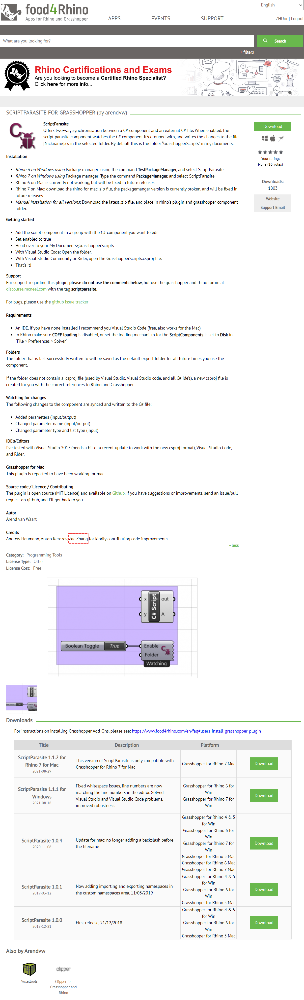

# Grasshopper plugin - Script Parasite

2021年因为开发工作的需要而重度使用Script Parasite，由于当时Script Parasite插件开发还比较初级，存在不少漏洞和不足。在通过联系作者Arendvw后，本人在需求端指出了问题并参与开发修正。现Script Parasite插件已经完善并建立GitHub页面（https://github.com/arendvw/ScriptParasite）交流和开源。

感谢Arendvw的主持开发和所有人的参与提升。

I used Script Parasite heavily in 2021 for development work, and since Script Parasite plugin development was rudimentary at that time, there were bugs and shortcomings. After contacting the author Arendvw, I posted the problem on the demand side and participated in the development. Now Script Parasite plugin has been perfected and we established a GitHub page (https://github.com/arendvw/ScriptParasite) for communication and open source.

Thanks to Arendvw for hosting the development and everyone's involvement.

