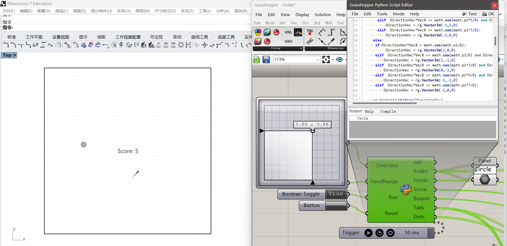

# Rhino - GrassHopper - Python Studies - Notes

_ETH MAS dfab | Zac Zhuo Zhang_

---

Contents

- [Essential Mathematics for Computational Design](#essential-mathematics-for-computational-design) <!--Finished-->
- [Basic GitHub Information](#basic-gitHub-information)<!--Finished-->
- [The Grasshopper Primer](#the-grasshopper-primer)<!--TODO-->
- [Grasshopper Getting Started](#grasshopper-getting-started)<!--Finished-->
- [Python for Rhinoceros](#python-for-rhinoceros)<!--Finished-->
- [What is Rhino Python and Python Basics](#what-is-rhino-python-and-python-basics)<!--Finished-->
- [GhPython Component and Python Script](#ghpython-component-and-python-script)<!--Finished-->
- [GhPython Exercise: Snake Game](#ghpython-exercise-snake-game)

    ---

# Essential Mathematics for Computational Design

> **LINK** https://wiki.mcneel.com/rhino/home/essentialmathematics

> **LINK** https://developer.rhino3d.com/guides/general/essential-mathematics/

> **BOOK** https://www.rhino3d.com/download/rhino/6/essentialmathematics

⚪◯◯◯◯

- A unit vector is a vector whose length is equal to one unit

```Csharp
    // In GH C#, unit vector can be assigned in this way:
    Vector3d a = new Vector3d ();
    a = Vector3d.XAxis;
    a = Vector3d.YAxis;
    a = Vector3d.ZAxis;
    // In addition, zero vector is in this way:
    a = Vector3d.Zero;
```

- Dot Product and Cross Product: The dot product of two non-zero unit vectors equals the cosine of the angle between them. The cross product takes two vectors and produces a third vector that is orthogonal to both.


```Csharp
// In Csharp, it is like:
Vector3d a,b;
c= a*b; //Dot Production;
c=a×b; //Cross Production;
```

- Vector Mathematics: https://developer.rhino3d.com/guides/general/essential-mathematics/vector-mathematics/#15-tutorials

- Parametric Curves and Surfaces: https://developer.rhino3d.com/guides/general/essential-mathematics/parametric-curves-surfaces/#31-parametric-curves

- Hermite and Bézier curves are two examples of cubic polynomial curves that are determined by four parameters. A Hermite curve is determined by two end points and two tangent vectors at these points, while a Bézier curve is defined by four points. While they differ mathematically, they share similar characteristics and limitations.

- Curve degree is a whole positive number. Rhino allows working with any degree curve starting with 1. Degrees 1, 2, 3, and 5 are the most useful but the degrees 4 and those above 5 are not used much in the real world.

# Basic GitHub Information

> **LINK** https://product.hubspot.com/blog/git-and-github-tutorial-for-beginners

⚪⚪⚪⚪◯

- A quick aside: git and GitHub are not the same thing. Git is an open-source, version control tool created in 2005 by developers working on the Linux operating system; GitHub is a company founded in 2008 that makes tools which integrate with git.

- You do not need GitHub to use git, but you cannot use GitHub without using git.

- If you leave a clear explanation of your changes it can be extremely helpful for future programmers (perhaps future you.

- ‘A branch in Git is simply a lightweight movable pointer to one of these commits.’

- By default, every git repository’s first branch is named **master** (and is typically used as the primary branch in the project).

- As part of the tech industry’s general anti-racism work, some groups have begun to use alternate names for the default branch (we are using **primary** in this tutorial, for example).

- A pull request (or PR) is a way to alert a repo's owners that you want to make some changes to their code. It allows them to review the code and make sure it looks good before putting your changes on the primary branch.

- Learn the concept of Branch System of Git: https://learngitbranching.js.org/?locale=zh_CN or https://git-school.github.io/visualizing-git .

- Additional, using git with VSCode: https://youtu.be/i_23KUAEtUM .

# The Grasshopper Primer

> **LINK** https://www.modelab.is/grasshopper-primer

⚪◯◯◯◯

<!--TODO: Page not found-->

# Grasshopper Getting Started

Follow these tutorials of 3a and 3b:

> **LINK** https://vimeopro.com/rhino/grasshopper-getting-started-by-david-rutten/video/79844992

> **LINK** https://gramaziokohler.github.io/teaching_materials/grasshopper

⚪◯◯◯◯

- A Data Tree is essentially a list of lists.

# Python for Rhinoceros

> **LINK** https://developer.rhino3d.com/guides/rhinopython/

⚪⚪⚪◯◯

- Python is sometimes called a scripting language or a glue language. This means python is used often to run a series of commands as a script or used to create links between two other technologies as a glue.

- Rhino uses Python version 2.7. To be more specific Rhino uses IronPython which brings together the Python language and Microsoft’s .NET framework.

> **LINK** (Python Basic Syntax) https://developer.rhino3d.com/guides/rhinopython/python-statements/

- In general, the lack of a required statement termination character simplifies script writing in Python.

- You cannot split a statement into multiple lines in Python by pressing . Instead, use the backslash () to indicate that a statement is continued on the next line.

- Sometimes, more than one statement may be put on a single line. In Python a semicolon ( ; ) can be used to separate multiple statements on the same line. For instance three statements can be written:

```Python
y = 3; x = 5; print(x+y)
#Above is the same as below.
y = 3
x = 5
print(x+y)
```

> **LINK** (Style Guide for Python Code) https://peps.python.org/pep-0008/

# What is Rhino Python and Python Basics

> **LINK** https://developer.rhino3d.com/guides/rhinopython/what-is-rhinopython/ 

> **LINK** https://gramaziokohler.github.io/teaching_materials/python/

# GhPython Component and Python Script

> **LINK** https://developer.rhino3d.com/guides/rhinopython/ghpython-component
 
> **LINK** https://developer.rhino3d.com/guides/rhinopython/your-first-python-script-in-grasshopper

> **LINK** (Additional Video tutorials by McNeel) https://youtu.be/l4_vIRtRUaU / https://youtu.be/qSysanmDKtI / https://youtu.be/ZGIA-fBuCV8

> **LINK** (Additional Video tutorials) https://youtu.be/Ln-ByMyfDy8

- Changing the name of the inputs/outputs: case sensitive; must begin with a letter or \_ .

- The input/output in python component, do NOT add any SPACE since this will create errors(C# won't have the problem).

- Type Hints: assigning types to inputs.

- Import modules:

```Python
import math
print math.pi
print math.pow(2,2)
print 2**8
 print (math.degrees(math.pi))
print (math.radians(math.pi))
```

- Using randoms:

```Python
import random
random_int = random.randint(10,20)
print random_int
random_float = random.uniform(10,20)
print random_float
```

- Accessing item(s)

```Python
first_num = num[0] #Get the first one
last_num = num[-1] #Get the last one
num[0] = 10 #Change the value of an item in the list
num.append(10) #Add an item
num.insert(a,b) #Insert an item b at No.a
```

- Help and prompts: the component proved help when you input "("
  


- Range function

```Python
sequence = range(1) #Crate a list [0]
sequence = range(5) #Crate a list from 0 to 4
sequence = range(3,7) #Crate a list from 3 to 6
oddSequence = range(1,10,2) #Crate a list [1,3,5,7,9] #range(start, stop, step)
```

- Slicing feature:

```Python
print names[:2] #Print the items No1 to No2
print names[2:] #Print items No2 to the last
print names[1:3] #Print items No1 to No3
newNames = names[:] #Copy a list (NOT reference)
```

- Nested list

```Python
import ghpythonlib.treehelper as th
list_of_list = [names, nums, chars]
a = th.list_to_tree(list_of_list)
```

- Other list functions

```Python
print len(myList) #Length of a list
print sum(myList) #Sum of all items of the num list
minNum = min(nums) #min of the num list
maxNum = max(nums) #max of the num list
names.pop(0) #Remove the first item of the list
names.remove("1") #Remove a specific item
names.reverse() #Reverse a list
names.sort() #Sort the list numerically or alphabetically
```

- Outer indentation level:

```Python
#Python uses indentation
# Example 1
for i in x:
    print i
    print "done!"
# Example 2
for i in x:
    print i
print "done!"
```

- Traversal (for loop)

```Python
  #Below is like 'foreach loop' in C#
  for i in list_num
      print i
  # Below is like 'for loop' in C#
  for i in range(len(list_num))
      print list_num[i]
```

# GhPython Exercise Snake Game

```Python
    import scriptcontext as sc
    import rhinoscriptsyntax as rs
    import random
    import Rhino.Geometry as rg
    import copy
    import math

    def UnitizePoint(point):
        point = rg.Vector3d(point.X,point.Y,0)
        rg.Vector3d.Unitize(point)
        point = rg.Point3d(point.X,point.Y,0)
        return point

    def DirectionalMove (Direction):
        DirectionVec = rg.Vector3d(Direction.X-0.5, Direction.Y-0.5,0)
        rg.Vector3d.Unitize(DirectionVec)
        VecX = rg.Vector3d.XAxis

        if DirectionVec.Y >= 0:
        if DirectionVec*VecX > math.cos(math.pi/8):
            DirectionVec = rg.Vector3d(1,0,0)
        elif  DirectionVec*VecX <= math.cos(math.pi/8) and DirectionVec*VecX > math.cos(math.pi*3/8):
            DirectionVec = rg.Vector3d(1,1,0)
        elif  DirectionVec*VecX <= math.cos(math.pi*3/8) and DirectionVec*VecX > math.cos(math.pi*5/8):
            DirectionVec = rg.Vector3d(0,1,0)
        elif  DirectionVec*VecX <= math.cos(math.pi*5/8) and DirectionVec*VecX > math.cos(math.pi*7/8):
            DirectionVec = rg.Vector3d(-1,1,0)
        elif  DirectionVec*VecX <= math.cos(math.pi*7/8):
            DirectionVec = rg.Vector3d(-1,0,0)
        else:
        if DirectionVec*VecX > math.cos(math.pi/8):
            DirectionVec = rg.Vector3d(1,0,0)
        elif  DirectionVec*VecX <= math.cos(math.pi/8) and DirectionVec*VecX > math.cos(math.pi*3/8):
            DirectionVec = rg.Vector3d(1,-1,0)
        elif  DirectionVec*VecX <= math.cos(math.pi*3/8) and DirectionVec*VecX > math.cos(math.pi*5/8):
            DirectionVec = rg.Vector3d(0,-1,0)
        elif  DirectionVec*VecX <= math.cos(math.pi*5/8) and DirectionVec*VecX > math.cos(math.pi*7/8):
            DirectionVec = rg.Vector3d(-1,-1,0)
        elif  DirectionVec*VecX <= math.cos(math.pi*7/8):
            DirectionVec = rg.Vector3d(-1,0,0)

        rg.Vector3d.Unitize(DirectionVec)
        return DirectionVec

    scale = 0.03
    tailLength = 20
    dotRange = 50
    Direction = DirectionalMove(Direction)
    snakeCircles = []
    tailCircles = []
    dots = []

    # Add the variables to the sticky dict
    if "snakeLocations" not in sc.sticky:
        sc.sticky["snakeLocations"] = []
        sc.sticky["snakeLocations"].append(rg.Point3d(0,0,0))

    if "foodLocation" not in sc.sticky:
        sc.sticky["foodLocation"] = rg.Point3d(0,0,0)

    if "score" not in sc.sticky:
        sc.sticky["score"] = 0

    if "Tails" not in sc.sticky:
        sc.sticky["Tails"] = []

    #Die
    if sc.sticky["snakeLocations"][0].X > FoodRange or sc.sticky["snakeLocations"][0].X < -FoodRange or sc.sticky["snakeLocations"][0].Y > FoodRange or sc.sticky["snakeLocations"][0].Y < -FoodRange:
        Run = False

    # Run
    if Reset:
        sc.sticky["score"] = 0
        sc.sticky["snakeLocations"] = []
        sc.sticky["Tails"] = []
        sc.sticky["snakeLocations"].append(rg.Point3d(0,0,0))
        random.seed(1)
        sc.sticky["foodLocation"] = rg.Point3d(random.uniform(-FoodRange,FoodRange),random.uniform(-FoodRange,FoodRange),0)

    elif not Run:
        print 'NOT Running'

    else:
        #With trigger
        if len(sc.sticky["snakeLocations"]) <= 1:
            sc.sticky["snakeLocations"][0].X += Direction.X
            sc.sticky["snakeLocations"][0].Y += Direction.Y
        else:
            tempSnake = copy.deepcopy(sc.sticky["snakeLocations"])
            for i in range(len(sc.sticky["snakeLocations"])):
                sc.sticky["snakeLocations"][i].X = tempSnake[i-1].X
                sc.sticky["snakeLocations"][i].Y = tempSnake[i-1].Y

            sc.sticky["Tails"].append(copy.deepcopy(sc.sticky["snakeLocations"][0]))
            if len(sc.sticky["Tails"]) >= tailLength:
                sc.sticky["Tails"].pop(0)

            sc.sticky["snakeLocations"][0].X = sc.sticky["snakeLocations"][1].X+Direction.X
            sc.sticky["snakeLocations"][0].Y = sc.sticky["snakeLocations"][1].Y+Direction.Y

        if rg.Point3d.DistanceTo(sc.sticky["snakeLocations"][0], sc.sticky["foodLocation"]) < scale*FoodRange :
            sc.sticky["score"] += 1
            sc.sticky["snakeLocations"].append(rg.Point3d(sc.sticky["snakeLocations"][-1].X-Direction.X,sc.sticky["snakeLocations"][-1].Y-Direction.Y,0))
            sc.sticky["foodLocation"] = rg.Point3d(random.uniform(-FoodRange,FoodRange),random.uniform(-FoodRange,FoodRange),0)

    # Return value
    for snakeLocations in sc.sticky["snakeLocations"]:
        snakeCircles.append(rg.Circle(rg.Plane(snakeLocations,rg.Vector3d.ZAxis), 1))
    Score = 'Score: ' + str(sc.sticky["score"])

    Snake = snakeCircles
    Foods = rg.Circle(rg.Plane(sc.sticky["foodLocation"],rg.Vector3d.ZAxis), scale*FoodRange)
    Bound = rg.Rectangle3d(rg.Plane(rg.Point3d(-FoodRange,-FoodRange,0),rg.Vector3d.ZAxis),2*FoodRange,2*FoodRange)

    for Tails in sc.sticky["Tails"]:
        tailCircles.append(rg.Circle(rg.Plane(Tails,rg.Vector3d.ZAxis), 1))
    Tails = tailCircles

    for i in range(dotRange):
        for j in range(dotRange):
            dots.append(rg.Point3d(FoodRange/dotRange+i*(2*FoodRange/dotRange)-FoodRange, FoodRange/dotRange+j*(2*FoodRange/dotRange)-FoodRange, 0))

    Dots = dots
```

- 

- 
