# ROS Studies

---
- [What is ROS](#what-is-ros)
- [ROS concepts](#ros-concepts)
- [My first ROS program](#my-first-ros-program)
- [Create a node](#create-a-node)
- [Node with a timer](#node-with-a-timer)
- [ROS node information display](#ros-node-information-display)
- [ROS talker information](#ros-talker-information)
- [ROS interface information](#ros-interface-information)
- [ROS topic echo](#ros-topic-echo)
- [ROS turtle circle](#ros-turtle-circle)
- [ROS subscriber and publisher](#ros-subscriber-and-publisher)
- [Moveit](#moveit)

---


## What is ROS
 - ROS is a **middleware**
 - Plumbing + Tools + Capabilities + Ecosystem
 - 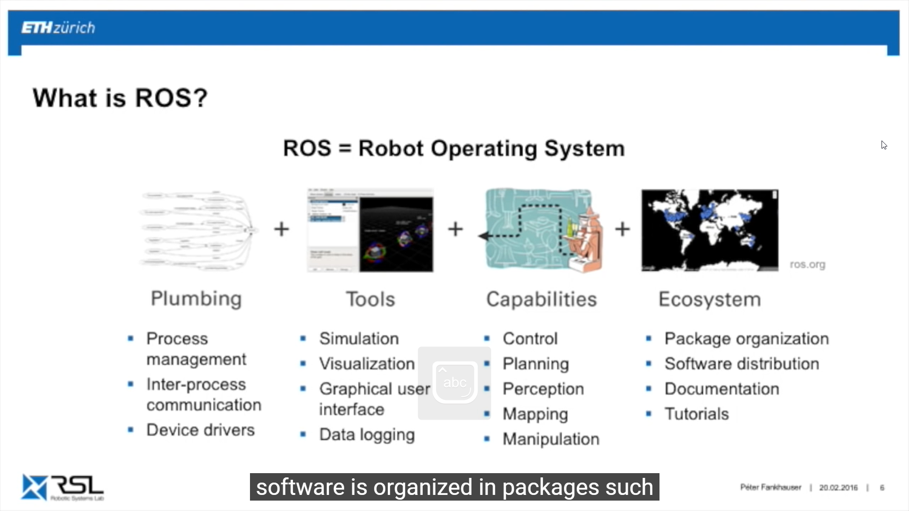
 - 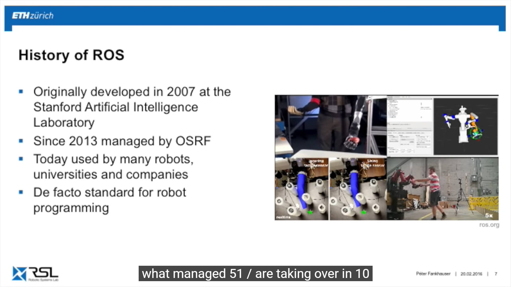
 - Run by open source robotic function
 - ROS philosophy
   - Peer to peer
   - Distributed
   - Multi-lingual
   - Light-weight
   - Free and open-source

## ROS concepts
 - **ROS Master** is the manager that communicates the nodes
 - Every nodes registers at startup with the master
 - start a ROS master with **roscore**
 - **ROS Nodes** is single purpose and executable program. It is managed in packages.
 - 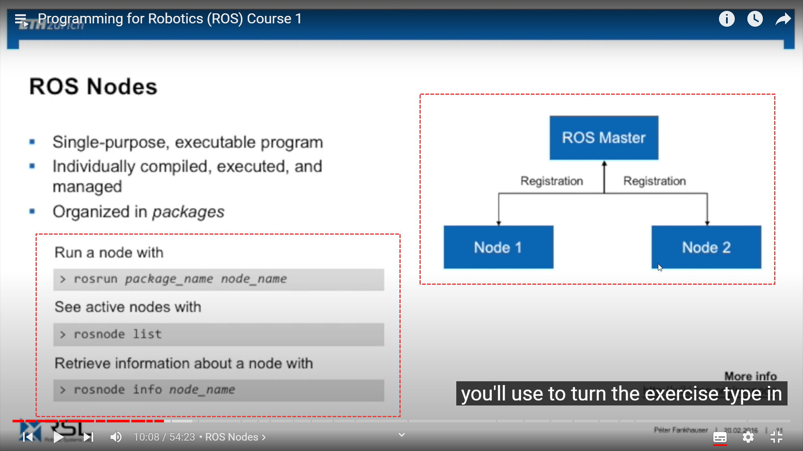
 - **ROS Topic** is a string of message
 - 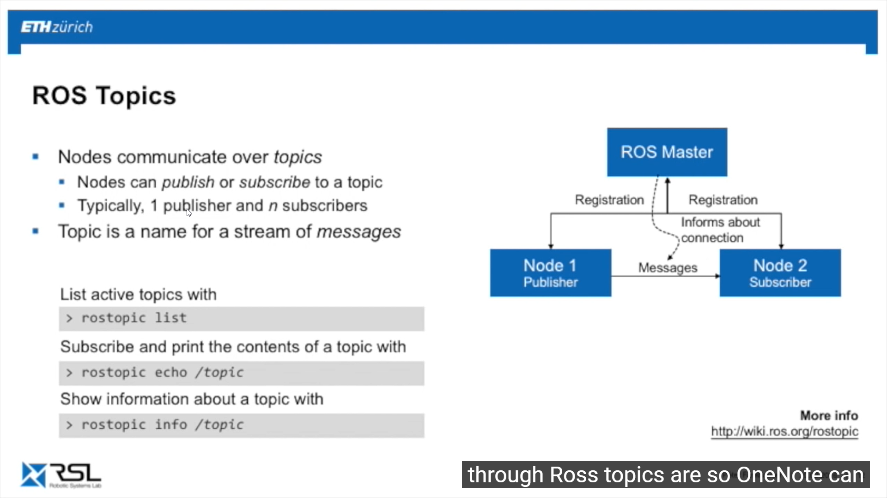
 - **ROS Messages** is data structure defining the type of a topic (in .msg file)
 - 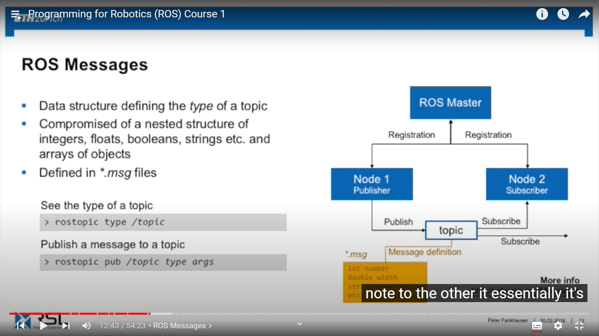
 - 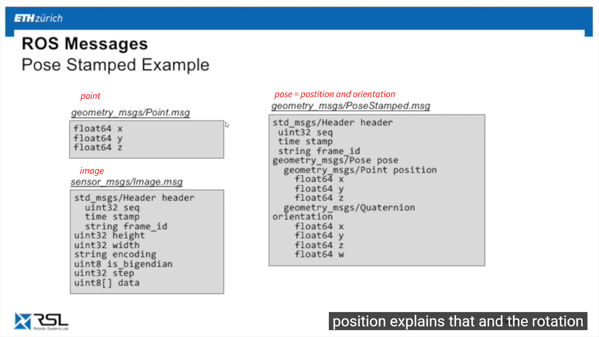

## My first ROS program
 - 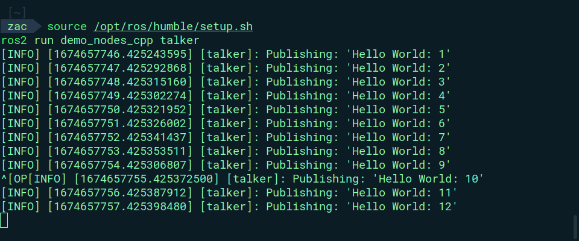

  - Basic commands
```terminal
ros2 run demo_nodes_cpp talker  
ros2 run demo_nodes_cpp listener
rqt_graph #representation of all the nodes
ros2 run turtlesim turtlesim_node
ros2 run turtlesim turtle_teleop_key
```
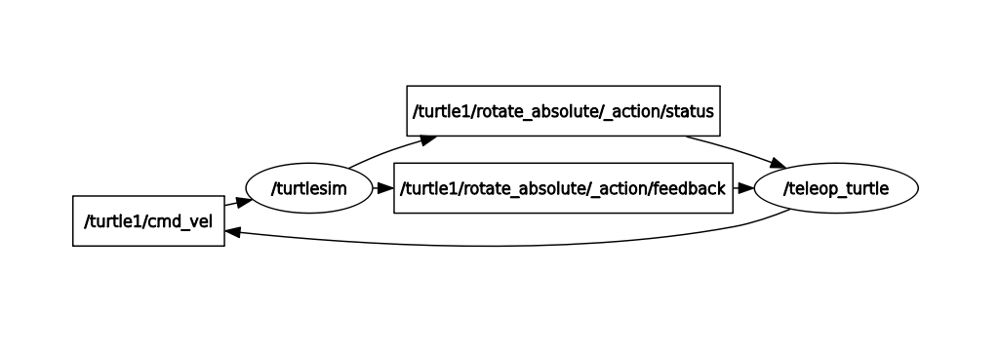

## Create a node

- create package

```terminal
  ros2 pkg create my_robot_controller --build-type ament_python --dependencies rclpy 
  colcon build
  chmod +x my_frist_node.py 
  source ~/.bashrc 
  colcon build --symlink-install
```

```Python

  # !/usr/bin/env python3

  import rclpy
  from rclpy.node import Node

  class MyNode(Node):

      def __init__(self):
          super().__init__("first_node")
          self.get_logger().info("Hello from ROS2")

  def main(args=None):
      rclpy.init(args=args)

      node = MyNode()
      # rclpy.spin(node)
      # node.destroy_node()
      rclpy.shutdown()


  if __name__ == '__main__':
      main()

```

## Node with a timer

```python
  # !/usr/bin/env python3

  import rclpy
  from rclpy.node import Node

  class MyNode(Node):

      def __init__(self):
          super().__init__("first_node_d2")
          # self.get_logger().info("Hello from ROS.")
          self.Counter = 0
          self.create_timer(1.0, self.timer_callback)

      def timer_callback(self):
          self.get_logger().info("Hello" + str(self.Counter))
          self.Counter += 1
  def main(args=None):
      rclpy.init(args=args)
      node = MyNode()

      rclpy.spin(node) #spin will be alive until you kill it
      # node.destroy_node()
      rclpy.shutdown()


  if __name__ == '__main__':
      main()

```
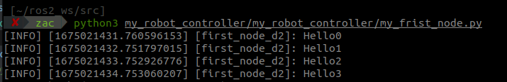


## ROS node information display

```terminal
  ros2 node list
  ros2 node info /first_node_d2
```
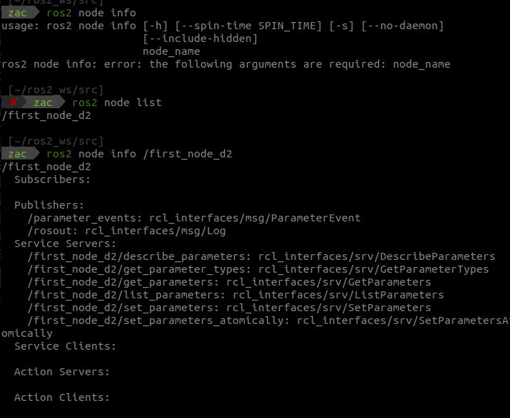


## ROS talker information
```terminal
ros2 topic info /chatter
```
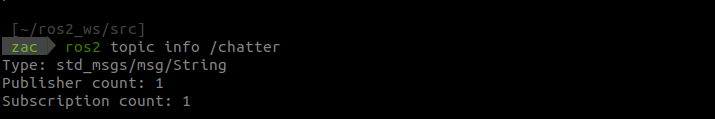


## ROS interface information
```terminal
ros2 interface show std_msgs/msg/String // ros2 interface show +TYPE
```
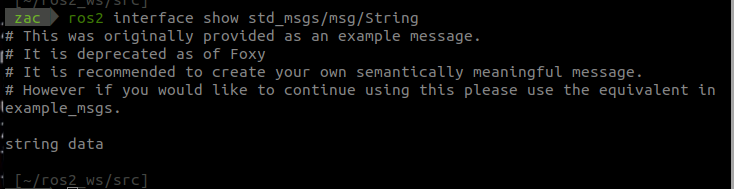


## ROS topic echo
```terminal
ros2 topic echo /chatter
```
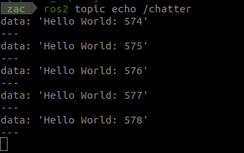
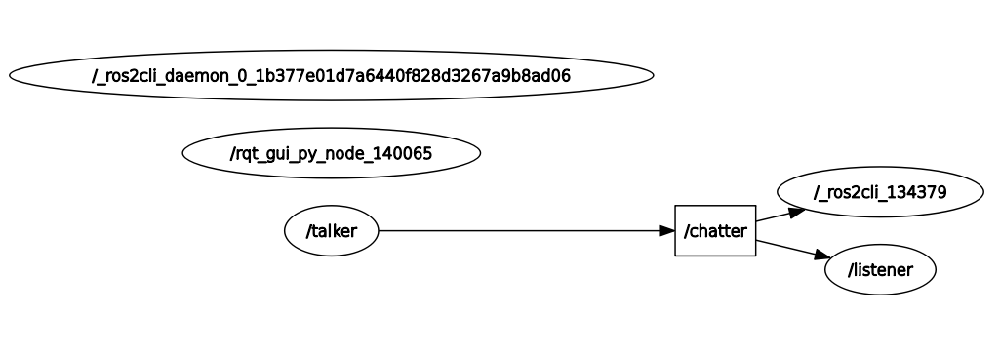


## ROS turtle circle

- 

```python

  import rclpy
  from rclpy.node import Node
  from geometry_msgs.msg import Twist

  class DrawCircleNode(Node):
      def __init__(self):
          super().__init__('draw_circle')
          self.cmd_vel_pub_ = self.create_publisher(Twist, "/turtle1/cmd_vel",10) 
          self.timer_ = self.create_timer(0.5, self.send_velocity_command)  

          self.get_logger().info('Draw circle node has been started') 
          
      def send_velocity_command(self):
          msg = Twist()
          msg.linear.x = 2.0
          msg.angular.z = 1.0
          self.cmd_vel_pub_.publish(msg)


  def main(args =None):

      rclpy.init(args = args)
      node = DrawCircleNode()
      rclpy.spin(node)
      rclpy.shutdown()


  if __name__ == '__main__':
      main()

```


## ROS subscriber and publisher

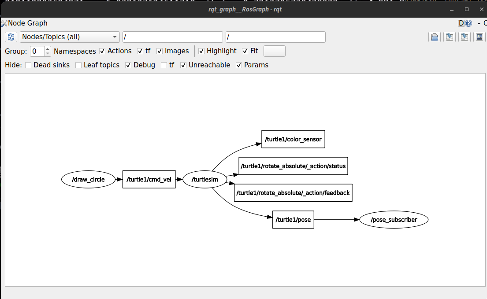


# ROS Server

```terminal

    ros2 run demo_nodes_cpp add_two_ints_server
    ros2 service list 
    ros2 service type /add_two_ints
    ros2 interface show example_interfaces/srv/AddTwoInts

    ros2 topic hz /turtle1/pose
    average rate: 62.490
	min: 0.015s max: 0.017s std dev: 0.00053s window: 64
average rate: 62.513


```


```python

#! Create a service client
    def call_set_pen_service(self, r,g,b,width,off):
        client = self.create_client(SetPen, "/turtle1/set_pen")
        while not client.wait_for_service(timeout_sec=1.0):
            self.get_logger().warn("Waiting for service...")
        
        request = SetPen.Request()
        request.r = r
        request.g = g
        request.b = b
        request.width = width
        request.off = off   

        future = client.call_async(request)
        future.add_done_callback(partial(self.callback_set_pen))

    def callback_set_pen(self,future):
        try:
            response = future.result()
        except Exception   as e:
            self.get_logger().error("Service call failed: {}".format(e))

```

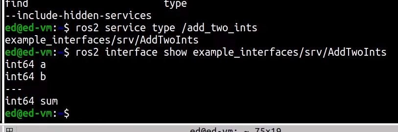


## Moveit 
