# Compas 100%

---

- [**After noticing the power of compass, I am planning to use compass library for everything: geometry, algorithm, robotic control, etc. The ideal platform is Linux/ubuntu. I am imaging that I can be independent from other software/library for coding like RhinoGeometry, Grasshopper, etc.**](#after-noticing-the-power-of-compass-i-am-planning-to-use-compass-library-for-everything-geometry-algorithm-robotic-control-etc-the-ideal-platform-is-linuxubuntu-i-am-imaging-that-i-can-be-independent-from-other-softwarelibrary-for-coding-like-rhinogeometry-grasshopper-etc)
- [Compas lecture 01](#compas-lecture-01)
- [Compas lecture 02](#compas-lecture-02)
- [Compas lecture 03](#compas-lecture-03)
- [Compas lecture 04](#compas-lecture-04)
- [COMPAS lecture 05](#compas-lecture-05)
- [COMPAS lecture 06](#compas-lecture-06)
- [COMPAS lecture 07](#compas-lecture-07)


---
**After noticing the power of compass, I am planning to use compass library for everything: geometry, algorithm, robotic control, etc. The ideal platform is Linux/ubuntu. I am imaging that I can be independent from other software/library for coding like RhinoGeometry, Grasshopper, etc.**
--

## Compas lecture 01
 - Gain the ability to design, plan and execute robotic fabrication processes using python


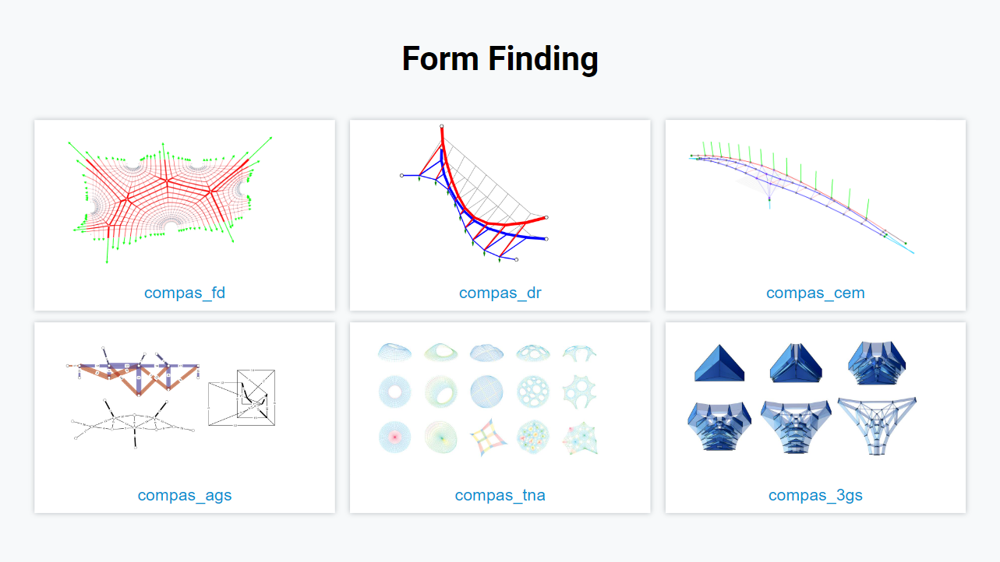


## Compas lecture 02


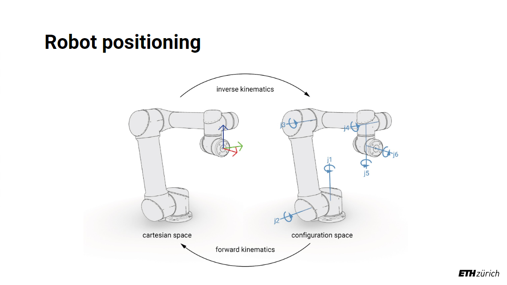


 - Example:
 ```python
      """There are several ways to construct a `Frame`.
      """
      from compas.geometry import Point
      from compas.geometry import Vector
      from compas.geometry import Frame
      from compas.geometry import Plane

      # Frame autocorrects axes to be orthonormal
      F = Frame(Point(1, 0, 0), Vector(-0.45, 0.1, 0.3), Vector(1, 0, 0))

      F = Frame([1, 0, 0], [-0.45, 0.1, 0.3], [1, 0, 0])

      F = Frame.from_points([1, 1, 1], [2, 3, 6], [6, 3, 0])
      F = Frame.from_plane(Plane([0, 0, 0], [0.5, 0.2, 0.1]))
      F = Frame.from_euler_angles([0.5, 1.0, 0.2])
      F = Frame.worldXY()
 ```


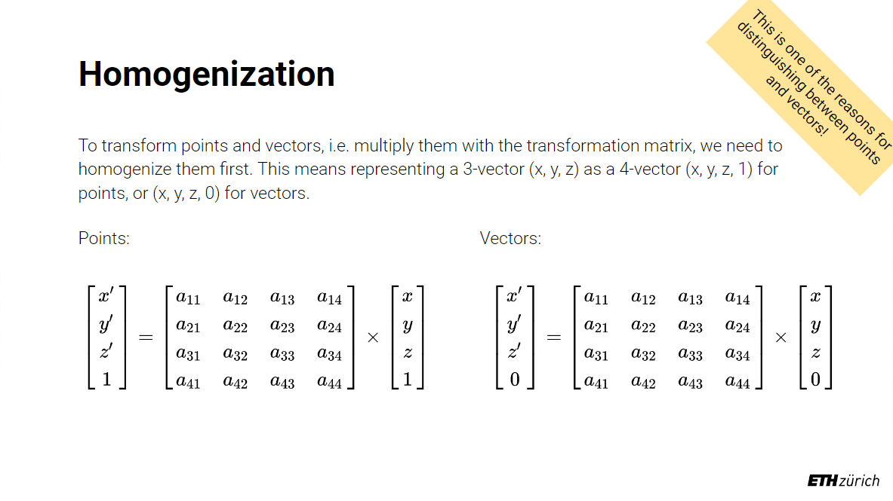


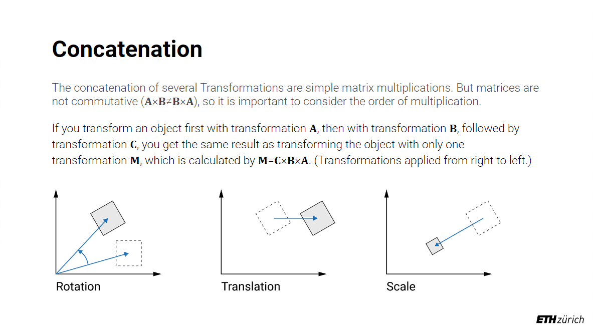
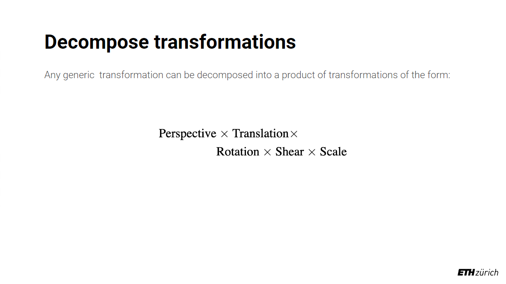


## Compas lecture 03


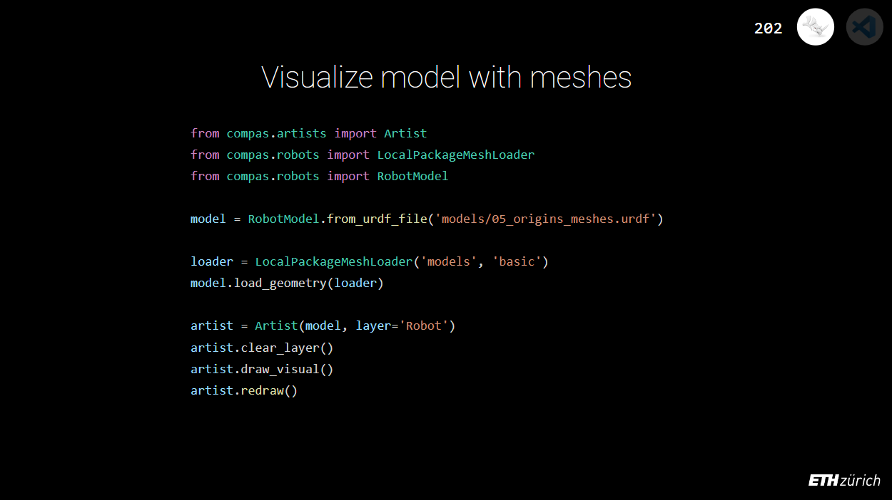
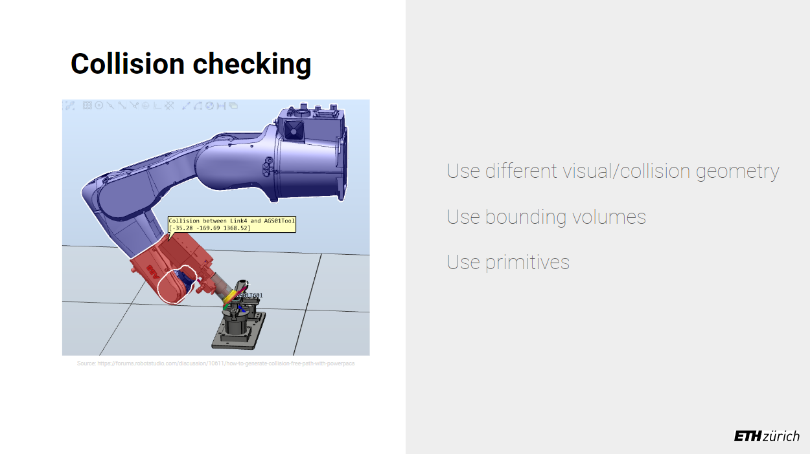


## Compas lecture 04


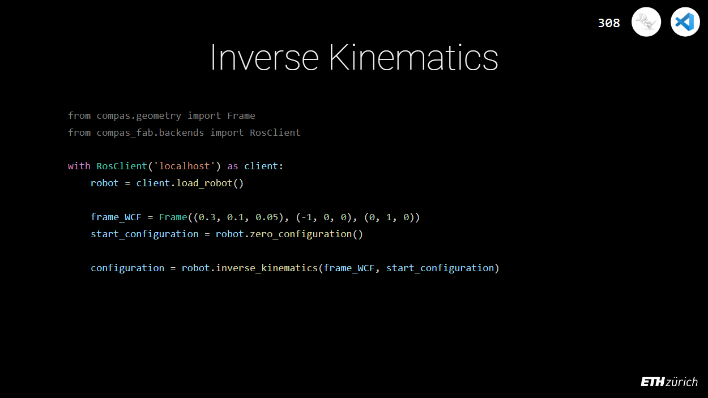


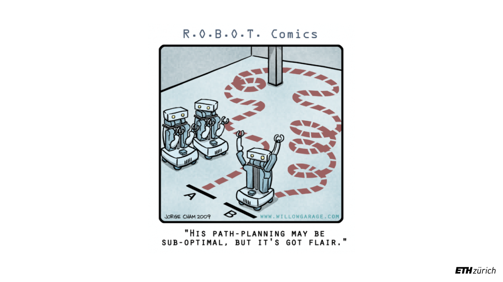


## COMPAS lecture 05


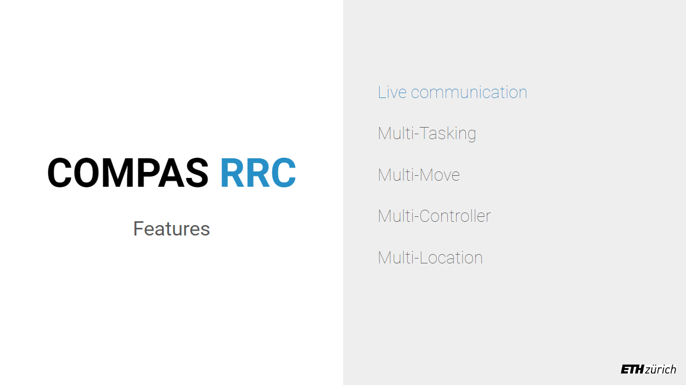


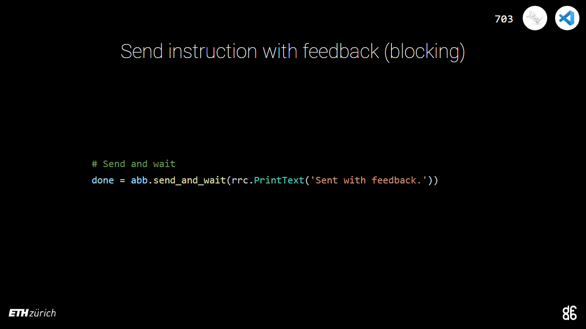


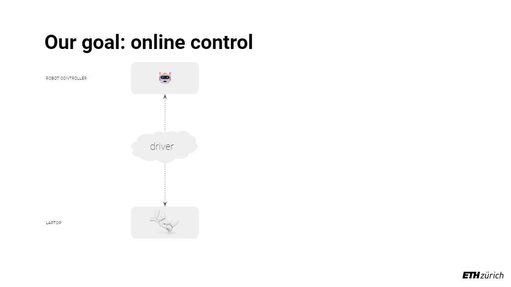


## COMPAS lecture 06


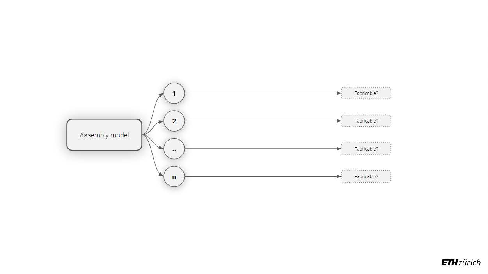


## COMPAS lecture 07


