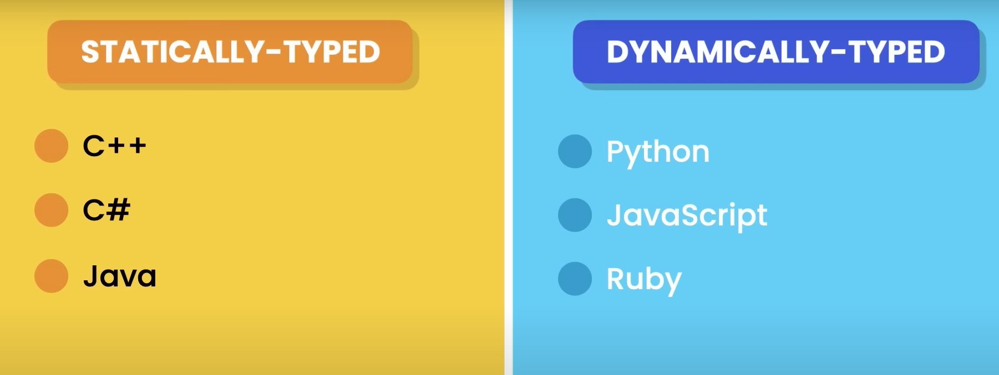
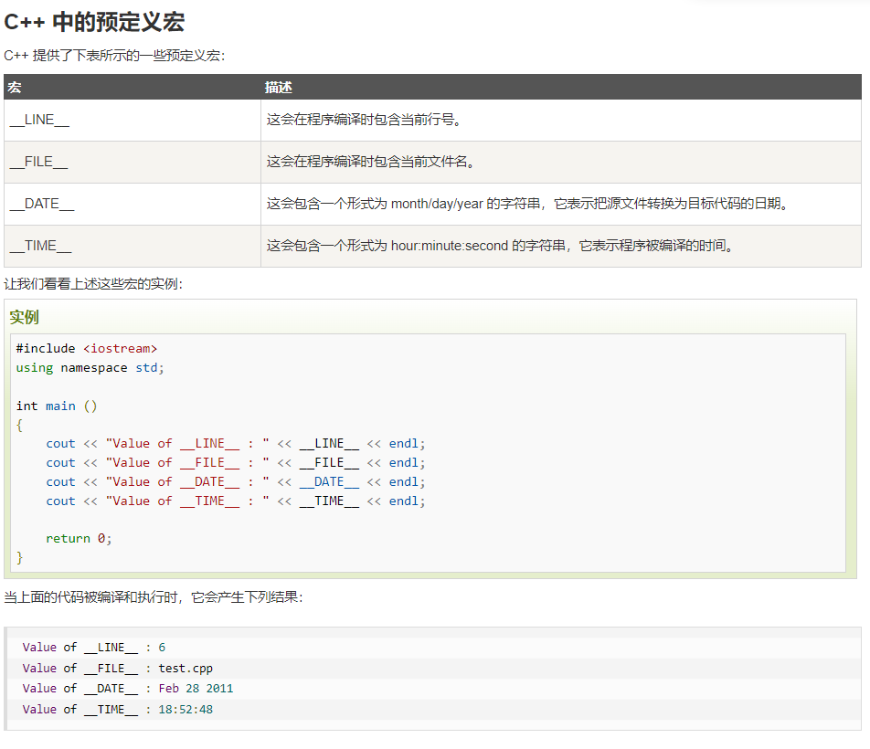

# C plus plus Studies

---

- [Source: Cherno](#source-cherno)
- [Note produce](#note-produce)
- [Main architecture](#main-architecture)
- [Mathematical expressions](#mathematical-expressions)
- [Output and input](#output-and-input)
- [Fundamental data types](#fundamental-data-types)
- [What is #include](#what-is-include)
- [What is #define](#what-is-define)
- [C++ 中的预定义宏](#c-中的预定义宏)
- [Head](#head)
- [Pointer (指针)](#pointer-指针)
- [Reference (引用)](#reference-引用)
- [Class (类)](#class-类)
- [Struct (结构体)](#struct-结构体)
- [Static (静态)](#static-静态)
- [Extern (外部)](#extern-外部)
- [Enum (枚举)](#enum-枚举)
- [Constructor (构造函数)](#constructor-构造函数)
- [Polymorphism (多态)](#polymorphism-多态)
- [new (动态内存分配)](#new-动态内存分配)
- [this (指针)](#this-指针)
- [thread (线程)](#thread-线程)
- [This note is mainly produced by GitHub copilot. copilot thinks himself](#this-note-is-mainly-produced-by-github-copilot-copilot-thinks-himself)
- [Operator Overloading (运算符重载)](#operator-overloading-运算符重载)
- [Tip: IEnumerable](#tip-ienumerable)

---

## Source: Cherno


## Note produce

- This note is mainly written by GitHub copilot. copilot is a new AI-powered code completion tool that helps you write code faster and more efficiently. It is currently in beta and available to GitHub Pro and Enterprise users. You can find more information about copilot here: https://copilot.github.com/

## Main architecture

```C++
#include <iostream>
int main()
{
    //Write your code HERE
    return 0; // if return any value that is not 0, whatever positive or negative, it tells the computer to that this program is not correctly run.
};
```

## Mathematical expressions

```C++
#include <iostream>
int main()
{
    int a =10;
    int b = ++a //Now a = 11, b = 11
    //OR
    int b = a++ // Now a = 11, b = 10
    return 0;
};
```

## Output and input

- Print one variable

```C++
int main()
{
    int x = 10;
    std ::cout << "x = " <<x;
    //above is the same as the two below:
    std ::cout << "x = " ;
    std ::cout << x;
    return 0;
};
```

- Print variables

```C++
int main()
{
    int x = 10;
    int y = 10;
    std ::cout << "x = " << x << std::endl<< "y = " << y << std::endl;
    return 0;
};
```

- Input value

```C++
int main()
{
    int x = 10;
    int y = 10;

    cout << "tell me what you like" << endl;
    int value;
    cin >> value;
    cout << value << endl;

    return 0;
};
```

## Fundamental data types



## What is #include

- '#include file' simply copy everything from the 'file' to the content.

## What is #define

- '#define x y' simply replace x as y.

```C++
#define PI 3.14159
int main ()
{
    cout << "Value of PI :" << PI << endl;
    return 0;
};
```

## C++ 中的预定义宏



## Head

- < and "
```C++
#include "iostream"
//below is almost the same as above
//"" means a specific location (relative location), <> means a file that exists in the folder, no matter the location.
#include <iostream>
```
- Why some files like 'iostream' does have a '.h'? - C++ stand library has no extension, but C stand library has '.h' extension.

## Pointer (指针)

- A pointer is a variable that stores the address of another variable.
- My first pointer

```C++
  int main()
  {
    int* ptr = &var;
    cout << ptr << endl;
    cin.get();
  };
```

- "int &b=a" is the & in this declaration statement is a reference
- "\*p=&b" is the & in this pointer initialization statement is an address operator
- "int\*" is a pointer to an integer

```C++
int main()
{
    int var = 8;
    int * ptr = &var;
    *ptr = 10;
    cout << var << endl;
    cin.get();

};
```

```C++
 void addOne (int* value)
 {
     (*value)++;
 };

 int main()
 {
     int a = 5;
     addOne(&a);
     cout << a << endl;
 };
```

## Reference (引用)

- A reference is an alias for another variable.

```C++
  int x = 10;   // x is an integer
  int &y = x; // y is a reference to x
```

- example

```C++
    int main()
    {
        int var = 0;
        int& ref = var;
        ref = 10;
        cout << var << endl;
        cin.get();

    };
```

```C++
  void addOne(int &value)
  {
      value++;
  };

  int main()
  {
      int var = 0;
      // int &ref = var;
      addOne(var);
      cout << var << endl;
      cin.get();
  };
```

## Class (类)

- A class is a user-defined data type, which holds its own data members and member functions, which can be accessed and used by creating an instance of that class.

```C++
   class Player
   {
   public:
       int x, y;
       int speed;
   };

   int main()
   {
       Player x;
       x.x = 10;

       cin.get();
   };
```

## Struct (结构体)

- A struct is a user-defined data type, which holds its own data members and member functions, which can be accessed and used by creating an instance of that struct.

```C++
   struct Player
   {
       int x, y;
       int speed;
   };

   int main()
   {
       Player x;
       x.x = 10;

       cin.get();
   };
```

- technically, the only difference between a class and a struct is that members of a struct are public by default, and members of a class are private by default. It means you can write '#define struct class' in the beginning of the code to switch between class and struct.

## Static (静态)

- Static variables are variables that are declared with the static keyword. Static variables are initialized only once, when the program starts. They are not destroyed when the function in which they are declared ends. They are destroyed when the program ends.

```C++
    #include <iostream>
    using namespace std;

    class Player
    {
    public:
        static int x, y;

    public:
        static int speed;
    };
    int Player::x;
    int Player::y;
    int Player::speed;

    int main()
    {
        Player x;

        x.x = 1;
        x.y = 2;
        x.speed = 3;

        Player y;
        y.x = 4;
        y.y = 5;
        y.speed = 6;

        cout << x.x << x.y << x.speed << " " << y.x << y.y << y.speed << endl;
    /// Outcome would be  456 456
        cin.get();
    };
```

## Extern (外部)

- The extern keyword is used to give a reference of a global variable that is visible to ALL the program files. When you use 'extern' the variable cannot be initialized as all it does is point the variable name at a storage location that has been previously defined.

## Enum (枚举)

- An enum is a user-defined data type that consists of integral constants.

```C++

  #include <iostream>
  using namespace std;

  enum Player:int
  {
      A = 1,
      B = 2,
      C = 3
  };

  int main()
  {
      Player x = A;
      if ( x ==1){
          cout << "x is A" << endl;
      };
      cin.get();
  };
```

## Constructor (构造函数)

- A constructor is a special member function of a class that is executed whenever we create new objects of that class.

```C++
  #include <iostream>
  using namespace std;

  class Player
  {
  public:
      int x, y;
      int speed;

  public:
      Player(int thex, int they, int thes)
      {
          x = thex;
          y = they;
          speed = thes;
      };
  };

  int main()
  {
      Player X = Player(1, 2, 3);
      cout << "X is" << X.x << "Y is" << X.y << "Z is" << X.speed << endl;
      cin.get();
  };
```

## Polymorphism (多态)

- Polymorphism is the ability of an object to take on many forms. The most common use of polymorphism in OOP occurs when a parent class reference is used to refer to a child class object.

```C++
  #include <iostream>
  using namespace std;

  class Entity
  {
  public:
      virtual string GetName() { return "Entity"; };
  };

  class Player : public Entity
  {
  private:
      string m_Name;
  public:
      Player(const string& name)
          : m_Name(name) {};

      string GetName() override { return m_Name; };
  };

  void PrintName(Entity* entity)
  {
      cout << entity->GetName() << endl;
  };

  int main()
  {
      Entity* e = new Entity();
      PrintName(e);

      Player* p = new Player("Cherno");
      PrintName(p);

      cin.get();
  };
```

## new (动态内存分配)

- The new operator is used to dynamically allocate memory. The new operator returns a pointer to the newly allocated memory, which is cast into a pointer of the type that was specified.

```C++
  #include <iostream>
  using namespace std;

  class Entity
  {
  public:
      virtual string GetName() { return "Entity"; };
  };

  class Player : public Entity
  {
  private:
      string m_Name;
  public:
      Player(const string& name)
          : m_Name(name) {};

      string GetName() override { return m_Name; };
  };

  void PrintName(Entity* entity)
  {
      cout << entity->GetName() << endl;
  };

  int main()
  {
      Entity* e = new Entity();
      PrintName(e);

      Player* p = new Player("Cherno");
      PrintName(p);

      cin.get();
  };
```

## this (指针)

- The this pointer is an implicit parameter to all member functions. Whenever you call a member function using an object of the class, the this pointer is passed as an implicit argument to the member function. The this pointer is used to refer to the invoking object.

```C++
  #include <iostream>
  using namespace std;

  class Entity
  {
    public:
      int x, y;
      Entity (int x, int y)
      {
          this->x = x;
          this->y = y;
      };
  };
```

## thread (线程)

- A thread is a sequence of instructions within a program that can be executed independently of other code. (in C#, join() is wait())

```C++
  #include <iostream>
  #include <thread>
  using namespace std;

  void Function()
  {
      cout << "Hello from thread" << endl;
      this_thread::sleep_for(1s);
  };

  int main()
  {
      thread t(Function);
      t.join();
      cout << "Hello from main" << endl;
      cin.get();
  };
```

## This note is mainly produced by GitHub copilot. copilot thinks himself

## Operator Overloading (运算符重载)

- Operator overloading is a feature of C++ that allows the programmer to define the behavior of operators in a way that is different from the default behavior. The default behavior of an operator is to perform an operation on the operands. For example, the + operator adds two operands. The programmer can change the behavior of an operator by defining a function that is called when the operator is used.

```C++
  #include <iostream>
  using namespace std;

  class Entity
  {
  public:
      int x, y;

      Entity(int x, int y)
      {
          this->x = x;
          this->y = y;
      };
      //! Important below
      Entity operator+(const Entity& other) const
      {
          return Entity(x + other.x, y + other.y);
      };
  };

  int main()
  {
      Entity a(50, 60);
      Entity b(10, 20);
      Entity c = a + b;
      cout << c.x << ", " << c.y << endl;
      cin.get();
  };
```

## Tip: IEnumerable

```C#
    IEnumerable<Brep> x1 = x;
    IEnumerable<Brep> y1 = y;
    // Point3d x = new Point3d(0, 0, 0);
    Brep[] xx = Brep.CreateBooleanDifference(x1, y1, 0.001);

    A = xx;
```
