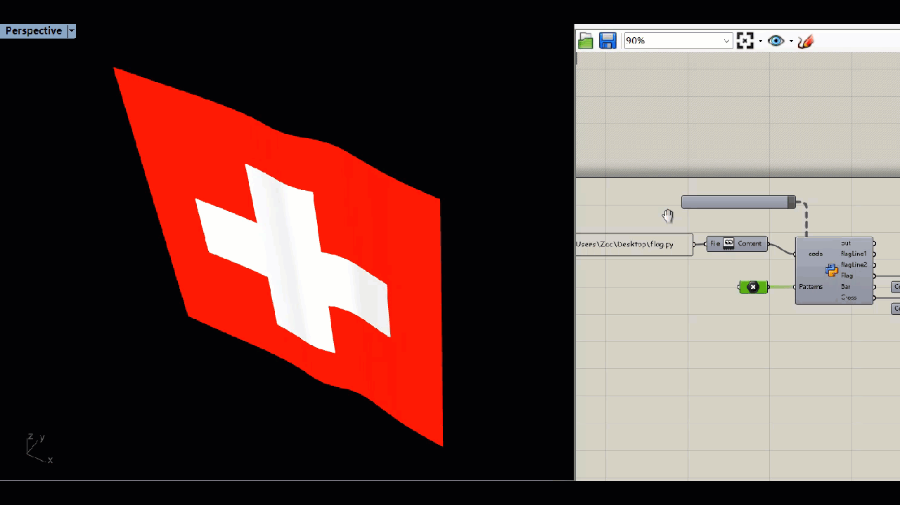
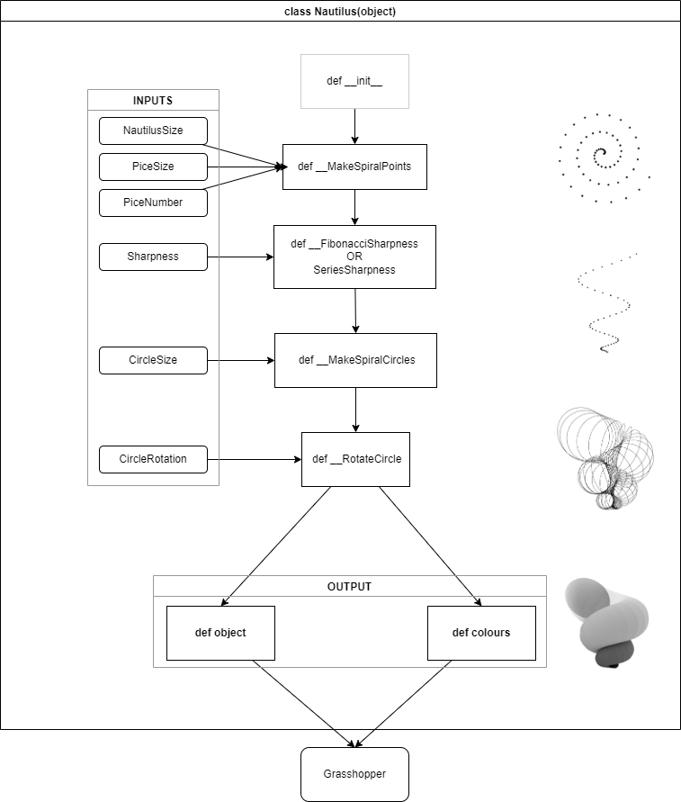

# MAS dfab - Week 1 - Python Basics

---

Contents:
- [Transformation](#transformation)
- [Floor division operator](#floor-division-operator)
- [Add list to a list](#add-list-to-a-list)
- [Tuple](#tuple)
- [Dictionary](#dictionary)
- [Enumeration](#enumeration)
- [Zip](#zip)
- [Multiple returns in definition](#multiple-returns-in-definition)
- [Class](#class)
- [Flag in the wind](#flag-in-the-wind)
- [Chinese flag](#chinese-flag)
- [Box class](#box-class)
- [Make a Nautilus](#make-a-nautilus)

---

## Transformation

```Python
a = int(a)
b = str(3.14)
```

## Floor division operator

```Python
print (8//3) #answer is 2
```

## Add list to a list

```Python
list1.extend(list2)
```

## Tuple

Once created, cannot be changed

```Python
b = (element1, element2, ... , elementn)
a = ("c.biancheng.net", 1, [2,'a'], ("abc",3.0))
```

## Dictionary

```Python
myDict = {"Name": "Zac", "Age": 23, "Gender": "Male"}
```

## Enumeration

```Python
for i, animals in enumeration(animals):
    print i
    print (animals)
```

## Zip

```Python
for animal, number in zip(animals, numbers):
    print animal
    print number
```

## Multiple returns in definition

```Python
def function ( var1, var2):
    doSomething()
    return x, y
a, b = function(var1, var2)
# a = x, b=y
```

## Class

```Python
class Message :
    message = "Hello World"
myMessage = Message
```

## Flag in the wind



```Python
    # This script is to generate a flag animation

    # Import
    from cgitb import reset
    import scriptcontext as sc
    import Rhino.Geometry as rg
    import copy
    import math
    import Rhino.Geometry.Brep as rb

    # Initial variables
    flagLength = 500 #mm
    flagWidth = 500 #mm
    subdivision = 10 #Must be integer
    reset = False #In case to initialize

    # Wave the flag
    def waveFlag (FlagLength, FlagWidth,Amplitude, Subdivision):
        if "wavingVariable" not in sc.sticky or reset:
            sc.sticky["wavingVariable"] = []
            for i in range(subdivision):
                sc.sticky["wavingVariable"].append(rg.Point3d((FlagLength/(Subdivision-1))*i,math.sin(math.pi * Subdivision/(i+1)) * Amplitude, 0) )
        else:
            for i in range (len(sc.sticky["wavingVariable"])):
                tempPointI = copy.deepcopy(sc.sticky["wavingVariable"][i])
                if  i == len (sc.sticky["wavingVariable"])-1:
                    tempPoint0 = copy.deepcopy(sc.sticky["wavingVariable"][0])
                    sc.sticky["wavingVariable"][i] = rg.Point3d(tempPointI.X,tempPoint0.Y, 0 )
                else:
                    tempPointJ =copy.deepcopy(sc.sticky["wavingVariable"][i+1])
                    sc.sticky["wavingVariable"][i]  = rg.Point3d(tempPointI.X,tempPointJ.Y, 0 )
        return sc.sticky["wavingVariable"]

    # Output flag
    flagPoints1 =  waveFlag( flagLength, flagWidth, 10, subdivision)
    flagLine1 = rg.NurbsCurve.Create(False, 2, flagPoints1)
    flagPoints2 = []
    for i in flagPoints1:
        flagPoint2 = rg.Point3d(i.X, i.Y, flagWidth)
        flagPoints2.append(flagPoint2)
    flagLine2 =  rg.NurbsCurve.Create(False, 2, flagPoints2)

    Flag = rg.NurbsSurface.CreateRuledSurface(flagLine1,flagLine2 )

    # Make a cross on the flag
    Patterns.append(Patterns[0])
    line = rg.PolylineCurve(Patterns) #Cross line
    surface = rg.Surface.CreateExtrusion(line, rg.Vector3d(0,300,0))
    b1 = rb.CreateFromSurface(surface)
    b2 = rb.CreateFromSurface(Flag)
    splitted = rb.Split(b2, b1, 0.01)

    Flag = splitted[0]
    Cross = splitted[1]
```

## Chinese flag


```Python
   # Import
   from cgitb import reset
   import scriptcontext as sc
   import Rhino.Geometry as rg
   import copy
   import math
   import Rhino.Geometry.Brep as rb

   #Def
   class Star:
       def __init__(self,xpos,ypos,rad,peaks,f,c=(255,0,0,0)):
           self.xpos = xpos
           self.ypos = ypos
           self.rad = rad
           self.peaks = peaks
           self.factor = f

       def draw(self):
           pts_star = []
           res = self.peaks * 2
           theta = 2 * math.pi / res

           for i in range(res):
               if i%2 == 0:
                   radius = self.rad * self.factor
               else:
                   radius = self.rad
               xc = self.xpos + math.cos(theta*i-theta/2) * radius
               yc = self.ypos + math.sin(theta*i-theta/2) * radius
               pts_star.append(rg.Point3d(xc,yc,0.2))

           curve_star = rg.NurbsCurve.Create(True,1,pts_star)
           star = rg.Brep.CreatePlanarBreps(curve_star,0.001)
           return star

   # Initial variables
   flagLength = 2880 #mm
   flagWidth = 1920 #mm

   # Draw stars
   star1 = Star(Patterns[0].X,Patterns[0].Y,200,5,0.4)
   star2 = Star(Patterns[1].X,Patterns[1].Y,70,5,0.4)
   star3 = Star(Patterns[2].X,Patterns[2].Y,70,5,0.4)
   star4 = Star(Patterns[3].X,Patterns[3].Y,70,5,0.4)
   star5 = Star(Patterns[4].X,Patterns[4].Y,70,5,0.4)
   Stars = []
   Stars=star1.draw()
   Stars += star2.draw()
   Stars+= star2.draw()
   Stars+=star3.draw()
   Stars+=star4.draw()
   Stars+=star5.draw()

   # Draw background
   RectangleSurface = rg.NurbsSurface.CreateFromCorners(rg.Point3d(0,0,0), rg.Point3d(flagLength,0,0), rg.Point3d(flagLength, flagWidth, 0), rg.Point3d(0,flagWidth,0))
```

## Box class

```Python
    import Rhino.Geometry as rg
    from ghpythonlib.components import ColourRGB

    class Rectangle(object):

        # Initialize my object
        def __init__(self, x,y,z,w,d,h, v =(0,0,1), c=(255,255,255,255)):
            self.x = x
            self.y = y
            self.z                           = z
            self.vector = rg.Vector3d(v[0], v[1], v[2])
            self.center = rg.Point3d(x,y,z)
            self.plane = rg.Plane(rg.Point3d(0,0,0), rg.Vector3d(0,0,1))
            self.w = w
            self.d =d
            self.h =h
            self.volume = w * d* h
            self.rect = None
            self.colour    = ColourRGB(c[0], c[1], c[2], c[3])
        def draw(self):
            self.rect = rg.Box(self.plane, rg.Interval(-self.w/2, self.w/2),
                                                rg.Interval(-self.d/2, self.d/2),
                                                rg.Interval(-self.h/2, self.h/2))

    objects = []
    colours = []
    totalVolume = 0

    r = Rectangle(0,0,0,10,10,5)
    r.draw()
    objects.append(r.rect)
    colours.append(r.colour)

    Objects = objects
    Colours = colours
```

## Make a Nautilus




```Python
    # IMPORT
    from copy import copy
    import Rhino.Geometry as rg
    import math
    from ghpythonlib.components import ColourRGB

    # INPUTS
    # NautilusSize
    # PiceSize
    # PiceNumber
    # Sharpness
    # CircleSize
    # CircleRotation

    # CLASS
    class Nautilus(object):
        # initialize
        def __init__(self, NautilusSize, PiceSize, PiceNumber, Sharpness, CircleSize, CircleRotation):
            self.nautilusSize = NautilusSize
            self.piceSize = PiceSize
            self.piceNumber = PiceNumber
            self.sharpness = Sharpness
            self.circle = CircleSize
            self.circleRotation = CircleRotation
            self.circles = self.__MakeSpiralCircles(
                self.__MakeSpiralPoints(NautilusSize, PiceSize, PiceNumber, Sharpness), CircleSize
            )

        def __FibonacciSharpness(PiceNumber, Sharpness):
            zSharpness = []
            zSharpness.append(Sharpness)
            zSharpness.append(Sharpness)
            for i in range(PiceNumber - 2):
                zSharpness.append(zSharpness[i] + zSharpness[i + 1])
            return zSharpness

        def __RotateCircle(self,circle, rotation):
            # circle = rg.Circle(x)
            circle.Transform(
                rg.Transform.Rotation(
                    rg.Vector3d(1, 0, 0),
                    rg.Vector3d(math.cos(rotation), math.sin(rotation), 0),
                    circle.Center,
                )
            )
            return circle

        def __MakeSpiralPoints(self, NautilusSize, PiceSize, PiceNumber, Sharpness):
            # Outcome point3d[]
            points = []
            for t in range(PiceNumber):
                r = NautilusSize * t
                x = r * math.cos(2 * math.pi * t * PiceSize * 0.1)
                y = r * math.sin(2 * math.pi * t * PiceSize * 0.1)
                #  ys = FibonacciSharpness(PiceNumber, Sharpness)#! FibonacciSharpness
                #  points.append(rg.Point3d(x,y,ys[t]))#! FibonacciSharpness
                #  print ys
                points.append(rg.Point3d(x, y, Sharpness * t * t))

            return points

        def __MakeSpiralCircles(self, SpiralPoints, Size):
            circles = []
            for i in range(len(SpiralPoints) - 1):
                # Make the vector
                vector = rg.Vector3d(SpiralPoints[i + 1] - SpiralPoints[i])
                # Make the plane
                plane = rg.Plane((SpiralPoints[i + 1] + SpiralPoints[i]) / 2, vector)

                # Rotate plane #!Hard part
                xAxis = copy(plane.XAxis)
                xAxis.Transform(rg.Transform.ProjectAlong(rg.Plane.WorldXY, plane.YAxis))
                plane.Transform(rg.Transform.Rotation(plane.XAxis, xAxis, plane.Origin))
                if plane.YAxis.Z < 0:
                    plane = rg.Plane(plane.Origin, -plane.XAxis, -plane.YAxis)

                # Make circle
                circle = rg.Circle(plane, Size * (i + 1))
                circles.append(self.__RotateCircle(circle, (i / (len(SpiralPoints) - 1)) * CircleRotation))

            return circles

        def colours(self):
            Colours = []
            for i in range(len(self.circles) - 1):
                colour = ColourRGB(
                    255,
                    i * 255 / (len(self.circles) - 1),
                    i * 255 / (len(self.circles) - 1),
                    i * 255 / (len(self.circles) - 1),
                )
                Colours.append(colour)
            return Colours

        def object(self):
            Nautilus = []
            for i in range(len(self.circles) - 1):
                Nautilus.append(
                    rg.NurbsSurface.CreateRuledSurface(
                        self.circles[i].ToNurbsCurve(), self.circles[i + 1].ToNurbsCurve()
                    )
                )
            return Nautilus


    nautilus = Nautilus(NautilusSize, PiceSize, PiceNumber, Sharpness, CircleSize, CircleRotation)
    Objects = nautilus.object()
    Colours = nautilus.colours()
    Circles = nautilus.circles

```
