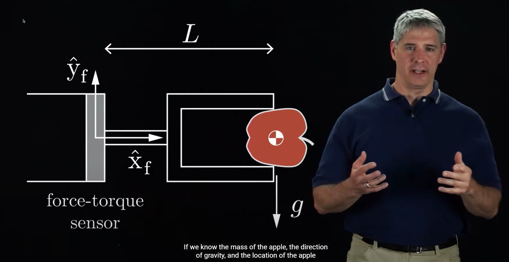
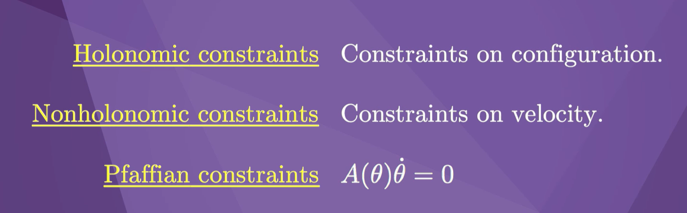
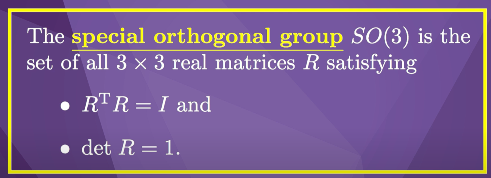
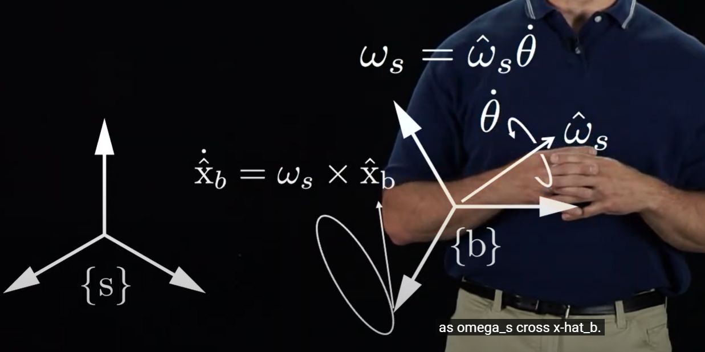
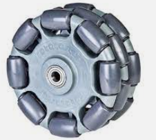
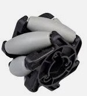

# Robotic Dynamics Studies - Chapter 1 - Preview

<iframe id="iframe" src="ModernRobotics_Chapter1.pdf#view=fitH" title="PDF loader" frameborder="0" allowfullscreen></iframe>

> **What sets a robot apart from an automated machine is that it should be easily reprogrammable for different tasks. Different tasks require different motions, and it would be unreasonable to expect the user to specify the entire time-history of each joint for every task; clearly it would be desirable for the robot's control computer to "fill in the details" from a small set of task input data.**

## Fixed Base and Floating Base

The former category includes all kinds of robotic machines
that are rigidly bolted to the ground. The classical example are industrial robot arms. The latter category encompasses mobile systems, i.e. robots that have a moving base.

## Degree of Freedom (DOF)
In robotics, Degree of Freedom (DOF) refers to the number of independent variables that are required to determine the position and orientation of an object in space. It is a measure of the number of ways in which the object can move.

## Kinematics
Kinematics is the description of the motion of points, bodies, and systems of bodies. It does only describe how things are moving, but **not** why.

## Rotation
While the configuration of a point is fully described by a position, bodies additionally require a rotation to define their **pose**.

## Actuation
Actuation is the process of converting energy into motion. In robotics, this is usually done by electric motors.

> Actuation of the joints, typically by electric motors, then causes the robot to move and exert forces in desired ways.

> The links are moved by actuators, which typically are electrically driven (e.g., by DC or AC motors, stepper motors, or shape memory alloys) but can also be driven by pneumatic or hydraulic cylinders.

> In the case of rotating electric motors, these would ideally be lightweight, operate at relatively low rotational speeds (e.g., in the range of hundreds of RPM), and be able to generate large forces and torques.

## Backlash
Backlash refers to the amount of play or clearance between two mechanical components in a robotic system. It is the amount by which a component can move before it contacts or engages with another component.

## Revolute and prismatic joint
The most common joints are revolute and prismatic joints. Revolute joints are also called rotary joints or pin joints. Prismatic joints are also called translational joints.

## Potentiometer
A potentiometer, also known as a pot, is an electronic component commonly used in robotics and other electronic systems. It is a variable resistor that can be used to control the voltage or current flowing through a circuit.

## Resolver
A resolver is an electrical device commonly used in robotics and other motion control systems to provide position feedback for rotary motion. It is a type of rotary transformer that converts the mechanical motion of a shaft into electrical signals that can be used by a controller to accurately determine the position and orientation of the shaft.

## Tachometer
A tachometer, also known as a tach, is an electronic device used to measure the speed or rotational velocity of a mechanical component, such as a motor or shaft. It is commonly used in robotics and other motion control systems to provide feedback on the speed of a motor or other rotating component.

## RGB-D Camera
> RGB-D cameras which measure the color (RGB) and depth (D) to each pixel

## Degrees of freedom (dof) 
The number of degrees of freedom (dof) of a mechanical system is the number of independent parameters that define its configuration. It is the number of parameters that determine the state of a physical system and is important to the analysis of systems of bodies in mechanical engineering, aeronautical engineering, robotics, and structural engineering.

## Twist
Also known as spatial velocities.

## Wrench (扳手)
Also known as spatial forces. 

## Constraints
A constraint is a restriction on the degrees of freedom of a mechanical system.

## Orthogonality

## Velocity kinematics
Velocity kinematics refers to the relationship between the joint linear and angular velocities and those of the end-effector frame.

> By multiplying the vector of joint-velocity rates by this configuration-dependent matrix, the twist of the end-effector frame can be obtained for any given robot configuration.

## Singularities
Kinematic singularities, which are configurations in which the end-effector frame loses the ability to move or rotate in one or more directions, correspond to those configurations at which the Jacobian matrix fails to have maximal rank.

## Angular velocity

## Exponential coordinates of rotation 
Exponential coordinates of rotation are a mathematical representation of a rotational movement that allows for easy computation of the resulting orientation. They are commonly used in robotics and computer graphics to represent the orientation of objects and to perform operations such as rotation, translation, and scaling.

## Inverse kinematics
The inverse kinematics problem is to determine the set of joint positions that achieves a desired end-effector configuration.

> For a given set of joint positions there usually exists a unique end-effector position and orientation but, for a particular end-effector position and orientation, there may exist multiple solutions to the joint positions, or no solution at all.

## Kinematically redundant ->** pseudoinverse** of the Jacobian
> If the open-chain robot is kinematically redundant, meaning that it has more joints than the dimension of the task space, then we use the **pseudoinverse** of the Jacobian.

## Kinematics of closed chains
> **While open chains have unique forward kinematics solutions, closed chains often have multiple forward kinematics solutions, and sometimes even multiple solutions for the inverse kinematics as well.** Also, because closed chains possess both actuated and passive joints, the kinematic singularity analysis of closed chains presents subtleties not encountered in open chains.

## Dynamics
> Dynamics is the study of motion taking into account the forces and torques that cause it. In analogy to the notions of a robot's forward and inverse kinematics, the forward dynamics problem is to determine the resulting joint accelerations for a given set of joint forces and torques. The inverse dynamics problem is to determine the input joint torques and forces needed for desired joint accelerations.

The dynamics for an open-chain robot can be derived using one of two approaches:

 - In the Lagrangian approach, first a set of coordinates - referred to as generalized coordinates in the classical dynamics literature - is chosen to parametrize the configuration space. The sum of the potential and kinetic energies of the robot's links are then expressed in terms of the generalized coordinates and their time derivatives. These are then substituted into the Euler-Lagrange equations, which then lead to a set of second-order differential equations for the dynamics, expressed in the chosen coordinates for the configuration space.
 - The Newton-Euler approach builds on the generalization of f = ma, i.e., the equations governing the acceleration of a rigid body given the wrench acting on it. Given the joint variables and their time derivatives, the Newton-Euler approach to inverse dynamics is: to propagate the link velocities and accelerations outward from the proximal link to the distal link, in order to determine the velocity and acceleration of each link; to use the equations of motion for a rigid body to calculate the wrench (and therefore the joint force or torque) that must be acting on the outermost link; and to proceed along the links back toward the base of the robot, calculating the joint forces or torques needed to create the motion of each link and to support the wrench transmitted to the distal links. Because of the open-chain structure, the dynamics can be formulated recursively.

## Trajectory generation
> **What sets a robot apart from an automated machine is that it should be easily reprogrammable for different tasks.** Different tasks require different motions, and it would be unreasonable to expect the user to specify the entire time-history of each joint for every task; clearly it would be desirable for the robot's control computer to "fill in the details" from a small set of task input data.

## Robot Control
> A robot can act as a source of programmed motions for tasks. It can act as a source of forces

## Omniwheels and Mecanum wheels

