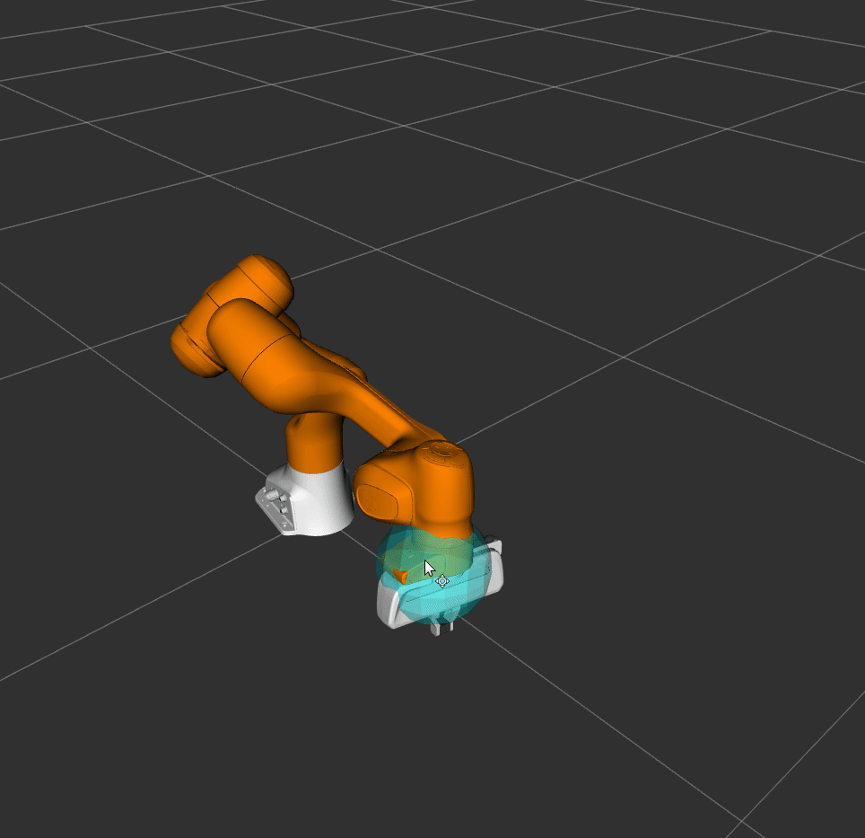
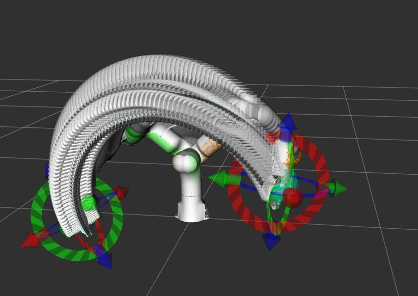
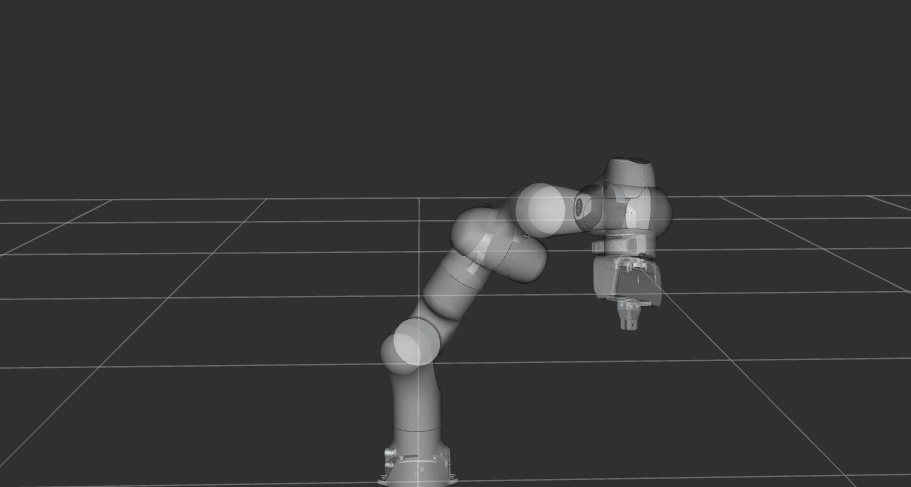
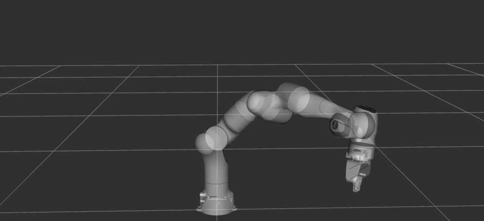

# Moveit Learning

Following the [official MoveIt tutorial](https://moveit.picknik.ai/humble/doc/tutorials/tutorials.html) to get to know the MoveIt package.

## Learning material

<iframe id="iframe" onload="adjustIframe();" src="moveit1.pdf#view=fitH" title="PDF loader" frameborder="0" allowfullscreen></iframe>

## Trial

## Show tail 

## Nullspace exploration

## Compare plan motion with cartesian path

(plan motion)

(cartesian path)
