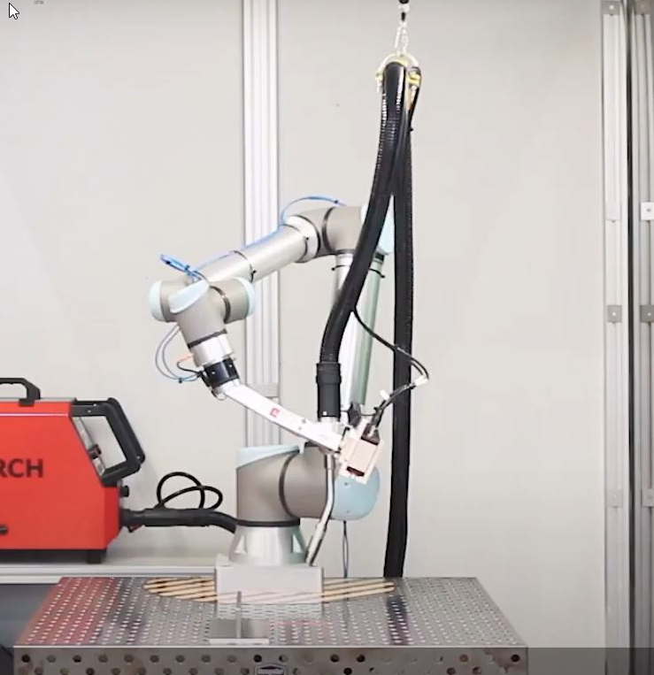

# Moveit Learning 2

- [Use UR in Moveit](#use-ur-in-moveit)
- [How to design your end effector](#how-to-design-your-end-effector)
- [Types of singularities](#types-of-singularities)
- [ROS install](#ros-install)
- [Moveit install](#moveit-install)
- [Using colcon to build packages](#using-colcon-to-build-packages)
- [MoveIt Setup Assistant](#moveit-setup-assistant)
- [Visualizing In RViz](#visualizing-in-rviz)
- [Planning Around Objects](#planning-around-objects)
- [Your First C++ MoveIt Project](#your-first-c-moveit-project)
- [Robot Model and Robot State](#robot-model-and-robot-state)
- [Pick and Place with MoveIt Task Constructor](#pick-and-place-with-moveit-task-constructor)


## Use UR in Moveit

```bash
ros2 launch ur_description view_ur.launch.py ur_type:=ur10
```


## How to design your end effector



## Types of singularities

<iframe id="iframe" onload="adjustIframe();" src="https://www.youtube.com/embed/L7J_9OSxGvA" title="YouTube video player" frameborder="0" allow="accelerometer; autoplay; clipboard-write; encrypted-media; gyroscope; picture-in-picture" allowfullscreen></iframe>


## ROS install

https://docs.ros.org/en/humble/Installation/Alternatives/Ubuntu-Development-Setup.html

## Moveit install

https://moveit.ros.org/install-moveit2/binary/

## Using colcon to build packages

https://docs.ros.org/en/humble/Tutorials/Beginner-Client-Libraries/Colcon-Tutorial.html

## MoveIt Setup Assistant

<iframe id="iframe" onload="adjustIframe();" src="moveit.picknik.ai-MoveIt Setup Assistant.pdf#view=fitH" title="PDF loader" frameborder="0" allowfullscreen></iframe>


## Visualizing In RViz

<iframe id="iframe" onload="adjustIframe();" src="moveit.picknik.ai-Visualizing In RViz.pdf#view=fitH" title="PDF loader" frameborder="0" allowfullscreen></iframe>

## Planning Around Objects

<iframe id="iframe" onload="adjustIframe();" src="moveit.picknik.ai-Planning Around Objects.pdf#view=fitH" title="PDF loader" frameborder="0" allowfullscreen></iframe>

## Your First C++ MoveIt Project

<iframe id="iframe" onload="adjustIframe();" src="moveit.picknik.ai-Your First C MoveIt Project.pdf#view=fitH" title="PDF loader" frameborder="0" allowfullscreen></iframe>

## Robot Model and Robot State

<iframe id="iframe" onload="adjustIframe();" src="moveit.picknik.ai-Robot Model and Robot State.pdf#view=fitH" title="PDF loader" frameborder="0" allowfullscreen></iframe>

## Pick and Place with MoveIt Task Constructor

<iframe id="iframe" onload="adjustIframe();" src="moveit.picknik.ai-Pick and Place with MoveIt Task Constructor.pdf#view=fitH" title="PDF loader" frameborder="0" allowfullscreen></iframe>
