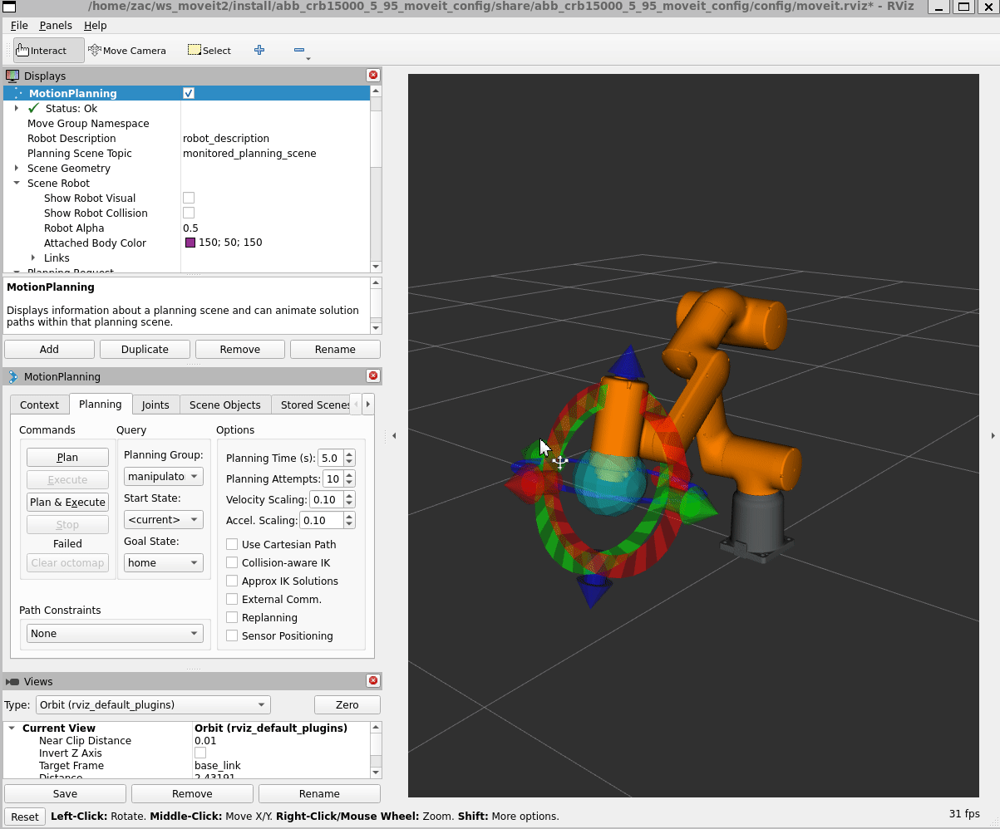
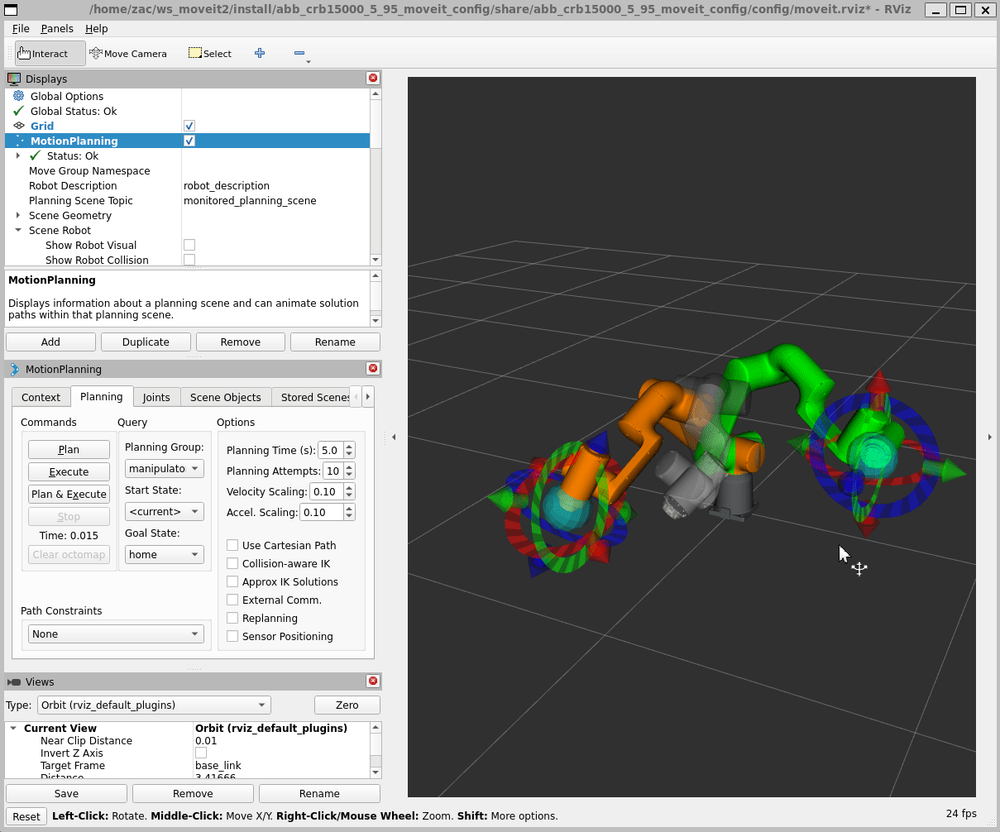
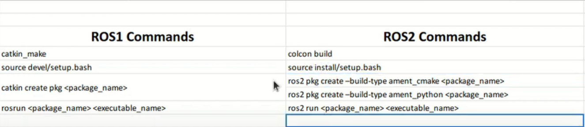
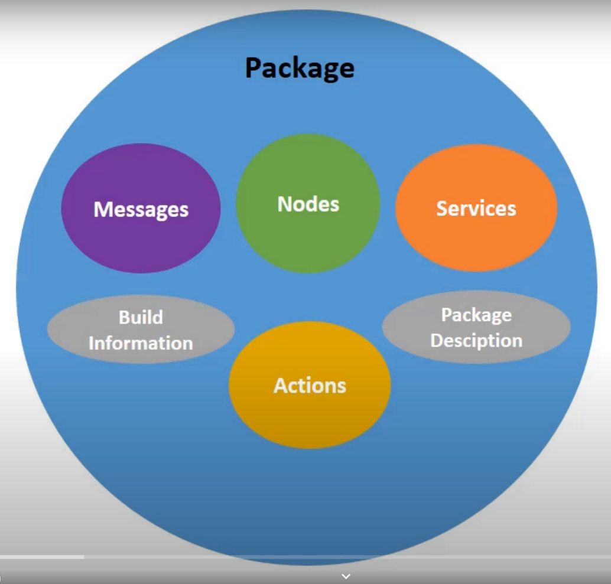
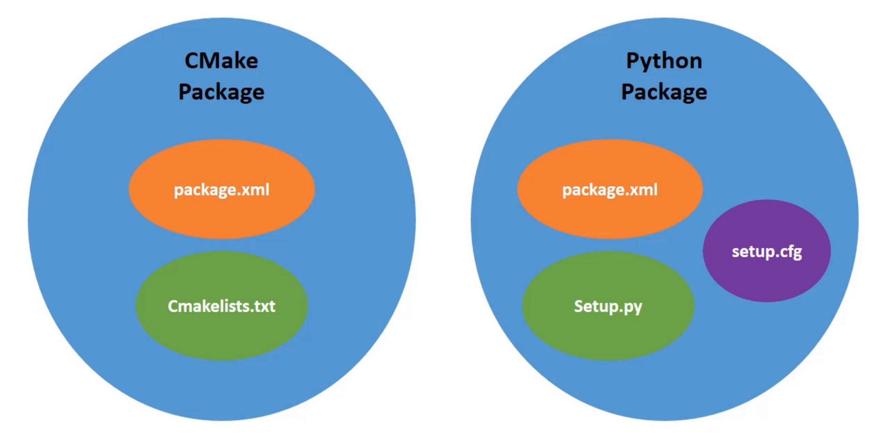

# MoveitLearning

- [abb\_irb4600\_40\_255 Robot](#abb_irb4600_40_255-robot)
- [GoFa Robot](#gofa-robot)
- [My First Launch File](#my-first-launch-file)
- [File format](#file-format)
- [Migration guide from ROS 1](#migration-guide-from-ros-1)


## abb_irb4600_40_255 Robot


## GoFa Robot




## My First Launch File

```Python
    from launch import LaunchDescription
    from launch.actions import DeclareLaunchArgument
    from launch_ros.actions import Node

    def generate_launch_description():
        model_args = DeclareLaunchArgument("model", default_value="$(find rfl_description)/urdf/rfl.urdf")
        gui_args = DeclareLaunchArgument("gui", default_value="True")
        rviz_args = DeclareLaunchArgument("rviz", default_value="$(find rfl_description)/rviz/urdf.rviz")

        joint_state_publisher_node = Node(
            package="joint_state_publisher",
            executable="joint_state_publisher",
            parameters=[{"robot_description": "$(find xacro)/xacro --inorder $(arg model)"}, {"use_gui": "$(arg gui)"}],
            output="screen",
        )

        robot_state_publisher_node = Node(package="robot_state_publisher", executable="robot_state_publisher", output="screen")

        rviz_node = Node(package="rviz2", executable="rviz2", arguments=["-d", "$(arg rviz2)"], output="screen")
        return LaunchDescription([model_args, gui_args, rviz_args, joint_state_publisher_node, robot_state_publisher_node, rviz_node])
```

## File format

SRDF:Semantic Robot Description Format
URDF:Unified Robot Description Format
SRDF: URDF + semantic information
XACRO: XML Macro


##  Migration guide from ROS 1






```C++
    int main(int argc, char *argv[])
    {
    // Initialize ROS and create a node.
    rclcpp::init(argc, argv);
    auto const node = std::make_shared<rclcpp::Node>(
        "hello_moveit",
        rclcpp::NodeOptions().automatically_declare_parameters_from_overrides(true));

    // Create a ROS logger
    auto const logger = rclcpp::get_logger("hello_moveit");

    // Next step goes here

    printf("I am Zac\n\n I think I am good at programming.\n\n But C++ and ROS is really hard for me.\n\n I am trying my best to learn it.\n\n I hope I can do it well.\n\n-----------------------------\n\n");
    // Shutdown ROS

    char c;
    do
    {
        printf("Press 'Enter' to continue\n");
        c = getchar();
    } while (c != '\n');
    printf("Continue\n");
    rclcpp::shutdown();

    return 0;
    }
```


```C++
    #include <cstdio>

    #include <memory>
    #include <moveit/move_group_interface/move_group_interface.h>

    int main(int argc, char *argv[])
    {
    // Initialize ROS and create a node.
    rclcpp::init(argc, argv);
    auto const node = std::make_shared<rclcpp::Node>(
        "hello_moveit",
        rclcpp::NodeOptions().automatically_declare_parameters_from_overrides(true));

    // Create a ROS logger
    auto const logger = rclcpp::get_logger("hello_moveit");

    //! Next step goes here
    using moveit::planning_interface::MoveGroupInterface;
    auto move_group_interface = MoveGroupInterface(node, "panda_arm");

    auto const target_pose = []
    {
        geometry_msgs::msg::Pose target_pose;
        target_pose.position.x = 0.5;
        target_pose.position.y = 0.0;
        target_pose.position.z = 0.5;
        target_pose.orientation.w = 1.0;
        return target_pose;
    }();

    move_group_interface.setPoseTarget(target_pose);

    auto const [success, plan] = [&move_group_interface]
    {
        moveit::planning_interface::MoveGroupInterface::Plan msg;
        auto const ok = static_cast<bool>(move_group_interface.plan(msg));
        return std::make_pair(ok, msg);
    }();

    // Execute the plan
    if (success)
    {
        move_group_interface.execute(plan);
    }
    else
    {
        RCLCPP_ERROR(logger, "Planing failed!");
    }

    // Shut down ROS
    rclcpp::shutdown();
    return 0;
    }
```