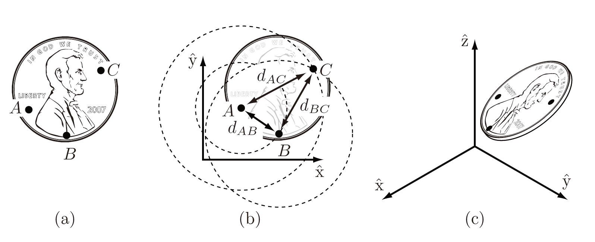
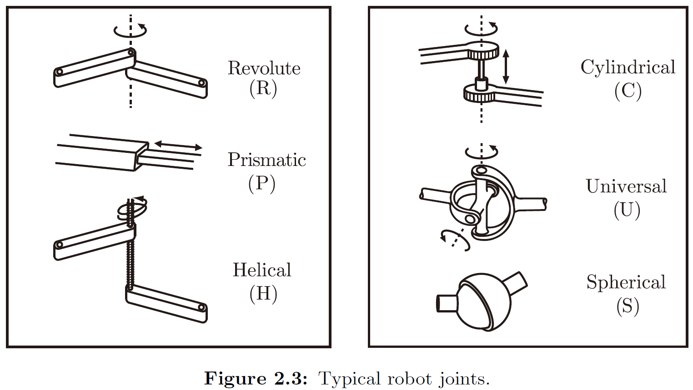

# Modern Robotics Studies 2

## Degrees of Freedom

> Assume our coin is no longer confined to the table (Figure 2.2(c)). The coordinates for the three points A, B, and C are now given by (xA; yA; zA), (xB; yB; zB), and (xC; yC; zC), respectively. Point A can be placed freely (three degrees of freedom). The location of point B is subject to the constraint d(A;B) = dAB, meaning it must lie on the sphere of radius dAB centered at A. Thus we have 3-1 = 2 freedoms to specify, which can be expressed as the latitude and longitude for the point on the sphere. Finally, the location of point C must lie at the intersection of spheres centered at A and B of radius dAC and dBC, respectively. In the general case the intersection of two spheres is a circle, and the location of point C can be described by an angle that parametrizes this circle. Point C therefore adds 3 - 2 = 1 freedom. Once the position of point C is chosen, the coin is fixed in space. 

- Above is the reason for SIX DEGREES OF FREEDOM.

**degrees of freedom = (sum of freedoms of the bodies) - (number of independent constraints):**

## Typical robot joints

