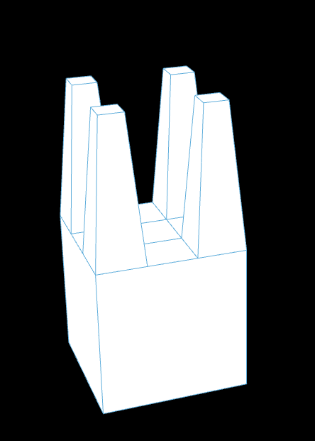
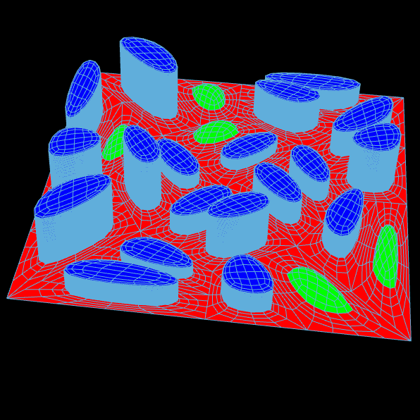

# MAS dfab - Week 3-4 - Robotic Dancing, Robotic Drawing, Generative City

---

- [L-System](#l-system)
- [Mola face](#mola-face)
- [Mola color](#mola-color)
- [Mola subdivision](#mola-subdivision)
- [Mola extrude](#mola-extrude)
- [Mola offset](#mola-offset)
- [Mola exercise 1](#mola-exercise-1)
- [Mola exercise 2](#mola-exercise-2)
- [Mola group](#mola-group)
- [Mola exercise 3](#mola-exercise-3)

---

## L-System

```Python
    import Rhino.Geometry as rg
    import math


    rule1_predecessor = "X"
    rule1_successor = "F+[[X]-X]-F[-FX]+X"
    rule2_predecessor = "F"
    rule2_successor = "FF"


    genotype = "X"


    for i in range(iterations):
        genotype = genotype.replace(rule1_predecessor, rule1_successor)
        genotype = genotype.replace(rule2_predecessor, rule2_successor)

    vt = rg.Point3d(0,0,0)

    vertices = []
    angles = []
    lines = []

    for c in genotype:
        if c == "+":
            # Turn right
            angle -= rotation
        elif c == "-":
            # Turn left
            angle += rotation
        elif c == "F":
            # Forward
            rad = math.radians(angle)
            next_vt = rg.Point3d(length*math.cos(rad) + vt.X, length*math.sin(rad) + vt.Y, 0)
            lines.append(rg.Line(vt, next_vt))

            vt = next_vt

        elif c == "[":
            # Save position
            vertices.append(vt)
            angles.append(angle)
        elif c == "]":
            # Restore position
            vt = vertices.pop()
            angle = angles.pop()


    L_system = lines
```

## Mola face

```python
    import mola
    from mola import module_rhino

    # Create an empty mesh
    m = mola.Mesh()

    # Define vertices
    a = mola.Vertex(0, 0, 0)
    b = mola.Vertex(15, 0, 0)
    c = mola.Vertex(15, 10, 0)
    d = mola.Vertex(0, 10, 0)

    # Add vertices to mesh
    vertices = [a, b, c, d]
    m.vertices = vertices

    # print(m.vertices)

    f = mola.Face([a,b,c,d])
    f.color = (0.6,0.6,0.6,1)
    m.faces.append(f)

    Mesh = module_rhino.display_mesh(m)
```

## Mola color

```python
    import mola

    # m = mola.construct_icosahedron(Radius)
    # Mesh = module_rhino.display_mesh(m)


    torus = mola.construct_torus(Radius, Radius2)

    mola.color_faces_by_curvature(torus.faces)
    # mola.color_faces_by_compactness(torus.faces)
    # mola.color_faces_by_area(torus.faces)

    Mesh = mola.module_rhino.display_mesh(torus)

    spheres = []
    for v in torus.vertices:
        radius = mola.math_map(v.z, -4, 4, 0.05, 0.5)
        s = mola.construct_sphere(radius, v.x, v.y, v.z,9, 9)
        temp = mola.module_rhino.display_mesh(s)
        spheres.append(temp)

    Spheres = spheres

```

## Mola subdivision

https://en.wikipedia.org/wiki/Catmull%E2%80%93Clark_subdivision_surface

```Python
    molaMesh = mola.subdivide_mesh_catmull(molaMesh)
```

## Mola extrude

```python
    molaMesh = mola.subdivide_mesh_extrude_tapered(molaMesh, faceAngles, fractions, doCaps)
```

## Mola offset

```python
    molaMesh = mola.mesh_offset(molaMesh, 0.1)
```

## Mola exercise 1

```python
    import mola
    import math
    import Rhino.Geometry as rg

    molaMesh = mola.construct_sphere(radius=5, u_res=8, v_res=8)

    for v in molaMesh.vertices:
        if v.z > 0:
            v.z *= 1.8

    molaMesh = mola.subdivide_mesh_catmull(molaMesh)

    # Get height value
    faceAngles = molaMesh.face_properties(mola.face_angle_vertical)
    # print (faceAngles)
    for i in range(len(faceAngles)):
        faceAngles[i] = abs(math.pi - abs(faceAngles[i]))
    faceAngles = mola.math_map_list(faceAngles, 0.1, 3)

    # Get fractions
    zPositions = molaMesh.face_properties(mola.face_center_z)
    fractions = mola.math_map_list(zPositions, 0.9, 0.1)

    doCaps = [True] * len(molaMesh.faces)
    for i in range(len(zPositions)):
        if zPositions[i] > 0.2:
            doCaps[i] = False

    molaMesh = mola.subdivide_mesh_extrude_tapered(molaMesh, faceAngles, fractions, doCaps)

    molaMesh = mola.subdivide_mesh_catmull(molaMesh)
    molaMesh = mola.subdivide_mesh_catmull(molaMesh)

    molaMesh = mola.mesh_offset(molaMesh, 0.1)

    mola.color_faces_by_horizontal_angle(molaMesh.faces)

    Mesh = mola.module_rhino.display_mesh(molaMesh)

    # outTemp = []
    # for face in molaMesh.faces:
    # outTemp.append(rg.Point3d(mola.face_center(face).x, mola.face_center(face).y, mola.face_center(face).z))

```

## Mola exercise 2



```python
    import Rhino.Geometry as rg
    import mola

    mMesh = mola.construct_box(0,0,0,10,10,10)


    dividedMeshes = mola.subdivide_face_split_grid(mMesh.faces[1], 3, 3)

    dividedMeshes.extend( mola.subdivide_face_extrude_tapered(dividedMeshes[0], 10))
    dividedMeshes.extend( mola.subdivide_face_extrude_tapered(dividedMeshes[2], 10))
    dividedMeshes.extend( mola.subdivide_face_extrude_tapered(dividedMeshes[6], 10))
    dividedMeshes.extend( mola.subdivide_face_extrude_tapered(dividedMeshes[8], 10))

    dividedMeshes.pop(0)
    dividedMeshes.pop(1)
    dividedMeshes.pop(4)
    dividedMeshes.pop(5)

    mMesh.faces.pop(1)
    mMesh.faces.extend(dividedMeshes)

    Faces = mola.module_rhino.display_faces([mMesh.faces[1]])
    Mesh = mola.module_rhino.display_mesh(mMesh)
```

## Mola group

```python
    for face in mMesh.faces:
        face.group = "plot"
```

## Mola exercise 3



```python
    import mola
    import random
    import Rhino.Geometry as rg

    mMesh = mola.construct_single_face(
        [mola.Vertex(0, 0, 0), mola.Vertex(10, 0, 0), mola.Vertex(10, 10, 0), mola.Vertex(0, 10, 0)]
    )

    newMesh = mola.Mesh()

    for face in mMesh.faces:
        newFaces = mola.subdivide_face_extrude_to_point_center(face, 0)
        newMesh.faces.extend(newFaces)

    mMesh = newMesh
    mMesh.update_topology()
    mMesh = mola.subdivide_mesh_catmull(mMesh)

    newMesh = mola.Mesh()
    for face in mMesh.faces:
        newFaces = mola.subdivide_face_split_grid(face, 2, 1)
        newMesh.faces.extend(newFaces)

    mMesh = newMesh


    for face in mMesh.faces:
        face.group = "plot"

    newMesh = mola.Mesh()
    for f in mMesh.faces:
        if f.group == "plot":
            new_faces = mola.subdivide_face_extrude_tapered(f, 0, 0.3, True)
            for nf in new_faces[:-1]:
                nf.group = "circulation"
                nf.color = (1, 0, 0)
            # [-1] is take the last element [:-1] is for taking all elements
            new_faces[-1].group = "construction"
            new_faces[-1].color = (0.5, 0, 1)
            newMesh.faces.extend(new_faces)
        else:
            newMesh.faces.append(f)


    mMesh = newMesh

    ########################################################################


    newMesh = mola.Mesh()
    for face in mMesh.faces:
        if face.group == "construction":
            if random.random() < 0.2:
                newFaces = mola.subdivide_face_extrude_to_point_center(face, 1)
                for newFace in newFaces:
                    newFace.group = "park"
                    newFace.color = (0, 1, 0)
                newMesh.faces.extend(newFaces)
            else:
                floorNumber = random.randint(5, 20)
                buildingSurface = [face]
                for i in range(floorNumber):
                    buildingSurface.extend(mola.subdivide_face_extrude(buildingSurface[-1], 0.1, False))
                    buildingSurface.pop(-6)
                for newFace in buildingSurface:
                    newFace.group = "building"
                    newFace.color = (0, 0, 1)
                newMesh.faces.extend(buildingSurface)


        newMesh.faces.append(face)

    newMesh.update_topology()
    newMesh = mola.subdivide_mesh_catmull(newMesh)
    newMesh = mola.subdivide_mesh_catmull(newMesh)

    mMesh = newMesh

    Mesh = mola.module_rhino.display_mesh(mMesh)
```