# MAS dfab - Week 5 - Generative City

---

Content

- [Axolotl Subtract](#axolotl-subtract)
- [Axolotl Addition](#axolotl-addition)
- [Axolotl Blend](#axolotl-blend)
- [Axolotl Practice](#axolotl-practice)
- [An interesting note](#an-interesting-note)
- [Processing mandelbrot set](#processing-mandelbrot-set)
- [From processing, do mandelbrot set in Rhino](#from-processing-do-mandelbrot-set-in-rhino)
- [Marching cubes](#marching-cubes)
- [Fractal Facade](#fractal-facade)
- [Python read/write](#python-readwrite)

---

## Axolotl Subtract


## Axolotl Addition


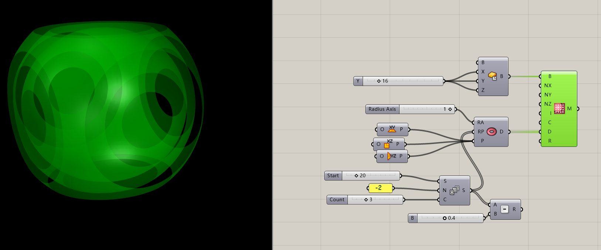

## Axolotl Blend

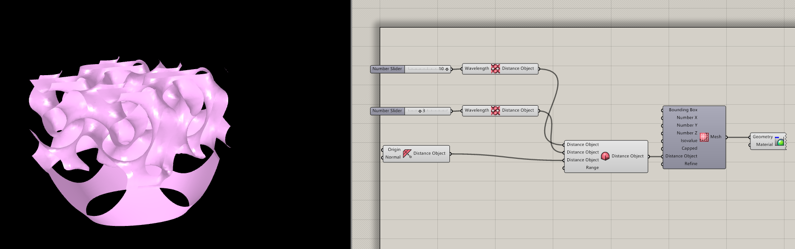

## Axolotl Practice


## An interesting note

```Python
    import math
    print (math.sin(30)) #-0.988031624093
    print (math.sin(-18.849556))
    # Python: The outcome is -7.846124032502473e-08
```

```Csharp
    A = Math.Sin(30);//-0.988032
    A = Math.Sin(-18.849556);
    // Csharp: The outcome is -7.8461e-8
```

```java
    println(sin(30)); //-0.9880316
    println(sin(-18.849556));
    // Java: The outcome is -4.7699523E-8
```

## Processing mandelbrot set


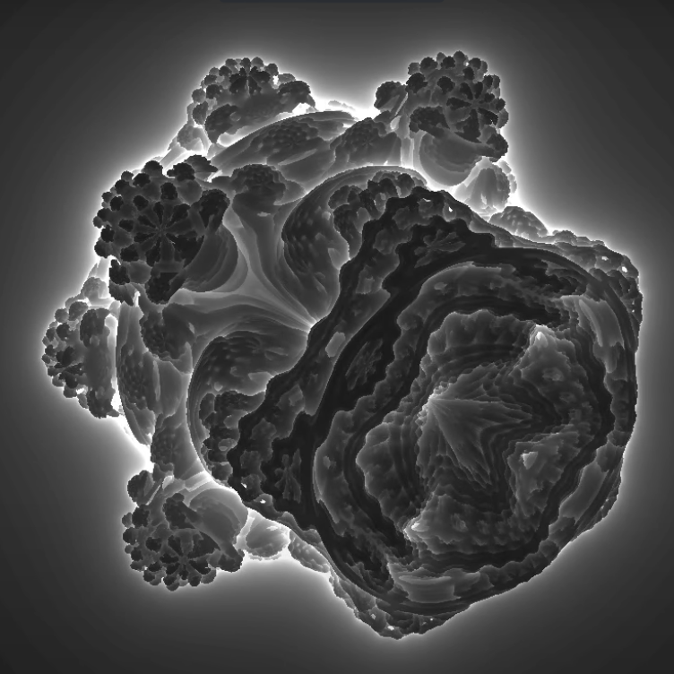
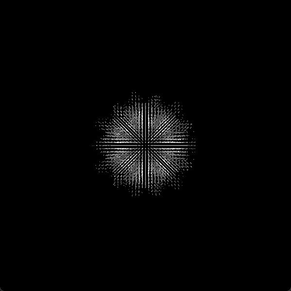

```Java
    import peasy.*;
    int DIM = 32;
    PeasyCam cam;
    PrintWriter output;

    ArrayList<PVector> mandelbrot = new ArrayList<PVector>();
    // ArrayList<PVector> outMandelbrot = new ArrayList<PVector>();
    int outData[image][image][image] = new int[DIM][DIM][DIM];

    class Spherical{
        float r, theta, phi;
        Spherical(float r, float theta, float phi) {
            this.r = r;
            this.theta = theta;
            this.phi = phi;
        }
    }

    Spherical spherical(float x, float y, float z) {
        float r = sqrt(x * x + y * y + z * z);
        float theta = atan2(sqrt(x * x + y * y), z);
        float phi = atan2(y,x);
        return new Spherical(r, theta, phi);
    }


    void setup() {
        size(600, 600, P3D);

        cam = new PeasyCam(this, 500);
        // !output
        // output = createWriter("C:/Users/Zac/Desktop/positions.txt");

        // Ball
        for (int i = 0; i < DIM; i++) {
            for (int j = 0; j < DIM; j++) {
                boolean edge = false;
                for (int k = 0; k < DIM; k++) {
                    float x = map(i, 0,DIM, -1,1);
                    float y = map(j, 0,DIM, -1,1);
                    float z = map(k, 0,DIM, -1,1);

                    PVector zeta = new PVector(0,0,0);


                    int interation = 0;
                    int maxInteration = 10;

                    int n = 8;

                    while(true) {

                        Spherical sphericalZ = spherical(zeta.x,zeta.y,zeta.z);
                        float newx = pow(sphericalZ.r,n) * sin(sphericalZ.theta * n) * cos(sphericalZ.phi * n);
                        float newy = pow(sphericalZ.r,n) * sin(sphericalZ.theta * n) * sin(sphericalZ.phi * n);
                        float newz = pow(sphericalZ.r,n) * cos(sphericalZ.theta * n);

                        zeta.x = newx + x;
                        zeta.y = newy + y;
                        zeta.z = newz + z;

                        interation++;

                        if (sphericalZ.r > 16) {
                            if (edge)edge = false;
                            // println (i+"x"+j+"x"+k);
                            // outMandelbrot.add(new PVector(100 * x, 100 * y, 100 * z));
                            outData[i][j][k] = 0;
                            // output.println(outData[i][j][k]);
                            break;
                        }

                        if (interation > maxInteration) {
                            //println (i+"x"+j+"x"+k);
                            // if (!edge)
                            // {
                            // edge = true;

                            // println(new PVector(100 * x, 100 * y, 100 * z));
                        // }
                            // stroke(255, 255, 255);
                            mandelbrot.add(new PVector(100 * x, 100 * y, 100 * z));
                            outData[i][j][k] = 1;
                            // output.println(outData[i][j][k]);
                            break;
                        }

                    }
                }
            }
        }


        // println(t);
        // println ( DIM*DIM*DIM);
        // println (mandelbrot.size()+outMandelbrot.size());
    }

    void draw() {
        background(0);
        stroke(255, 255,255);
        for (PVector v : mandelbrot) {
            point(v.x, v.y, v.z);
        }
    }

    // void keyPressed() {
    //     output.flush(); // Writes the remaining data to the file
    //     output.close(); // Finishes the file
    //     exit(); // Stops the program
    // }

```

## From processing, do mandelbrot set in Rhino

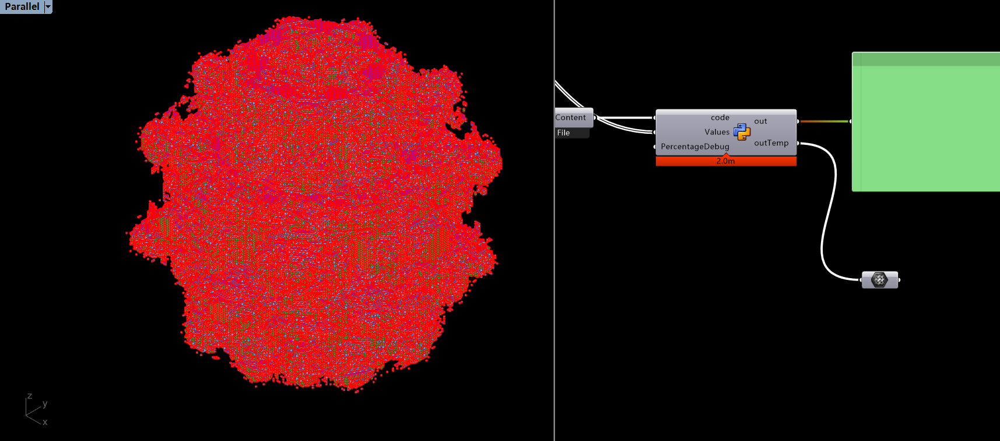

```Python

    import mola
    import math
    from mola import module_rhino
    from ghpythonlib import treehelpers

    dim = int(math.floor(len(Values) ** (1 / 3) + 0.0001))


    # ! Too tree
    facesArray = [image]
    lineArray = [image]
    for i in range(dim):
        facesArray.append(Values[dim*dim * i : dim*dim * (i + 1)])

    for face in facesArray:
        tempArray = [image]
        for i in range(dim):
            tempArray.append(face[dim * i : dim * (i + 1)])
        lineArray.append(tempArray)
    # ! End to tree

    for i in range(dim):
        for j in range(dim):
            for k in range(dim):
                lineArray[0][j][k]=0
                lineArray[-1][j][k] =0
                lineArray[i][0][k]=0
                lineArray[i][-1][k] =0
                lineArray[i][j][0]=0
                lineArray[i][j][-1] =0


    # ! Too list
    values = [image]
    for i in range(dim):
        for j in range(dim):
            for k in range(dim):
                values.append(lineArray[i][j][k] )
    # x = treehelpers.list_to_tree(lineArray)

    # print (len(values))
    cubes = mola.mesh_marching_cubes(dim, dim, dim, values, 0.5)
    cubes.update_topology()
    mola.color_faces_by_vertical_angle(cubes.faces)

    outTemp = module_rhino.display_mesh(cubes)

```

## Marching cubes


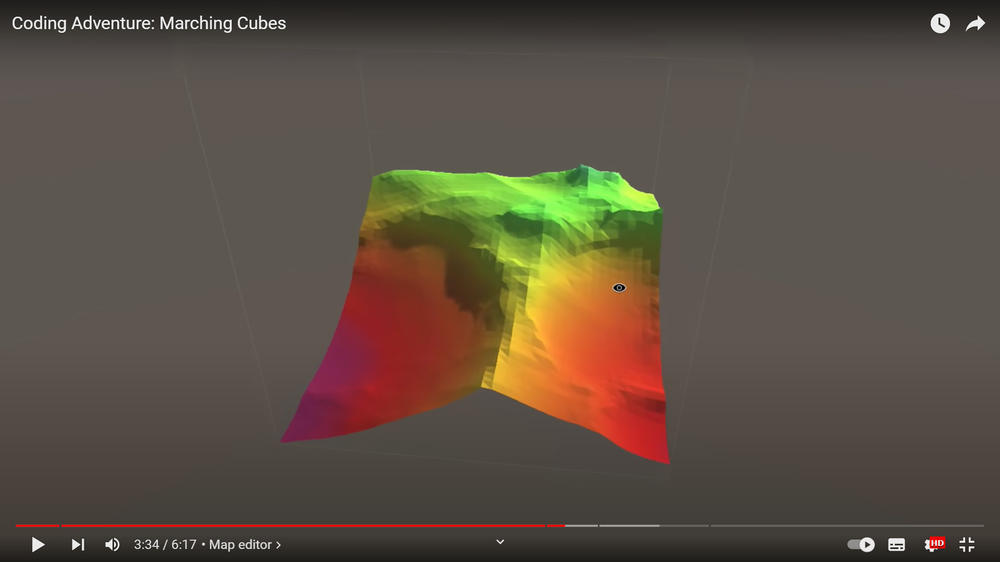
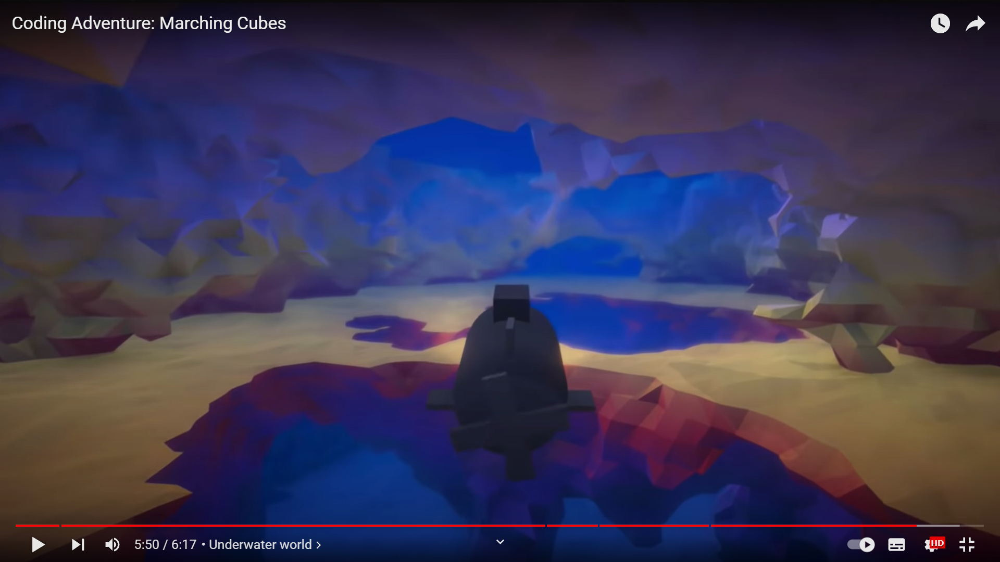

## Fractal Facade

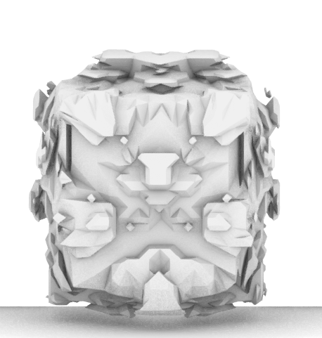
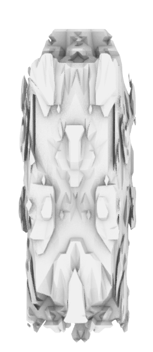
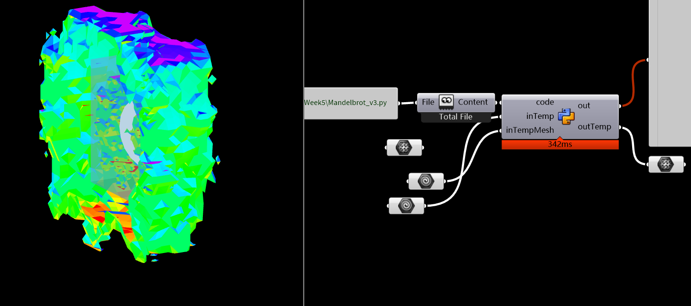

```Python
import mola
from mola import module_rhino
import Rhino.Geometry as rg
import Rhino.Geometry.Intersect as intersection
import zorse

theMesh = module_rhino.mesh_from_rhino_mesh(inTemp)
for vertex in theMesh.vertices:
    ray = rg.Ray3d(rg.Point3d(0, 0, 0), rg.Vector3d(vertex.x, vertex.y, vertex.z))
    intersectionPoint = intersection.Intersection.MeshRay(inTempMesh, ray)
    # print(type(intersectionPoint))

    intersectionPoint = ray.PointAt(intersectionPoint)  # type: ignore
    vertex.x = intersectionPoint.X + vertex.x
    vertex.y = intersectionPoint.Y + vertex.y
    vertex.z = intersectionPoint.Z + vertex.z
    # print(intersectionPoint)


theMesh.update_topology()
mola.color_faces_by_vertical_angle(theMesh.faces)

outTemp = module_rhino.display_mesh(theMesh)

```

## Python read/write

```Python
html = open(file_path, "r", encoding="utf-8")
htmlTexts = html.read()

html = open(file_path, "w", encoding="utf-8")
html.write(htmlTexts)

DIM32 = r"C:\Zac\19 Github\Notes\MASdfab-Week5\DIM32.csv"
DIM64 = r"C:\Zac\19 Github\Notes\MASdfab-Week5\DIM64.csv"
DIM128 = r"C:\Zac\19 Github\Notes\MASdfab-Week5\DIM128.csv"
data = []
with open(DIM32)as f:
    reader = csv.reader(f)
    # headers = next(reader)
    # print(headers)
    for row in reader:
        data.append(row)
```

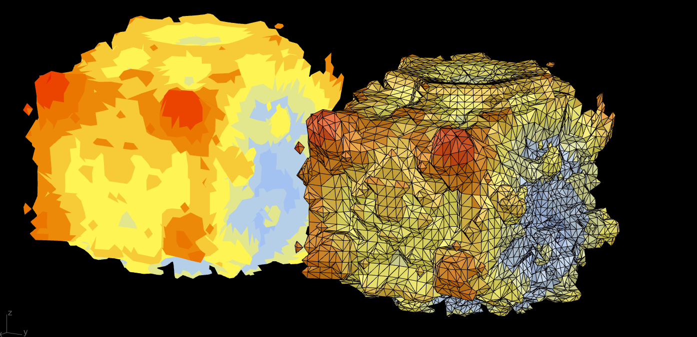
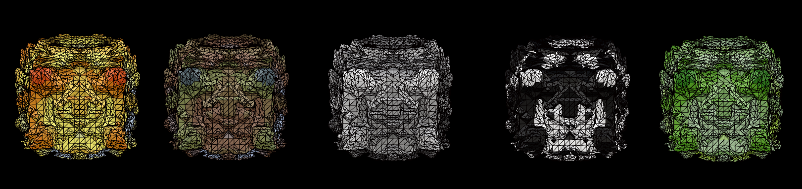

```Python
import mola
from mola import module_rhino
import Rhino.Geometry as rg
import Rhino.Geometry.Intersect as intersection
import zorse
import csv
import math


def Distance(vertex1, vertex2):
    return math.pow(
        math.pow(vertex1.x - vertex2.x, 2)
        + math.pow(vertex1.y - vertex2.y, 2)
        + math.pow(vertex1.z - vertex2.z, 2),
        0.5,
    )


DIM32 = r"C:\Zac\19 Github\Notes\MASdfab-Week5\DIM32.csv"
DIM64 = r"C:\Zac\19 Github\Notes\MASdfab-Week5\DIM64.csv"
DIM128 = r"C:\Zac\19 Github\Notes\MASdfab-Week5\DIM128.csv"

data = []
with open(DIM32) as f:
    reader = csv.reader(f)
    # headers = next(reader)
    # print(headers)
    for row in reader:
        data.extend(row)


dim = int(math.floor(len(data) ** (1 / 3) + 1))
# print (dim)
# print (len(data)** (1 / 3))

# ! Too tree
facesArray = []
lineArray = []
for i in range(dim):
    facesArray.append(data[dim * dim * i : dim * dim * (i + 1)])

for face in facesArray:
    tempArray = []
    for i in range(dim):
        tempArray.append(face[dim * i : dim * (i + 1)])
    lineArray.append(tempArray)
# ! End to tree

for i in range(dim):
    for j in range(dim):
        for k in range(dim):
            lineArray[0][j][k] = 0
            lineArray[-1][j][k] = 0
            lineArray[i][0][k] = 0
            lineArray[i][-1][k] = 0
            lineArray[i][j][0] = 0
            lineArray[i][j][-1] = 0


# ! Too list
values = []
for i in range(dim):
    for j in range(dim):
        for k in range(dim):
            values.append(int(lineArray[i][j][k]))

cubes = mola.mesh_marching_cubes(dim, dim, dim, values, 0.5)

# Marching cubes mesh to the center
for vertex in cubes.vertices:
    vertex.x = vertex.x - dim / 2
    vertex.y = vertex.y - dim / 2
    vertex.z = vertex.z - dim / 2


# Get the minimal distance
Center = mola.Vertex(0, 0, 0)
distance = Distance(Center, cubes.vertices[0])
for vertex in cubes.vertices:
    if Distance(Center, vertex) <= distance:
        distance = Distance(Center, vertex)


for vertex in cubes.vertices:
    vec = rg.Vector3d(vertex.x, vertex.y, vertex.z)
    vec.Unitize()
    ray = rg.Ray3d(rg.Point3d(0, 0, 0), vec)
    intersectionPoint = intersection.Intersection.MeshRay(inTemp, ray)

    intersectionPoint = ray.PointAt(intersectionPoint - distance)  # type: ignore
    vertex.x = intersectionPoint.X + vertex.x
    vertex.y = intersectionPoint.Y + vertex.y
    vertex.z = intersectionPoint.Z + vertex.z

# Roughness
for vertex in cubes.vertices:
    vec = rg.Vector3d(vertex.x, vertex.y, vertex.z)
    vec.Unitize()
    ray = rg.Ray3d(rg.Point3d(0, 0, 0), vec)
    intersectionPoint = intersection.Intersection.MeshRay(inTemp, ray)
    intersectionPoint = ray.PointAt(intersectionPoint)  # type: ignore
    vertex.x += (vertex.x - intersectionPoint.X) * xRoughness
    vertex.y += (vertex.y - intersectionPoint.Y) * yRoughness
    vertex.z += (vertex.z - intersectionPoint.Z) * zRoughness

cubes.update_topology()

# Color code
colorPara = []
greatestNumber = 0
smallestNumber = 10**10
for face in cubes.faces:
    para = Distance(face.center(), Center)
    colorPara.append(para)
    if para > greatestNumber:
        greatestNumber = para
    if para < smallestNumber:
        smallestNumber = para

colors = []
for i in range(len(colorPara)):
    para = int((colorPara[i] - smallestNumber) / (greatestNumber - smallestNumber) * 10)
    colors.append([Colors[para].R/255, Colors[para].G/255, Colors[para].B/255])
    cubes.faces[i].color =colors [i]


outTemp = module_rhino.display_mesh(cubes)

```

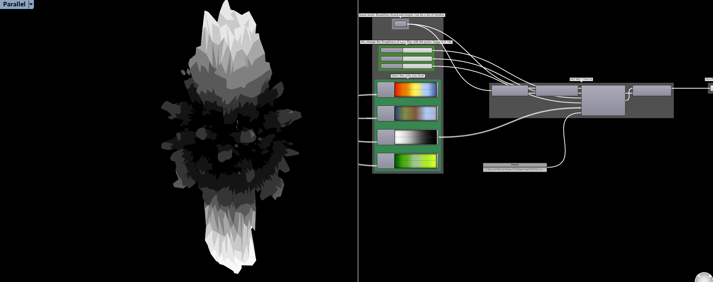
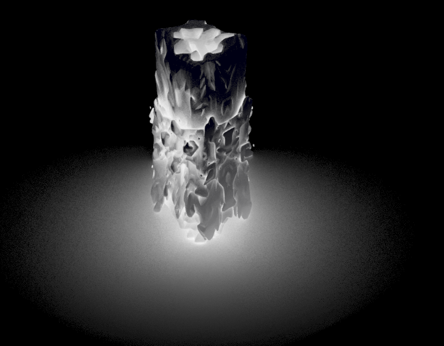
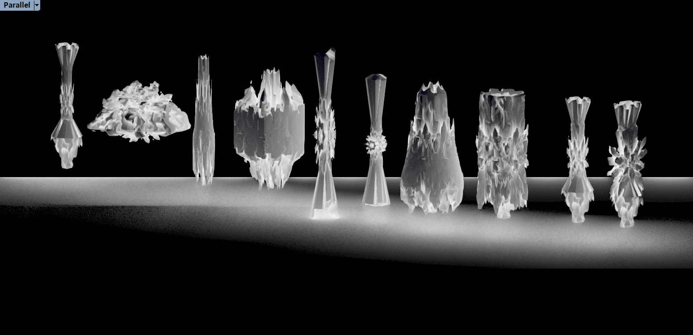
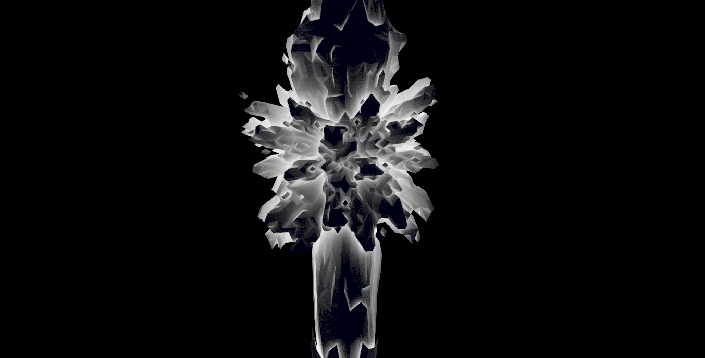
