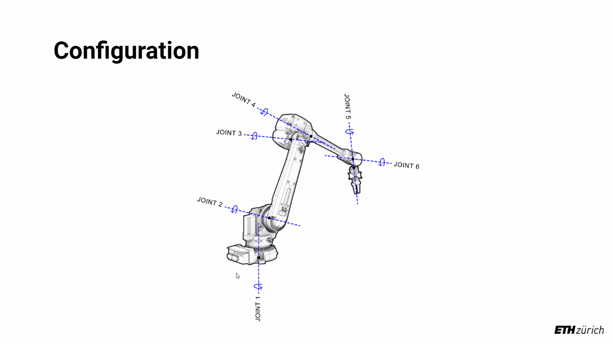

# MAS dfab - Week 6 - Compas and Endless Wall

---

Contents

- [Tip: quick loop variable assign](#tip-quick-loop-variable-assign)
- [Print grasshopper file location](#print-grasshopper-file-location)
- [Load json file](#load-json-file)
- [Write json file](#write-json-file)
- [Python dictionary](#python-dictionary)
- [Python dictionary tip](#python-dictionary-tip)
- [Compas installation](#compas-installation)
- [Initialize environment](#initialize-environment)
- [JSON load/loads](#json-loadloads)
- [Robotics](#robotics)

---

## Tip: quick loop variable assign

```python   
    originFrames =[c.plane_to_compas_frame(p) for p in ps]
```

## Print grasshopper file location

```Python
    ghCanvas = ghenv.Component.OnPingDocument()
    folder = os.path.dirname(ghCanvas.FilePath)
```

## Load json file

```python
    with open(os.path.join(folder, 'simple_spheres.json')) as file :
    myD = json.load(file)
```

## Write json file

```python
    with open(os.path.join(folder, "myFistItem"), "w") as file:
    myJ = json.dump(myJson, file, indent=2)
```

## Python dictionary

```python
    myList = []

    myDict = {}
    myDict = dict()


    # print(type(myDict))

    myList = [1, 2, 3, 4]

    myD = {"students": [], "robots": [], "chairs": []}
    # myD["laptops"] = True

    myD["robots"] = True, "abb", 6  # type: ignore
    myD["students"] = "XX", "YY", "ZZ"  # type: ignore


    for key, value in myD.items():
        print(key)
        print(value)
    # print(myD)
```

## Python dictionary tip

You can only output Dictionary keys, basically.

```python
   myD = {"students": [], "robots": [], "chairs": []}
   outTemp = myD
   # The output is [chairs, students, robots]
```

## Compas installation

```
    Windows PowerShell
    版权所有（C） Microsoft Corporation。保留所有权利。

    安装最新的 PowerShell，了解新功能和改进！https://aka.ms/PSWindows

    PS C:\Users\Zac> pip install cython --install-option="--no-cython-compile"
    WARNING: Disabling all use of wheels due to the use of --build-option / --global-option / --install-option.
    Collecting cython
    Downloading Cython-0.29.32.tar.gz (2.1 MB)
        ━━━━━━━━━━━━━━━━━━━━━━━━━━━━━━━━━━━━━━━━ 2.1/2.1 MB 6.0 MB/s eta 0:00:00
    Preparing metadata (setup.py) ... done
    Skipping wheel build for cython, due to binaries being disabled for it.
    Installing collected packages: cython
    Running setup.py install for cython ... done
    Successfully installed cython-0.29.32

    [notice] A new release of pip available: 22.2.2 -> 22.3
    [notice] To update, run: C:\Users\Zac\AppData\Local\Microsoft\WindowsApps\PythonSoftwareFoundation.Python.3.10_qbz5n2kfra8p0\python.exe -m pip install --upgrade pip
    PS C:\Users\Zac> pip install compas
    Collecting compas
    Downloading COMPAS-1.17.0-py2.py3-none-any.whl (5.2 MB)
        ━━━━━━━━━━━━━━━━━━━━━━━━━━━━━━━━━━━━━━━━ 5.2/5.2 MB 4.9 MB/s eta 0:00:00
    Collecting matplotlib>=3.1
    Downloading matplotlib-3.6.1-cp310-cp310-win_amd64.whl (7.2 MB)
        ━━━━━━━━━━━━━━━━━━━━━━━━━━━━━━━━━━━━━━━━ 7.2/7.2 MB 10.0 MB/s eta 0:00:00
    Collecting scipy>=1.1
    Downloading scipy-1.9.3-cp310-cp310-win_amd64.whl (40.1 MB)
        ━━━━━━━━━━━━━━━━━━━━━━━━━━━━━━━━━━━━━━━━ 40.1/40.1 MB 14.5 MB/s eta 0:00:00
    Collecting pycollada
    Downloading pycollada-0.7.2.tar.gz (107 kB)
        ━━━━━━━━━━━━━━━━━━━━━━━━━━━━━━━━━━━━━━━━ 107.6/107.6 kB ? eta 0:00:00
    Preparing metadata (setup.py) ... done
    Collecting typing-extensions
    Downloading typing_extensions-4.4.0-py3-none-any.whl (26 kB)
    Requirement already satisfied: cython in c:\users\zac\appdata\local\packages\pythonsoftwarefoundation.python.3.10_qbz5n2kfra8p0\localcache\local-packages\python310\site-packages (from compas) (0.29.32)
    Collecting watchdog
    Downloading watchdog-2.1.9-py3-none-win_amd64.whl (78 kB)
        ━━━━━━━━━━━━━━━━━━━━━━━━━━━━━━━━━━━━━━━━ 78.4/78.4 kB ? eta 0:00:00
    Collecting networkx
    Downloading networkx-2.8.7-py3-none-any.whl (2.0 MB)
        ━━━━━━━━━━━━━━━━━━━━━━━━━━━━━━━━━━━━━━━━ 2.0/2.0 MB 18.5 MB/s eta 0:00:00
    Collecting sympy
    Downloading sympy-1.11.1-py3-none-any.whl (6.5 MB)
        ━━━━━━━━━━━━━━━━━━━━━━━━━━━━━━━━━━━━━━━━ 6.5/6.5 MB 15.3 MB/s eta 0:00:00
    Collecting imageio>=2.7
    Downloading imageio-2.22.2-py3-none-any.whl (3.4 MB)
        ━━━━━━━━━━━━━━━━━━━━━━━━━━━━━━━━━━━━━━━━ 3.4/3.4 MB 21.5 MB/s eta 0:00:00
    Requirement already satisfied: pillow in c:\users\zac\appdata\local\packages\pythonsoftwarefoundation.python.3.10_qbz5n2kfra8p0\localcache\local-packages\python310\site-packages (from compas) (9.2.0)
    Collecting schema
    Downloading schema-0.7.5-py2.py3-none-any.whl (17 kB)
    Requirement already satisfied: numpy>=1.15.4 in c:\users\zac\appdata\local\packages\pythonsoftwarefoundation.python.3.10_qbz5n2kfra8p0\localcache\local-packages\python310\site-packages (from compas) (1.23.4)
    Collecting jsonschema
    Downloading jsonschema-4.16.0-py3-none-any.whl (83 kB)
        ━━━━━━━━━━━━━━━━━━━━━━━━━━━━━━━━━━━━━━━━ 83.1/83.1 kB 4.9 MB/s eta 0:00:00
    Collecting contourpy>=1.0.1
    Downloading contourpy-1.0.5-cp310-cp310-win_amd64.whl (164 kB)
        ━━━━━━━━━━━━━━━━━━━━━━━━━━━━━━━━━━━━━━━━ 164.1/164.1 kB 9.6 MB/s eta 0:00:00
    Collecting cycler>=0.10
    Downloading cycler-0.11.0-py3-none-any.whl (6.4 kB)
    Collecting kiwisolver>=1.0.1
    Downloading kiwisolver-1.4.4-cp310-cp310-win_amd64.whl (55 kB)
        ━━━━━━━━━━━━━━━━━━━━━━━━━━━━━━━━━━━━━━━━ 55.3/55.3 kB 2.8 MB/s eta 0:00:00
    Collecting packaging>=20.0
    Using cached packaging-21.3-py3-none-any.whl (40 kB)
    Collecting fonttools>=4.22.0
    Downloading fonttools-4.38.0-py3-none-any.whl (965 kB)
        ━━━━━━━━━━━━━━━━━━━━━━━━━━━━━━━━━━━━━━━━ 965.4/965.4 kB 20.3 MB/s eta 0:00:00
    Collecting pyparsing>=2.2.1
    Using cached pyparsing-3.0.9-py3-none-any.whl (98 kB)
    Requirement already satisfied: python-dateutil>=2.7 in c:\users\zac\appdata\local\packages\pythonsoftwarefoundation.python.3.10_qbz5n2kfra8p0\localcache\local-packages\python310\site-packages (from matplotlib>=3.1->compas) (2.8.2)
    Collecting attrs>=17.4.0
    Using cached attrs-22.1.0-py2.py3-none-any.whl (58 kB)
    Collecting pyrsistent!=0.17.0,!=0.17.1,!=0.17.2,>=0.14.0
    Downloading pyrsistent-0.18.1-cp310-cp310-win_amd64.whl (61 kB)
        ━━━━━━━━━━━━━━━━━━━━━━━━━━━━━━━━━━━━━━━━ 61.6/61.6 kB ? eta 0:00:00
    Collecting contextlib2>=0.5.5
    Downloading contextlib2-21.6.0-py2.py3-none-any.whl (13 kB)
    Collecting mpmath>=0.19
    Downloading mpmath-1.2.1-py3-none-any.whl (532 kB)
        ━━━━━━━━━━━━━━━━━━━━━━━━━━━━━━━━━━━━━━━━ 532.6/532.6 kB 32.6 MB/s eta 0:00:00
    Requirement already satisfied: six>=1.5 in c:\users\zac\appdata\local\packages\pythonsoftwarefoundation.python.3.10_qbz5n2kfra8p0\localcache\local-packages\python310\site-packages (from python-dateutil>=2.7->matplotlib>=3.1->compas) (1.16.0)
    Using legacy 'setup.py install' for pycollada, since package 'wheel' is not installed.
    Installing collected packages: mpmath, watchdog, typing-extensions, sympy, scipy, pyrsistent, pyparsing, networkx, kiwisolver, imageio, fonttools, cycler, contourpy, contextlib2, attrs, schema, pycollada, packaging, jsonschema, matplotlib, compas
    WARNING: The script watchmedo.exe is installed in 'C:\Users\Zac\AppData\Local\Packages\PythonSoftwareFoundation.Python.3.10_qbz5n2kfra8p0\LocalCache\local-packages\Python310\Scripts' which is not on PATH.
    Consider adding this directory to PATH or, if you prefer to suppress this warning, use --no-warn-script-location.
    WARNING: The script isympy.exe is installed in 'C:\Users\Zac\AppData\Local\Packages\PythonSoftwareFoundation.Python.3.10_qbz5n2kfra8p0\LocalCache\local-packages\Python310\Scripts' which is not on PATH.
    Consider adding this directory to PATH or, if you prefer to suppress this warning, use --no-warn-script-location.
    WARNING: The scripts imageio_download_bin.exe and imageio_remove_bin.exe are installed in 'C:\Users\Zac\AppData\Local\Packages\PythonSoftwareFoundation.Python.3.10_qbz5n2kfra8p0\LocalCache\local-packages\Python310\Scripts' which is not on PATH.
    Consider adding this directory to PATH or, if you prefer to suppress this warning, use --no-warn-script-location.
    WARNING: The scripts fonttools.exe, pyftmerge.exe, pyftsubset.exe and ttx.exe are installed in 'C:\Users\Zac\AppData\Local\Packages\PythonSoftwareFoundation.Python.3.10_qbz5n2kfra8p0\LocalCache\local-packages\Python310\Scripts' which is not on PATH.
    Consider adding this directory to PATH or, if you prefer to suppress this warning, use --no-warn-script-location.
    Running setup.py install for pycollada ... done
    WARNING: The script jsonschema.exe is installed in 'C:\Users\Zac\AppData\Local\Packages\PythonSoftwareFoundation.Python.3.10_qbz5n2kfra8p0\LocalCache\local-packages\Python310\Scripts' which is not on PATH.
    Consider adding this directory to PATH or, if you prefer to suppress this warning, use --no-warn-script-location.
    WARNING: The script compas_rpc.exe is installed in 'C:\Users\Zac\AppData\Local\Packages\PythonSoftwareFoundation.Python.3.10_qbz5n2kfra8p0\LocalCache\local-packages\Python310\Scripts' which is not on PATH.
    Consider adding this directory to PATH or, if you prefer to suppress this warning, use --no-warn-script-location.
    Successfully installed attrs-22.1.0 compas-1.17.0 contextlib2-21.6.0 contourpy-1.0.5 cycler-0.11.0 fonttools-4.38.0 imageio-2.22.2 jsonschema-4.16.0 kiwisolver-1.4.4 matplotlib-3.6.1 mpmath-1.2.1 networkx-2.8.7 packaging-21.3 pycollada-0.7.2 pyparsing-3.0.9 pyrsistent-0.18.1 schema-0.7.5 scipy-1.9.3 sympy-1.11.1 typing-extensions-4.4.0 watchdog-2.1.9

    [notice] A new release of pip available: 22.2.2 -> 22.3
    [notice] To update, run: C:\Users\Zac\AppData\Local\Microsoft\WindowsApps\PythonSoftwareFoundation.Python.3.10_qbz5n2kfra8p0\python.exe -m pip install --upgrade pip
    PS C:\Users\Zac>
    PS C:\Users\Zac>
    PS C:\Users\Zac> cd path/to/compas
    cd : 找不到路径“C:\Users\Zac\path\to\compas”，因为该路径不存在。
    所在位置 行:1 字符: 1
    + cd path/to/compas
    + ~~~~~~~~~~~~~~~~~
        + CategoryInfo          : ObjectNotFound: (C:\Users\Zac\path\to\compas:String) [Set-Location], ItemNotFoundException
        + FullyQualifiedErrorId : PathNotFound,Microsoft.PowerShell.Commands.SetLocationCommand

    PS C:\Users\Zac> pip install -e .
    Obtaining file:///C:/Users/Zac
    ERROR: file:///C:/Users/Zac does not appear to be a Python project: neither 'setup.py' nor 'pyproject.toml' found.

    [notice] A new release of pip available: 22.2.2 -> 22.3
    [notice] To update, run: C:\Users\Zac\AppData\Local\Microsoft\WindowsApps\PythonSoftwareFoundation.Python.3.10_qbz5n2kfra8p0\python.exe -m pip install --upgrade pip
    PS C:\Users\Zac> pip install compas[planarity]
    Requirement already satisfied: compas[planarity] in c:\users\zac\appdata\local\packages\pythonsoftwarefoundation.python.3.10_qbz5n2kfra8p0\localcache\local-packages\python310\site-packages (1.17.0)
    Requirement already satisfied: jsonschema in c:\users\zac\appdata\local\packages\pythonsoftwarefoundation.python.3.10_qbz5n2kfra8p0\localcache\local-packages\python310\site-packages (from compas[planarity]) (4.16.0)
    Requirement already satisfied: watchdog in c:\users\zac\appdata\local\packages\pythonsoftwarefoundation.python.3.10_qbz5n2kfra8p0\localcache\local-packages\python310\site-packages (from compas[planarity]) (2.1.9)
    Requirement already satisfied: imageio>=2.7 in c:\users\zac\appdata\local\packages\pythonsoftwarefoundation.python.3.10_qbz5n2kfra8p0\localcache\local-packages\python310\site-packages (from compas[planarity]) (2.22.2)
    Requirement already satisfied: networkx in c:\users\zac\appdata\local\packages\pythonsoftwarefoundation.python.3.10_qbz5n2kfra8p0\localcache\local-packages\python310\site-packages (from compas[planarity]) (2.8.7)
    Requirement already satisfied: scipy>=1.1 in c:\users\zac\appdata\local\packages\pythonsoftwarefoundation.python.3.10_qbz5n2kfra8p0\localcache\local-packages\python310\site-packages (from compas[planarity]) (1.9.3)
    Requirement already satisfied: schema in c:\users\zac\appdata\local\packages\pythonsoftwarefoundation.python.3.10_qbz5n2kfra8p0\localcache\local-packages\python310\site-packages (from compas[planarity]) (0.7.5)
    Requirement already satisfied: typing-extensions in c:\users\zac\appdata\local\packages\pythonsoftwarefoundation.python.3.10_qbz5n2kfra8p0\localcache\local-packages\python310\site-packages (from compas[planarity]) (4.4.0)
    Requirement already satisfied: pillow in c:\users\zac\appdata\local\packages\pythonsoftwarefoundation.python.3.10_qbz5n2kfra8p0\localcache\local-packages\python310\site-packages (from compas[planarity]) (9.2.0)
    Requirement already satisfied: cython in c:\users\zac\appdata\local\packages\pythonsoftwarefoundation.python.3.10_qbz5n2kfra8p0\localcache\local-packages\python310\site-packages (from compas[planarity]) (0.29.32)
    Requirement already satisfied: sympy in c:\users\zac\appdata\local\packages\pythonsoftwarefoundation.python.3.10_qbz5n2kfra8p0\localcache\local-packages\python310\site-packages (from compas[planarity]) (1.11.1)
    Requirement already satisfied: pycollada in c:\users\zac\appdata\local\packages\pythonsoftwarefoundation.python.3.10_qbz5n2kfra8p0\localcache\local-packages\python310\site-packages (from compas[planarity]) (0.7.2)
    Requirement already satisfied: matplotlib>=3.1 in c:\users\zac\appdata\local\packages\pythonsoftwarefoundation.python.3.10_qbz5n2kfra8p0\localcache\local-packages\python310\site-packages (from compas[planarity]) (3.6.1)
    Requirement already satisfied: numpy>=1.15.4 in c:\users\zac\appdata\local\packages\pythonsoftwarefoundation.python.3.10_qbz5n2kfra8p0\localcache\local-packages\python310\site-packages (from compas[planarity]) (1.23.4)
    Collecting planarity
    Downloading planarity-0.4.1.zip (193 kB)
        ━━━━━━━━━━━━━━━━━━━━━━━━━━━━━━━━━━━━━━━━ 193.2/193.2 kB 1.7 MB/s eta 0:00:00
    Preparing metadata (setup.py) ... done
    Requirement already satisfied: python-dateutil>=2.7 in c:\users\zac\appdata\local\packages\pythonsoftwarefoundation.python.3.10_qbz5n2kfra8p0\localcache\local-packages\python310\site-packages (from matplotlib>=3.1->compas[planarity]) (2.8.2)
    Requirement already satisfied: pyparsing>=2.2.1 in c:\users\zac\appdata\local\packages\pythonsoftwarefoundation.python.3.10_qbz5n2kfra8p0\localcache\local-packages\python310\site-packages (from matplotlib>=3.1->compas[planarity]) (3.0.9)
    Requirement already satisfied: fonttools>=4.22.0 in c:\users\zac\appdata\local\packages\pythonsoftwarefoundation.python.3.10_qbz5n2kfra8p0\localcache\local-packages\python310\site-packages (from matplotlib>=3.1->compas[planarity]) (4.38.0)
    Requirement already satisfied: kiwisolver>=1.0.1 in c:\users\zac\appdata\local\packages\pythonsoftwarefoundation.python.3.10_qbz5n2kfra8p0\localcache\local-packages\python310\site-packages (from matplotlib>=3.1->compas[planarity]) (1.4.4)
    Requirement already satisfied: packaging>=20.0 in c:\users\zac\appdata\local\packages\pythonsoftwarefoundation.python.3.10_qbz5n2kfra8p0\localcache\local-packages\python310\site-packages (from matplotlib>=3.1->compas[planarity]) (21.3)
    Requirement already satisfied: contourpy>=1.0.1 in c:\users\zac\appdata\local\packages\pythonsoftwarefoundation.python.3.10_qbz5n2kfra8p0\localcache\local-packages\python310\site-packages (from matplotlib>=3.1->compas[planarity]) (1.0.5)
    Requirement already satisfied: cycler>=0.10 in c:\users\zac\appdata\local\packages\pythonsoftwarefoundation.python.3.10_qbz5n2kfra8p0\localcache\local-packages\python310\site-packages (from matplotlib>=3.1->compas[planarity]) (0.11.0)
    Requirement already satisfied: attrs>=17.4.0 in c:\users\zac\appdata\local\packages\pythonsoftwarefoundation.python.3.10_qbz5n2kfra8p0\localcache\local-packages\python310\site-packages (from jsonschema->compas[planarity]) (22.1.0)
    Requirement already satisfied: pyrsistent!=0.17.0,!=0.17.1,!=0.17.2,>=0.14.0 in c:\users\zac\appdata\local\packages\pythonsoftwarefoundation.python.3.10_qbz5n2kfra8p0\localcache\local-packages\python310\site-packages (from jsonschema->compas[planarity]) (0.18.1)
    Requirement already satisfied: setuptools in c:\program files\windowsapps\pythonsoftwarefoundation.python.3.10_3.10.2288.0_x64__qbz5n2kfra8p0\lib\site-packages (from planarity->compas[planarity]) (63.2.0)
    Requirement already satisfied: contextlib2>=0.5.5 in c:\users\zac\appdata\local\packages\pythonsoftwarefoundation.python.3.10_qbz5n2kfra8p0\localcache\local-packages\python310\site-packages (from schema->compas[planarity]) (21.6.0)
    Requirement already satisfied: mpmath>=0.19 in c:\users\zac\appdata\local\packages\pythonsoftwarefoundation.python.3.10_qbz5n2kfra8p0\localcache\local-packages\python310\site-packages (from sympy->compas[planarity]) (1.2.1)
    Requirement already satisfied: six>=1.5 in c:\users\zac\appdata\local\packages\pythonsoftwarefoundation.python.3.10_qbz5n2kfra8p0\localcache\local-packages\python310\site-packages (from python-dateutil>=2.7->matplotlib>=3.1->compas[planarity]) (1.16.0)
    Using legacy 'setup.py install' for planarity, since package 'wheel' is not installed.
    Installing collected packages: planarity
    Running setup.py install for planarity ... error
    error: subprocess-exited-with-error

    × Running setup.py install for planarity did not run successfully.
    │ exit code: 1
    ╰─> [22 lines of output]
        running install
        C:\Program Files\WindowsApps\PythonSoftwareFoundation.Python.3.10_3.10.2288.0_x64__qbz5n2kfra8p0\lib\site-packages\setuptools\command\install.py:34: SetuptoolsDeprecationWarning: setup.py install is deprecated. Use build and pip and other standards-based tools.
            warnings.warn(
        running build
        running build_py
        creating build
        creating build\lib.win-amd64-cpython-310
        creating build\lib.win-amd64-cpython-310\planarity
        copying planarity\planarity_functions.py -> build\lib.win-amd64-cpython-310\planarity
        copying planarity\planarity_networkx.py -> build\lib.win-amd64-cpython-310\planarity
        copying planarity\__init__.py -> build\lib.win-amd64-cpython-310\planarity
        creating build\lib.win-amd64-cpython-310\planarity\tests
        copying planarity\tests\test.py -> build\lib.win-amd64-cpython-310\planarity\tests
        copying planarity\tests\test_planarity.py -> build\lib.win-amd64-cpython-310\planarity\tests
        copying planarity\tests\test_planarity_networkx.py -> build\lib.win-amd64-cpython-310\planarity\tests
        copying planarity\tests\__init__.py -> build\lib.win-amd64-cpython-310\planarity\tests
        running build_ext
        cythoning planarity/planarity.pyx to planarity\planarity.c
        C:\Users\Zac\AppData\Local\Packages\PythonSoftwareFoundation.Python.3.10_qbz5n2kfra8p0\LocalCache\local-packages\Python310\site-packages\Cython\Compiler\Main.py:369: FutureWarning: Cython directive 'language_level' not set, using 2 for now (Py2). This will change in a later release! File: C:\Users\Zac\AppData\Local\Temp\pip-install-lka9qw6g\planarity_72c595de180445349a28375597ae64d9\planarity\planarity.pyx
            tree = Parsing.p_module(s, pxd, full_module_name)
        building 'planarity.planarity' extension
        error: Microsoft Visual C++ 14.0 or greater is required. Get it with "Microsoft C++ Build Tools": https://visualstudio.microsoft.com/visual-cpp-build-tools/
        [end of output]

    note: This error originates from a subprocess, and is likely not a problem with pip.
    error: legacy-install-failure

    × Encountered error while trying to install package.
    ╰─> planarity

    note: This is an issue with the package mentioned above, not pip.
    hint: See above for output from the failure.

    [notice] A new release of pip available: 22.2.2 -> 22.3
    [notice] To update, run: C:\Users\Zac\AppData\Local\Microsoft\WindowsApps\PythonSoftwareFoundation.Python.3.10_qbz5n2kfra8p0\python.exe -m pip install --upgrade pip
    PS C:\Users\Zac> pip install -e .[planarity]
    Obtaining file:///C:/Users/Zac
    ERROR: file:///C:/Users/Zac does not appear to be a Python project: neither 'setup.py' nor 'pyproject.toml' found.

    [notice] A new release of pip available: 22.2.2 -> 22.3
    [notice] To update, run: C:\Users\Zac\AppData\Local\Microsoft\WindowsApps\PythonSoftwareFoundation.Python.3.10_qbz5n2kfra8p0\python.exe -m pip install --upgrade pip
    PS C:\Users\Zac>
```

## Initialize environment

```
    Windows PowerShell
    版权所有（C） Microsoft Corporation。保留所有权利。

    安装最新的 PowerShell，了解新功能和改进！https://aka.ms/PSWindows

    PS C:\Users\Zac> conda env active
    usage: conda-env-script.py [-h] {create,export,list,remove,update,config} ...
    conda-env-script.py: error: argument {create,export,list,remove,update,config}: invalid choice: 'active' (choose from 'create', 'export', 'list', 'remove', 'update', 'config')
    PS C:\Users\Zac> conda env list
    # conda environments:
    #
    base                     C:\Users\Zac\anaconda3

    PS C:\Users\Zac> conda config --add channels conda-forge
    PS C:\Users\Zac> conda env create -f https://dfab.link/intro22.yml
    Collecting package metadata (repodata.json): \
    PS C:\Users\Zacdone
    Solving environment: done

    Downloading and Extracting Packages
    importlib_resources- | 29 KB     | ############################################################################ | 100%
    packaging-21.3       | 36 KB     | ############################################################################ | 100%
    krb5-1.19.3          | 847 KB    | ############################################################################ | 100%
    zipp-3.9.0           | 13 KB     | ############################################################################ | 100%
    glib-2.74.0          | 452 KB    | ############################################################################ | 100%
    pyopengl-3.1.6       | 867 KB    | ############################################################################ | 100%
    svgwrite-1.4.3       | 52 KB     | ############################################################################ | 100%
    constantly-15.1.0    | 9 KB      | ############################################################################ | 100%
    pthread-stubs-0.4    | 6 KB      | ############################################################################ | 100%
    font-ttf-ubuntu-0.83 | 1.9 MB    | ############################################################################ | 100%
    libxml2-2.10.3       | 3.6 MB    | ############################################################################ | 100%
    vs2015_runtime-14.29 | 1.2 MB    | ############################################################################ | 100%
    fonttools-4.38.0     | 1.7 MB    | ############################################################################ | 100%
    compas_fab-0.27.0    | 2.9 MB    | ############################################################################ | 100%
    libwebp-1.2.4        | 76 KB     | ############################################################################ | 100%
    openssl-1.1.1q       | 6.0 MB    | ############################################################################ | 100%
    jsoncpp-1.9.5        | 532 KB    | ############################################################################ | 100%
    tk-8.6.12            | 3.5 MB    | ############################################################################ | 100%
    typing_extensions-4. | 29 KB     | ############################################################################ | 100%
    pycparser-2.21       | 100 KB    | ############################################################################ | 100%
    gstreamer-1.20.3     | 2.2 MB    | ############################################################################ | 100%
    libssh2-1.10.0       | 228 KB    | ############################################################################ | 100%
    colorama-0.4.5       | 18 KB     | ############################################################################ | 100%
    vc-14.2              | 14 KB     | ############################################################################ | 100%
    lz4-c-1.9.3          | 135 KB    | ############################################################################ | 100%
    compas_occ-0.6.0     | 32 KB     | ############################################################################ | 100%
    tbb-devel-2021.6.0   | 1.1 MB    | ############################################################################ | 100%
    bcrypt-3.2.2         | 41 KB     | ############################################################################ | 100%
    zstd-1.5.2           | 401 KB    | ############################################################################ | 100%
    hdf5-1.12.2          | 24.0 MB   | ############################################################################ | 100%
    appdirs-1.4.4        | 13 KB     | ############################################################################ | 100%
    brotli-1.0.9         | 18 KB     | ############################################################################ | 100%
    python-3.9.13        | 17.9 MB   | ############################################################################ | 100%
    libtiff-4.4.0        | 1.1 MB    | ############################################################################ | 100%
    pkgutil-resolve-name | 9 KB      | ############################################################################ | 100%
    font-ttf-source-code | 684 KB    | ############################################################################ | 100%
    m2w64-gcc-libgfortra | 342 KB    | ############################################################################ | 100%
    pip-22.3             | 1.5 MB    | ############################################################################ | 100%
    pyparsing-3.0.9      | 79 KB     | ############################################################################ | 100%
    icu-70.1             | 17.0 MB   | ############################################################################ | 100%
    mpmath-1.2.1         | 437 KB    | ############################################################################ | 100%
    freeimage-3.18.0     | 689 KB    | ############################################################################ | 100%
    lcms2-2.12           | 882 KB    | ############################################################################ | 100%
    win32_setctime-1.1.0 | 7 KB      | ############################################################################ | 100%
    fonts-conda-ecosyste | 4 KB      | ############################################################################ | 100%
    imageio-2.22.0       | 3.2 MB    | ############################################################################ | 100%
    libiconv-1.17        | 698 KB    | ############################################################################ | 100%
    python_abi-3.9       | 4 KB      | ############################################################################ | 100%
    cython-0.29.32       | 1.9 MB    | ############################################################################ | 100%
    pugixml-1.11.4       | 211 KB    | ############################################################################ | 100%
    font-ttf-dejavu-sans | 388 KB    | ############################################################################ | 100%
    x265-3.5             | 5.3 MB    | ############################################################################ | 100%
    unicodedata2-14.0.0  | 492 KB    | ############################################################################ | 100%
    libpng-1.6.38        | 773 KB    | ############################################################################ | 100%
    autobahn-22.7.1      | 381 KB    | ############################################################################ | 100%
    libraw-0.20.2        | 1.0 MB    | ############################################################################ | 100%
    zope.interface-5.5.0 | 319 KB    | ############################################################################ | 100%
    pythonocc-core-7.6.2 | 38.5 MB   | ############################################################################ | 100%
    m2w64-gmp-6.1.0      | 726 KB    | ############################################################################ | 100%
    contourpy-1.0.5      | 173 KB    | ############################################################################ | 100%
    munkres-1.1.4        | 12 KB     | ############################################################################ | 100%
    libvorbis-1.3.7      | 267 KB    | ############################################################################ | 100%
    ffmpeg-4.4.2         | 12.7 MB   | ############################################################################ | 100%
    expat-2.4.9          | 387 KB    | ############################################################################ | 100%
    mpfr-4.1.0           | 450 KB    | ############################################################################ | 100%
    twisted-iocpsupport- | 44 KB     | ############################################################################ | 100%
    zlib-1.2.13          | 113 KB    | ############################################################################ | 100%
    bzip2-1.0.8          | 149 KB    | ############################################################################ | 100%
    compas_rrc-1.1.0     | 17 KB     | ############################################################################ | 100%
    msys2-conda-epoch-20 | 3 KB      | ############################################################################ | 100%
    aom-3.5.0            | 11.7 MB   | ############################################################################ | 100%
    kiwisolver-1.4.4     | 61 KB     | ############################################################################ | 100%
    cffi-1.15.1          | 229 KB    | ############################################################################ | 100%
    qt-webengine-5.15.4  | 60.1 MB   | ############################################################################ | 100%
    gettext-0.21.1       | 5.3 MB    | ################################################################################################################ | 100%
    nptyping-2.3.1       | 21 KB     | ################################################################################################################ | 100%
    pycollada-0.7.2      | 84 KB     | ################################################################################################################ | 100%
    pyasn1-modules-0.2.7 | 60 KB     | ################################################################################################################ | 100%
    tzdata-2022e         | 118 KB    | ################################################################################################################ | 100%
    hyperlink-21.0.0     | 71 KB     | ################################################################################################################ | 100%
    openh264-2.3.1       | 727 KB    | ################################################################################################################ | 100%
    pyyaml-6.0           | 154 KB    | ################################################################################################################ | 100%
    certifi-2022.9.24    | 155 KB    | ################################################################################################################ | 100%
    pyopenssl-22.1.0     | 122 KB    | ################################################################################################################ | 100%
    utfcpp-3.2.1         | 11 KB     | ################################################################################################################ | 100%
    ucrt-10.0.20348.0    | 1.2 MB    | ################################################################################################################ | 100%
    jpeg-9e              | 366 KB    | ################################################################################################################ | 100%
    roslibpy-1.3.0       | 32 KB     | ################################################################################################################ | 100%
    boost-cpp-1.78.0     | 17.1 MB   | ################################################################################################################ | 100%
    libsqlite-3.39.4     | 642 KB    | ################################################################################################################ | 100%
    m2w64-gcc-libs-5.3.0 | 520 KB    | ################################################################################################################ | 100%
    lerc-4.0.0           | 190 KB    | ################################################################################################################ | 100%
    pyserial-3.5         | 64 KB     | ################################################################################################################ | 100%
    typing-extensions-4. | 8 KB      | ################################################################################################################ | 100%
    rapidjson-1.1.0      | 104 KB    | ################################################################################################################ | 100%
    intel-openmp-2022.1. | 3.7 MB    | ################################################################################################################ | 100%
    qtpy-2.2.1           | 49 KB     | ################################################################################################################ | 100%
    m2w64-gcc-libs-core- | 214 KB    | ################################################################################################################ | 100%
    libwebp-base-1.2.4   | 328 KB    | ################################################################################################################ | 100%
    libbrotlienc-1.0.9   | 716 KB    | ################################################################################################################ | 100%
    ca-certificates-2022 | 189 KB    | ################################################################################################################ | 100%
    liblapack-3.9.0      | 5.6 MB    | ################################################################################################################ | 100%
    networkx-2.8.7       | 1.6 MB    | ################################################################################################################ | 100%
    pillow-9.2.0         | 45.2 MB   | ################################################################################################################ | 100%
    glew-2.1.0           | 941 KB    | ################################################################################################################ | 100%
    libblas-3.9.0        | 5.6 MB    | ################################################################################################################ | 100%
    pcre2-10.37          | 942 KB    | ################################################################################################################ | 100%
    importlib-metadata-4 | 33 KB     | ################################################################################################################ | 100%
    git-2.38.1           | 105.9 MB  | ################################################################################################################ | 100%
    service_identity-18. | 12 KB     | ################################################################################################################ | 100%
    libxcb-1.13          | 1.3 MB    | ################################################################################################################ | 100%
    libogg-1.3.4         | 34 KB     | ################################################################################################################ | 100%
    qt-main-5.15.6       | 68.8 MB   | ################################################################################################################ | 100%
    idna-3.4             | 55 KB     | ################################################################################################################ | 100%
    freetype-py-2.3.0    | 58 KB     | ################################################################################################################ | 100%
    textdistance-4.5.0   | 28 KB     | ################################################################################################################ | 100%
    occt-7.6.2           | 27.5 MB   | ################################################################################################################ | 100%
    bullet-cpp-3.21      | 20.7 MB   | ################################################################################################################ | 100%
    openexr-3.1.5        | 1.4 MB    | ################################################################################################################ | 100%
    mpir-3.0.0           | 3.0 MB    | ################################################################################################################ | 100%
    watchdog-2.1.9       | 116 KB    | ################################################################################################################ | 100%
    xz-5.2.6             | 213 KB    | ################################################################################################################ | 100%
    imath-3.1.5          | 178 KB    | ################################################################################################################ | 100%
    libbrotlicommon-1.0. | 67 KB     | ################################################################################################################ | 100%
    attrs-22.1.0         | 48 KB     | ################################################################################################################ | 100%
    brotli-bin-1.0.9     | 21 KB     | ################################################################################################################ | 100%
    xorg-libxau-1.0.9    | 57 KB     | ################################################################################################################ | 100%
    cryptography-38.0.2  | 1.1 MB    | ################################################################################################################ | 100%
    m2w64-libwinpthread- | 31 KB     | ################################################################################################################ | 100%
    gst-plugins-base-1.2 | 2.4 MB    | ################################################################################################################ | 100%
    pyrsistent-0.18.1    | 85 KB     | ################################################################################################################ | 100%
    compas_cgal-0.5.0    | 596 KB    | ################################################################################################################ | 100%
    wheel-0.37.1         | 31 KB     | ################################################################################################################ | 100%
    vtk-9.1.0            | 33.2 MB   | ################################################################################################################ | 100%
    libcblas-3.9.0       | 5.6 MB    | ################################################################################################################ | 100%
    double-conversion-3. | 72 KB     | ################################################################################################################ | 100%
    compas-1.17.0        | 4.9 MB    | ################################################################################################################ | 100%
    jxrlib-1.1           | 620 KB    | ################################################################################################################ | 100%
    scipy-1.9.3          | 28.3 MB   | ################################################################################################################ | 100%
    mkl-2022.1.0         | 182.7 MB  | ################################################################################################################ | 100%
    incremental-22.10.0  | 18 KB     | ################################################################################################################ | 100%
    pyside2-5.15.6       | 10.1 MB   | ################################################################################################################ | 100%
    libtheora-1.1.1      | 201 KB    | ################################################################################################################ | 100%
    fontconfig-2.14.1    | 208 KB    | ################################################################################################################ | 100%
    txaio-21.2.1         | 21 KB     | ################################################################################################################ | 100%
    openjpeg-2.5.0       | 256 KB    | ################################################################################################################ | 100%
    jsonschema-4.16.0    | 65 KB     | ################################################################################################################ | 100%
    schema-0.7.5         | 19 KB     | ################################################################################################################ | 100%
    sqlite-3.39.4        | 658 KB    | ################################################################################################################ | 100%
    libzip-1.9.2         | 145 KB    | ################################################################################################################ | 100%
    svt-av1-1.3.0        | 3.1 MB    | ################################################################################################################ | 100%
    twisted-22.8.0       | 5.2 MB    | ################################################################################################################ | 100%
    tbb-2021.6.0         | 174 KB    | ################################################################################################################ | 100%
    numpy-1.23.4         | 6.3 MB    | ################################################################################################################ | 100%
    pyasn1-0.4.8         | 53 KB     | ################################################################################################################ | 100%
    six-1.16.0           | 14 KB     | ################################################################################################################ | 100%
    done
    Installing pip dependencies: | Ran pip subprocess with arguments:
    ['C:\\Users\\Zac\\anaconda3\\envs\\intro22\\python.exe', '-m', 'pip', 'install', '-U', '-r', 'C:\\Users\\Zac\\AppData\\Local\\Temp\\condaenv.kx68zg2y.requirements.txt']
    Pip subprocess output:
    Collecting black
      Downloading black-22.10.0-cp39-cp39-win_amd64.whl (1.2 MB)
         ---------------------------------------- 1.2/1.2 MB 5.8 MB/s eta 0:00:00
    Collecting mypy-extensions>=0.4.3
      Using cached mypy_extensions-0.4.3-py2.py3-none-any.whl (4.5 kB)
    Collecting platformdirs>=2
      Using cached platformdirs-2.5.2-py3-none-any.whl (14 kB)
    Collecting pathspec>=0.9.0
      Using cached pathspec-0.10.1-py3-none-any.whl (27 kB)
    Collecting click>=8.0.0
      Using cached click-8.1.3-py3-none-any.whl (96 kB)
    Requirement already satisfied: typing-extensions>=3.10.0.0 in c:\users\zac\anaconda3\envs\intro22\lib\site-packages (from black->-r C:\Users\Zac\AppData\Local\Temp\condaenv.kx68zg2y.requirements.txt (line 1)) (4.4.0)
    Collecting tomli>=1.1.0
      Using cached tomli-2.0.1-py3-none-any.whl (12 kB)
    Requirement already satisfied: colorama in c:\users\zac\anaconda3\envs\intro22\lib\site-packages (from click>=8.0.0->black->-r C:\Users\Zac\AppData\Local\Temp\condaenv.kx68zg2y.requirements.txt (line 1)) (0.4.5)
    Installing collected packages: mypy-extensions, tomli, platformdirs, pathspec, click, black
    Successfully installed black-22.10.0 click-8.1.3 mypy-extensions-0.4.3 pathspec-0.10.1 platformdirs-2.5.2 tomli-2.0.1

    done
    #
    # To activate this environment, use
    #
    #     $ conda activate intro22
    #
    # To deactivate an active environment, use
    #
    #     $ conda deactivate

    Retrieving notices: ...working... done
```

## JSON load/loads

- json.loads(): Deserialize s (a str or unicode instance containing a JSON document) to a Python object.
- json.load(): Deserialize fp (a .read()-supporting file-like object containing a JSON document) to a Python object.

## Robotics




