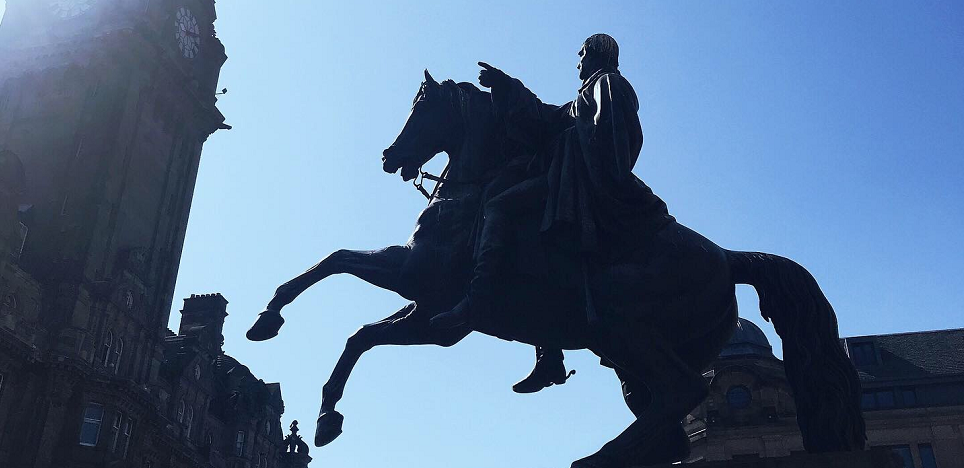

# ArchZ三周年 - ArchZ Website v2.0 启用
---

---
感谢一直以来经常交流、浏览的读者朋友。ArchZ作为本人分享设计、输出内容、记录想法、储存知识的灵活个人空间，已经存在了三年。

---

（2019年12月06日, ArchZ的第一篇推文：《不是开天辟地，却为我的新篇》）

---

个人网站和个人公众号作为ArchZ内容框架下的双生子，内容上基本相同，但互相弥补其传播方式中的不足。由于个人网站的服务器变更和形式框架的逐渐固化，2022年9月，本人开始在学习HTM、CSS、JavaScript、Markdown和Python的同时着手重构ArchZ静态网站并挂载GitHub，作为主要面向非微信用户群体（例如国外读者）的浏览地址。现在，ArchZ Website的基础结构已基本搭建完毕，并上载在Github中（国内用户需要科学上网）：**https://zaczhangzhuo.github.io/**

---

相较于v1.0版本，ArchZ Website v2.0有如下升级和改变：

- 网站风格更新：采用黑白高对比调风格，网站所有页面均用统一css样式表控制。网站中所有代码块均经过调色、统一显示。网站内嵌包括静态图片、动图、视频、外链在内的多种媒体形式。后续可能添加JavaScript效果、WebGL效果和交互内容。

- 网站结构更新：主题内容分为zDesigner、zLearner、zWriter、zPhotographer和zIndividualDeveloper,分别对应ArchZ公众号中的z做设计、z学软件、z小事件、z游览地菜单。所有内容均可通过后台配置的Python文件一键更新。并保留后续添加主题的接口。

- 网站内容更新：已发布的文章均已同步在网站中，并且在不足之处有所修正。未来将继续更新ETH MAS dfab课程学习笔记、著名建筑摄影和开发自学等内容。

- 网站板块更新：除主题模块外，新增额外内容，并将继续添加和开发。

---

欢迎大家访问和指正。