# Rhino User Meeting

(会议现场 / Conference site)
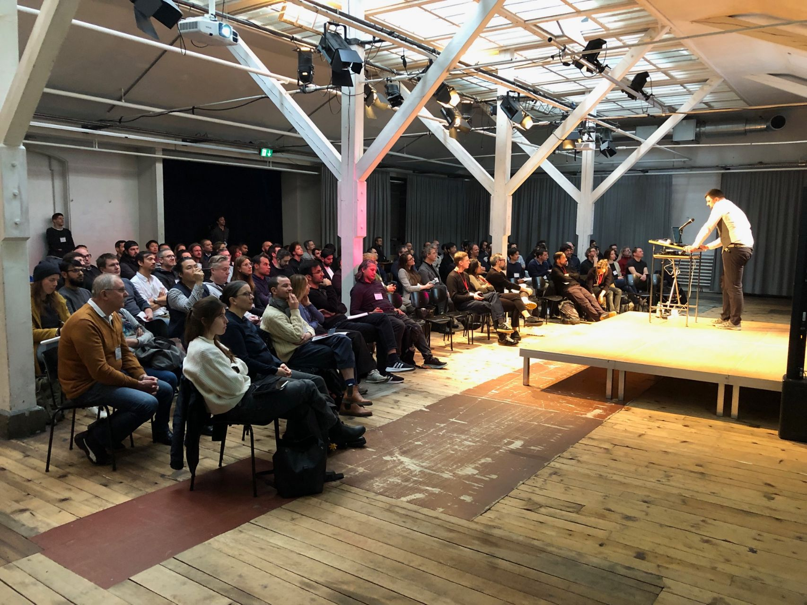
(会议现场 / Conference site)

---

活动网站 / Event Website: https://events.mcneel.eu/rhino-user-meeting-basel/

活动日程 / Event schedule: https://docs.google.com/document/d/173FCU-EIPkqnbxKtODo_S7qld-3-duWOdZjUnB4N6t0/view

---

Rhino 欧洲用户会议邀请了 COMPAS 的 Tom van Mele、Chair of Sustainable Construction 的 Alina、Chair of Architecture and Building Systems 的 Christoph 等人作为演讲者，展示 ETH Zurich 各大教席使用 Rhino 的实例和先锋成果。同时，MESH、SAEKI 等与我们项目紧密合作的公司代表也是会议的展示者和演讲者。因此，此次大会日程很早就被我们得知，我个人也非常积极的参与。

The Rhino European User Meeting invited Tom van Mele from COMPAS, Alina from the Chair of Sustainable Construction, Christoph from the Chair of Architecture and Building Systems, and other speakers to showcase the examples and cutting-edge achievements of ETH Zurich's major chairs using Rhino. Representatives from companies such as MESH and SAEKI, who closely collaborate with our MAS DFAB program, also participated in the conference as exhibitors and speakers. Therefore, the conference schedule was known to us very early on, and I personally participated very actively.

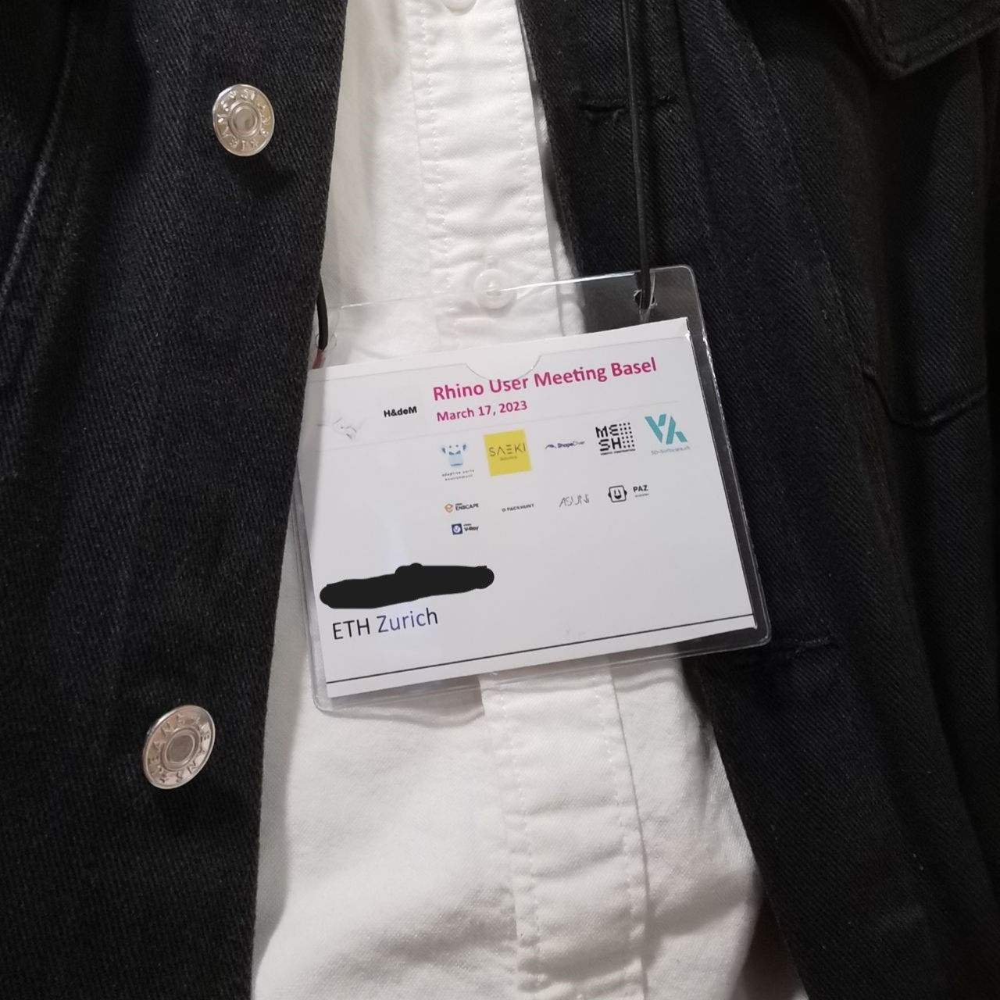
(个人ID卡 / ID card)

上午的论坛主要是展示软件方面的成就，Herzog & de Meuron 建筑技术部门作为组织者和东道主第一个展示，但Herzog & de Meuron在技术方面的研究方向多是以项目为导向的BIM等内容，我可以相信 Herzog & de Meuron 的技术部门仅有寥寥数人。之后和 Michael Drobnik 聊天中也得知了一些基本信息，他们的工作相比 ZHA Code 更加业务导向，技术革新较低。

The morning forum mainly showcased software achievements, with the technical department of Herzog & de Meuron as the organizer and host presenting first. However, Herzog & de Meuron's research direction in technology is mainly project-oriented BIM and other related fields. I can believe that their technical department only has a handful of people. During my conversation with Michael Drobnik, I learned some basic information that their work is more business-oriented and has different technical focus compared to ZHA Code.

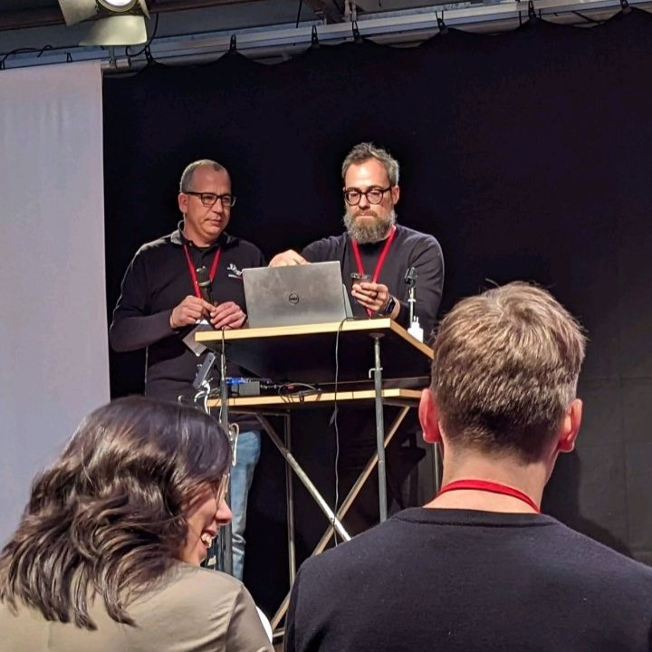
(来自Herzog & de Meuron的Michael Drobnik / Michael Drobnik from Herzog & de Meuron)

然而之后关于 Rhino 和 GH 的展示内容则被我认为是这一整天的高光：Rhino 的整个生态环境已经十分成熟而且在高速发展，展示中透露的信息也十分有效：直击当下用户的痛点，包括.net 从 4.8 到 7 的升级、CPython 和 IronPython 同时存在的支持都在 Rhino8 的计划之中。Rhino Compute、官方支持 three.js 的 3DM-Loader、WIP 等内容也十分吸引人。

However, the presentation on Rhino and GH that followed was what I considered to be the highlight of the entire day. The entire ecosystem of Rhino has become very mature and is rapidly evolving. The information revealed in the presentation was also very effective, targeting the pain points of current users, including the upgrade from .net 4.8 to 7, support for both CPython and IronPython, which are both planned for Rhino 8. Rhino Compute, 3DM-Loader with official support for three.js, and WIP were also very attractive features showcased.

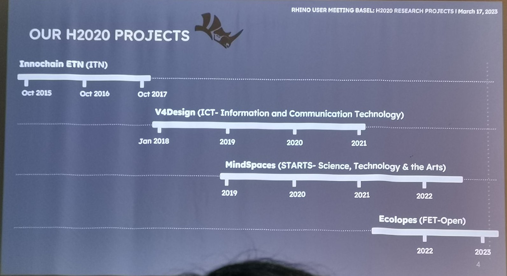
(Rhino 产品发展时间线 / Rhino product development timeline)

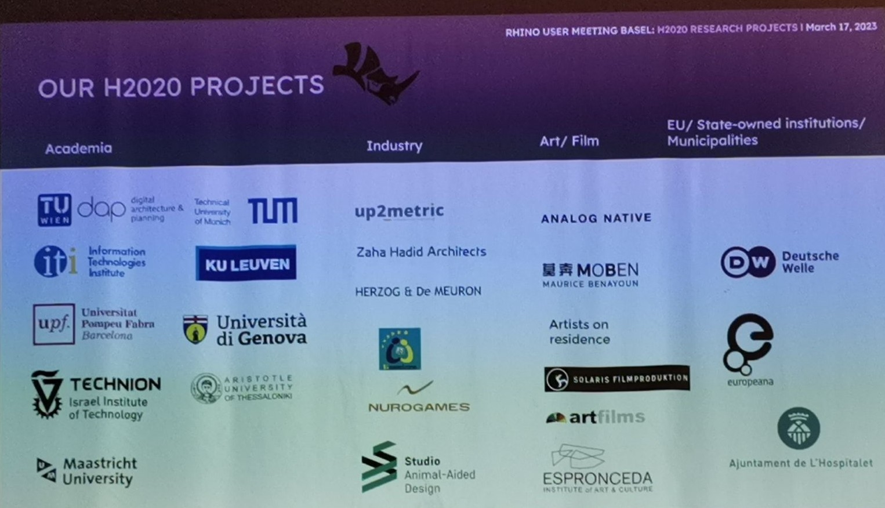
(Rhino 产品合作 / Rhino product collaboration)

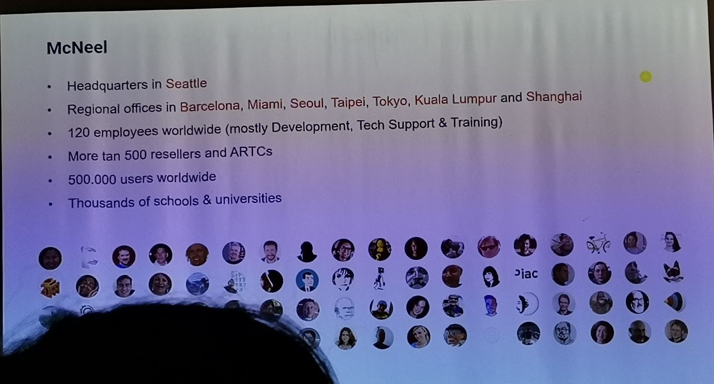
(McNeel团队 / McNeel team)

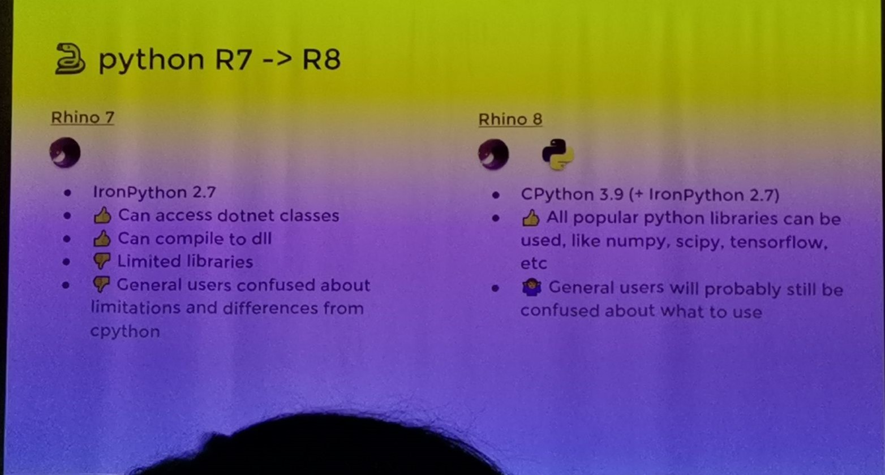
(Rhino8重大更新1: CPYthon和IronPython同时存在 / Rhino8 major update 1: CPYthon and IronPython coexist)

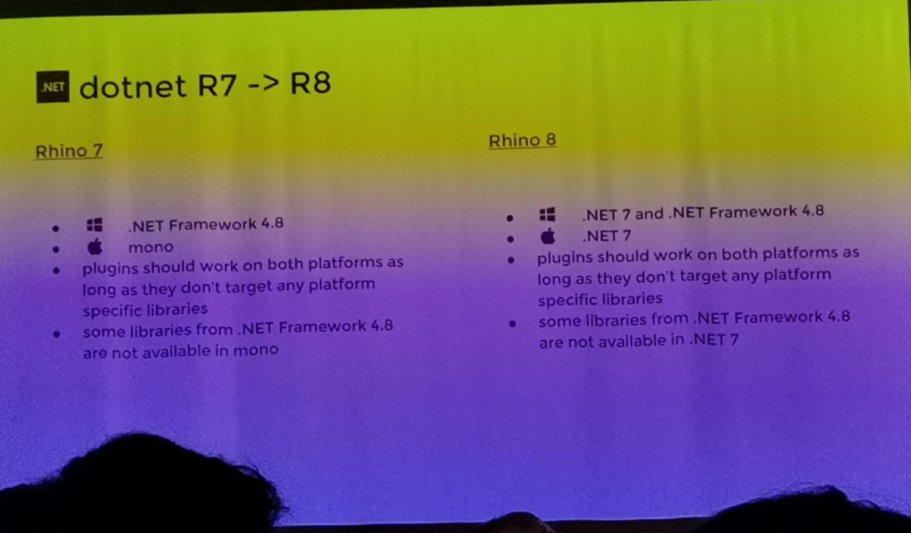
(Rhino8重大更新2: Rhino .NET 从 4.8 升级到 7 / Rhino8 major update 2: Rhino .NET upgrade from 4.8 to 7)

(Rhino8重大更新3: Rhino Compute / Rhino8 major update 3: Rhino Compute)

David Rutten 上场，也让我看到了这位“蒙面网友”的真人，此时我激动不已。之后在和Herzog & de Meuron 的 Michael 聊天时也知道：其实他和 David 在工作之前就相互认识，相当于目睹 David 以一人之力开发了整个 GH——也就是说这个占据数字化建造80%以上使用场景的软件，几乎是此人一人开发的。

David Rutten took the stage and I was excited to see the true face of this "masked netizen". Later on, during my conversation with Michael from Herzog & de Meuron, I learned that they actually knew each other before working. This means that David almost single-handedly developed GH, which is used in over 80% of digital fabrication and computational design scenarios. It was truly remarkable to witness the work of this person who has contributed so much to the development of this software.

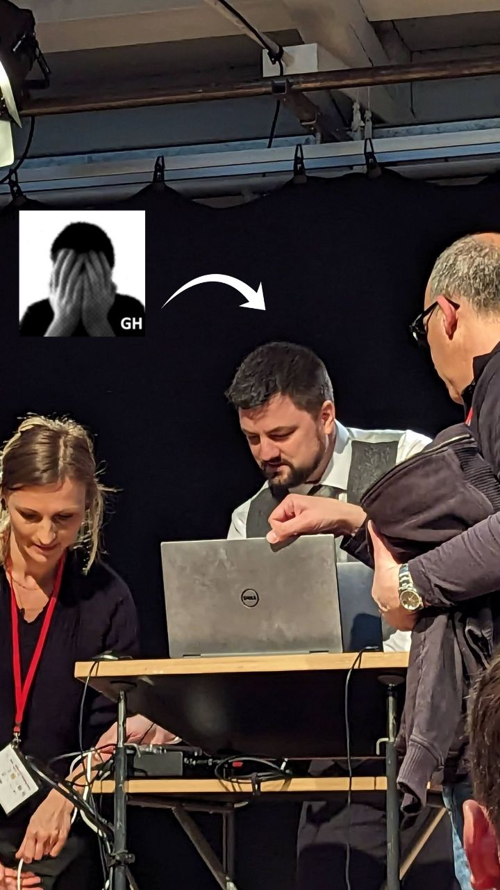
(David Rutten)

尤其是当他展示关于 GH2 的内容的时候：关于 pannel 的提升已经让我们对 dark data 有更直白的了解，类似于指针的数据显示思路是对.net 使用的完美体现；同时，对于显示语法的提升也是很让人眼前一亮的概念。在 David 演讲完后，我实在没有按耐住心里的激动，还是举手问了一个问题：'maybe a general question, but a lot of people are concern: how does grasshopper 2 inherit the heritage of grasshopper 1 like the plug-ins?’从他的回答来看，是一个非常成功的提问：

Especially when he showcased the features of GH2: the improvement in panel has given us a more direct understanding of dark data, and the data display concept similar to pointers is a perfect embodiment of the use of .net. Also, the improvement in display grammar is also a concept that is very eye-catching. After David finished his presentation, I couldn't hold back my excitement and raised my hand to ask a question: "Maybe a general question, but many people are concerned: how does Grasshopper 2 inherit the heritage of Grasshopper 1 like the plugins?" From his answer, it was a very successful question.

1. 首先 David 回应这是一个“very unconformable”的问题，证明这正是软件开发的痛点所在；
2. 其次他承认 GH2 无法兼容 GH1 大部分插件的事实，给我们打了预防针。
3. 之后他也给出了他的解决方案：GH1 是一个发展十分成熟的软件，下一个版本的 Rhino 很可能会同时保留 GH1 和安装 GH2，以达到最多的功能使用。
4. 随后的演示中，他同时在他电脑的 Rhino 中打开 GH2 后直接打开 GH1，我们意外的看到很多个错误窗口同时弹出。看到开发者也弹出错误窗口，我心里高兴不已——直击痛点，展示不足。
5. 最后，David 展示了一个惊人的功能：在 GH1 中调用一个基础 component，直接拖拽到了 GH2 的窗口中，这样 GH2 就有了一个 GH1 的 component！同时他还表示：同时存在在 Rhino 上的 GH2 和 GH1，交流不仅是基于 component 的 script 层面的，更是基于 data 的 geometry 层面的，也就是说 GH1 和 GH2 可以共享 Meta-data 数据！十分令人期待。虽然他表示 component 的兼容之存在于少数的 component，而且 Meta-data 的共享十分有局限性，但技术革新令人振奋，未来可期。

1. First, David responded that it was a "very uncomfortable" question, proving that this is a pain point in software development.
2. Secondly, he acknowledged the fact that GH2 cannot be compatible with most GH1 plug-ins, giving us a heads up.
3. He then presented his solution: GH1 is a very mature software, and the next version of Rhino may keep both GH1 and install GH2 to achieve maximum functionality.
4. In the subsequent demonstration, he opened GH1 directly after opening GH2 on his computer, and we unexpectedly saw many error windows popping up. Seeing the developer also encounter error windows made me very happy - this pointed out the shortcomings and showed areas for improvement.
5. Finally, David demonstrated an amazing feature: calling a basic component in GH1, and dragging it directly to the window of GH2, so that GH2 has a GH1 component! He also stated that the communication between GH1 and GH2 on Rhino is not only based on the script level of components but also on the data geometry layer of meta-data. This means that GH1 and GH2 can share meta-data, which is very exciting. Although he stated that the compatibility of components only exists in a few cases and the sharing of meta-data has limitations, the technological innovation is inspiring, and the future is promising.

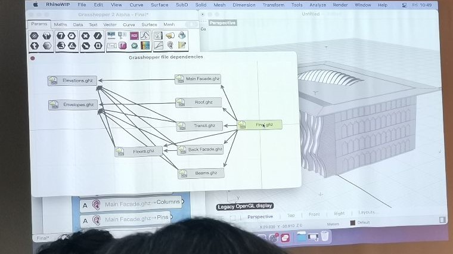
(David Rutten的主要展示内容：Dark Data, GH2等 / David Rutten's main presentation: Dark Data, GH2, etc.)

随后的我们进入午间茶歇。午餐后我和 SAEKI Robotics 的展厅人员聊了聊，知道 SAEKI Robotics 实际上是 Matthias 注资的公司，并且只有三位员工(两位是工程师背景)——而他们提供给了我们将近一半的 3D 打印挤出头。这种微型公司的势头已经在欧洲势不可挡：今天来展示的公司有一半以上都是微型公司，例如 MESH 由 Fabio 注资，目前仅有 3 人+1 位实习生。唯有 V-ray，Adidas，Forster 等公司是在场的大体量公司代表。

After the lunch break, I had a chat with the staff at the SAEKI Robotics booth and learned that SAEKI Robotics is actually a small company and has only three employees, two of whom are engineers - and they provided us with almost half of the 3D printing extruders. The momentum of such small companies in Europe is unstoppable: more than half of the companies showcased today are small companies, such as MESH, which currently has only three people and one intern. Only V-ray, Adidas, Forster, and other large companies were represented at the event.

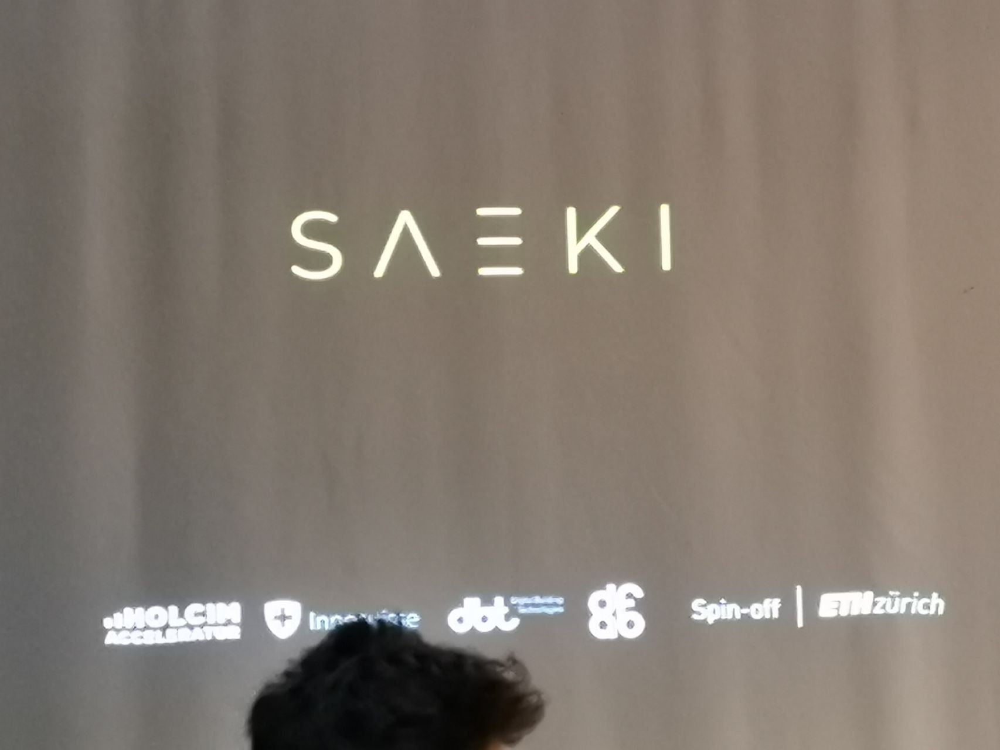
(SAEKI Robotics)

十一点半到一点关于 AEC 的展示是我认为今天最不吸引我的环节：并非 AEC 无聊，我反倒十分重视 AEC，而是演讲内容并没有突破我的知识界面，反倒有许多重合内容。“技术无限，市场有限”的事实也显露无疑。两点到三点半的部分也较为一般，主要是 computing 的部分，像’Computing Climate’这样的课题大多是模仿 ladybug 等软件，对我吸引性不强。反倒是 Adidas，Forster 等专注于织物、鞋品、车辆建模和设计的公司似乎是本场最富有的公司，其许多不允许拍照和分享的内容格外引人瞩目。

At 11:30 to 13:00, the AEC presentation was the least attractive part of the day for me, not because AEC is boring, but because the content of the speech did not break through my knowledge interface and there were many overlapping contents. The fact that "technology is infinite and the market is limited" is also evident. The part from 14:00 to 15:30 was also average, mainly about computing. Topics such as "Computing Climate" mostly imitated software like Ladybug, which did not interest me much. Instead, companies such as Adidas and Forster, which focus on fabric, footwear, and vehicle modeling and design, seemed to be the most exciting and had many contents that were not allowed to be photographed or shared.

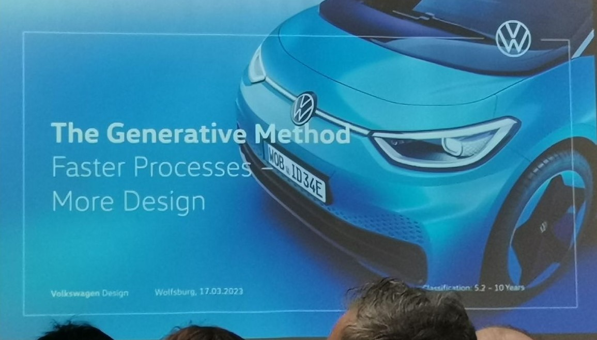
(Volkswagen Group)

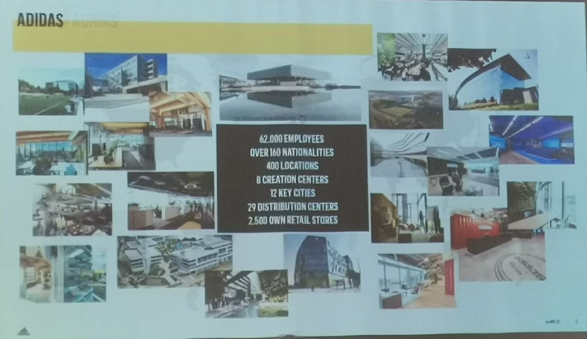
(Adidas)

四点到六点是制造、机械学部分，先说 COMPAS 吧，这是我最崇拜也是认为最酷的开源软件之一，也是整个 NCCR 多年研究高浓度知识结晶中的结晶，并且我个人也在逐步步入 COMPAS 100%的日常使用。

From 16:00 to 18:00, there were sessions on Robotics, Design & Manufacturing. Let's start with COMPAS, one of the coolest open-source software programs that I admire the most. It is the culmination of years of research at NCCR, and I am gradually moving towards using COMPAS in my daily work.

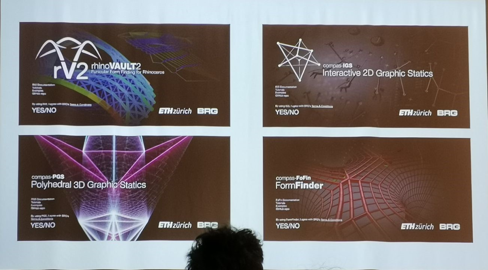
(COMPAS)

KUKA|crc、Digital Mainstream 都是十分令人激动的展示，推进建筑产业的工业化是行业曙光之一。

KUKA|crc and Digital Mainstream were both very exciting presentations, promoting the industrialization of the construction industry as one of the industry's bright spots.

以下是一些比较松散的亮点，均来自制造、机械学部分的各个公司展示：

Here are some other highlights from various companies' presentations in the Robotics, Design & Manufacturing section:

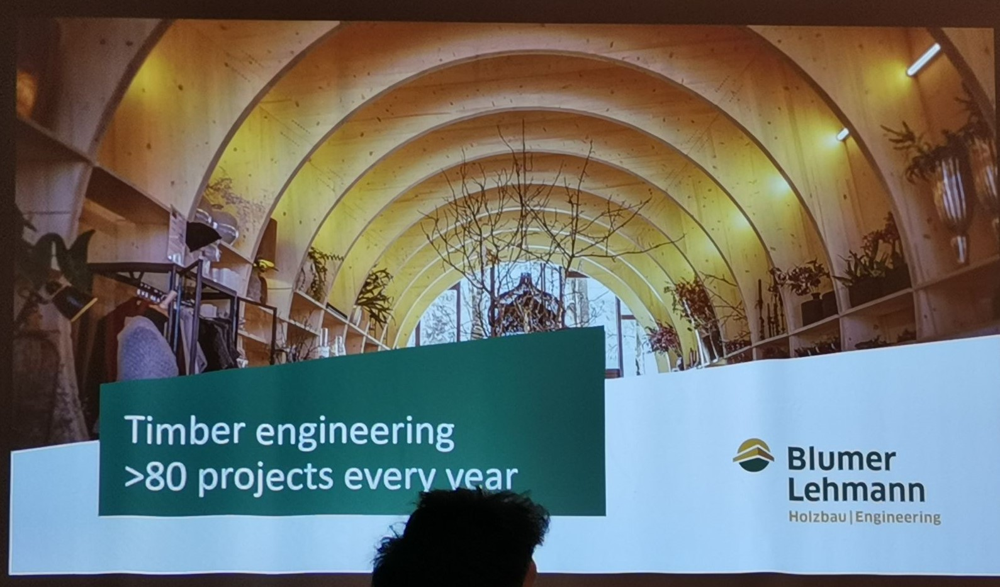
(Bumer Lehmann)

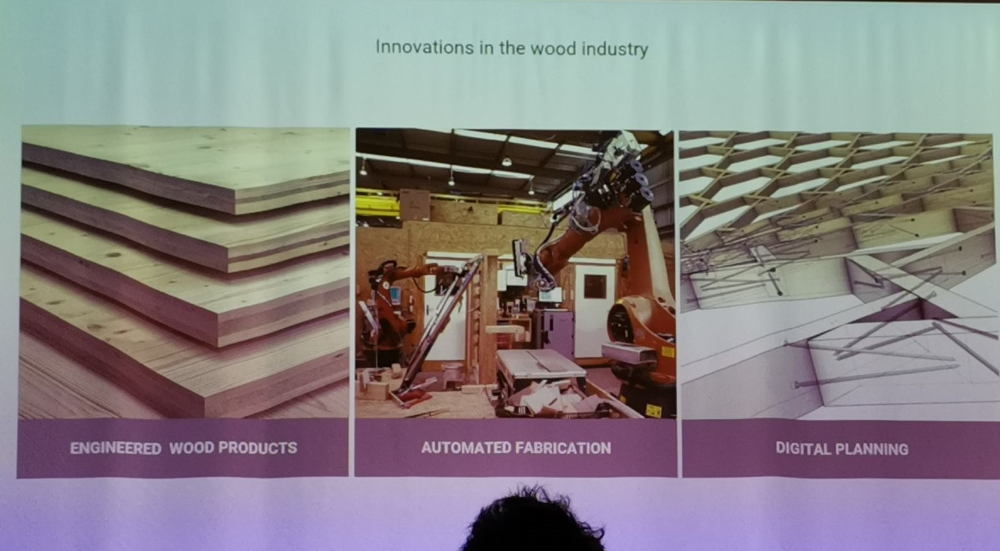
(Design to Production)

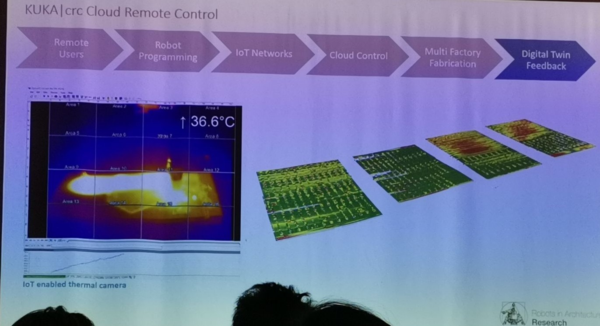
(KUKA|crc)

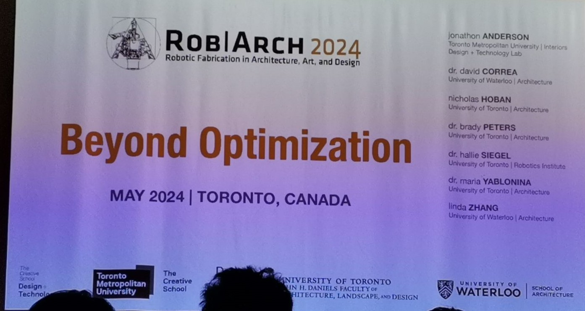
(ROB ARCH)

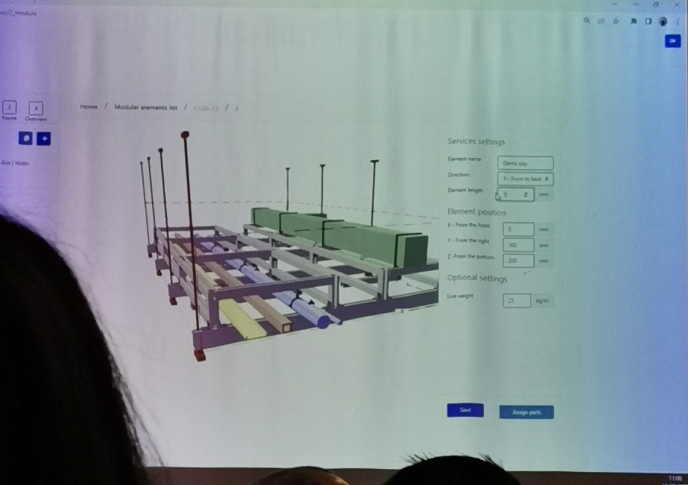
(Packhunt.io)

总之，收获满满。时代在进步，软件在发展，科技在应用，Ai在推动。

In summary, it was a fruitful experience. The times are advancing, software is developing, technology is being applied, and AI is driving progress.

---

共勉！
