# z2023小事纪

## 01月01日 苏黎世
雷克雅未克-Lecco-米兰-苏黎世的旅程过于尽兴，2022的结尾为2023留下后遗症——早晨起来晚了一分钟，瑞士准时的公车从面前开走，司机还做了个无奈的表情。
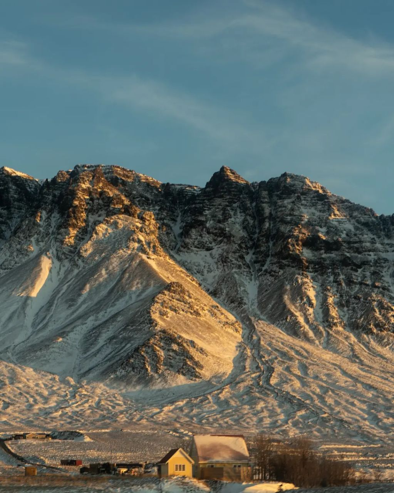

## 01月21日  农历新年
回望一年，一步步走来，从RoboticDancing, ComputationalArt, RoboticDrawing, GenerativeCity, ArduinoUselessMachine, EndlessWall，到Miniproject，我在4个月时间的T1密集学习了几乎所有梦寐以求的技术和方法，对ITA和NCCR dfab逐渐从崇拜到融入。
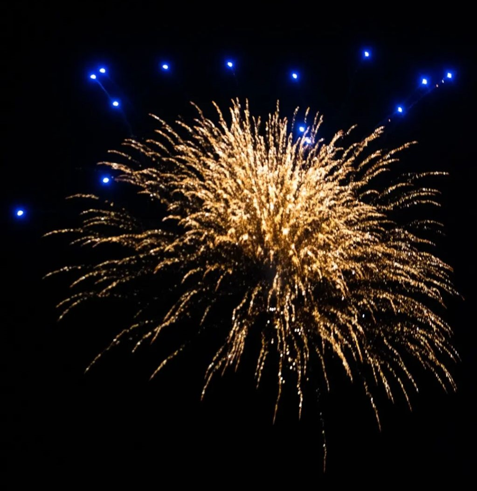

## 02月02日-06日 马德里
感谢同学Ramon的招待，能体验到十足地道的西班牙家庭氛围。
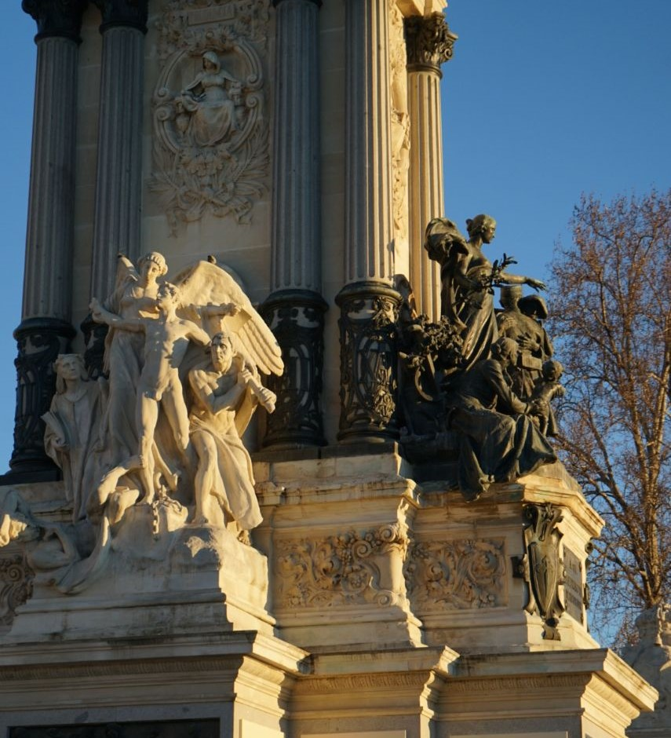

## 02月19日 卢塞恩
狂欢节后的周日瑞士，或许是这个国家最宁静的一天，但和朋友一起散心总能感受愉悦。
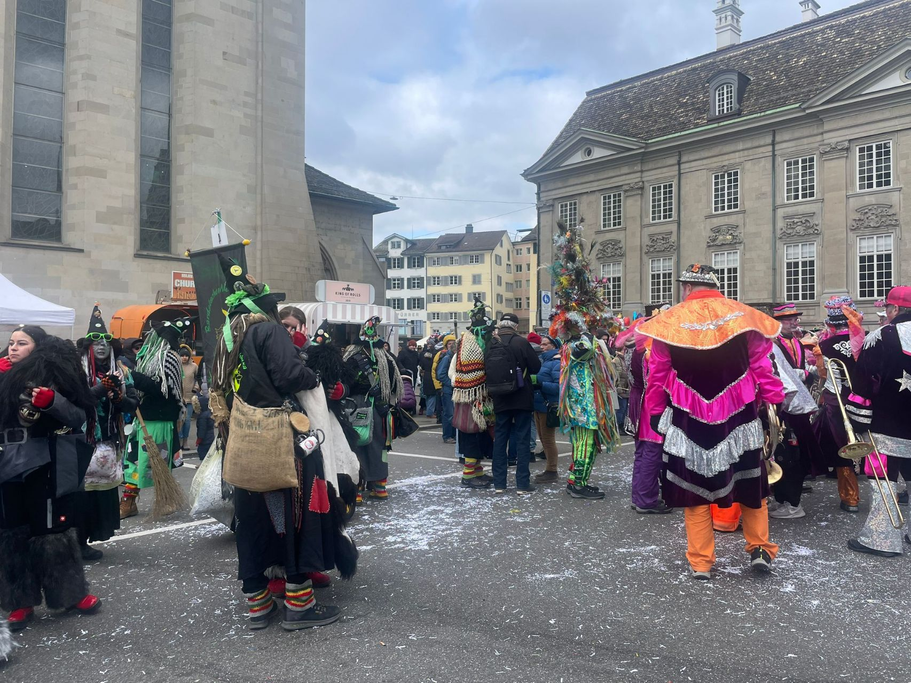

## 02月25日  George Ezra 演唱会
三年前从未想过会在三年后的欧洲看到George Ezra的演唱会。体面严肃的瑞士人也逐渐从一起摇摆，变成狂欢。
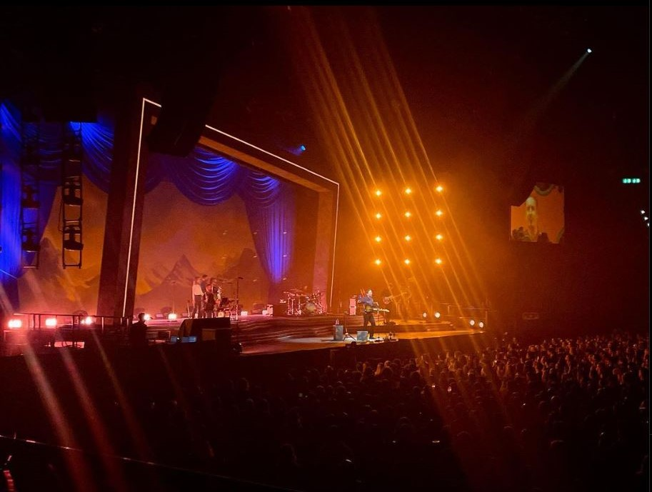

## 03月16日 T2Final
第一个T2是完美的小组合作，所有人都精诚团结，互相打气，Final Pre过程行云流水而且十分有组织。评委整个过程中最主要的评价也是
“you guys really had fun”。 这次也是罕见的看到评委们即使在超时的情况下还争相拿话筒发表意见，而且大多是对我们工作的肯定。结束后我们所有人抱在一起。
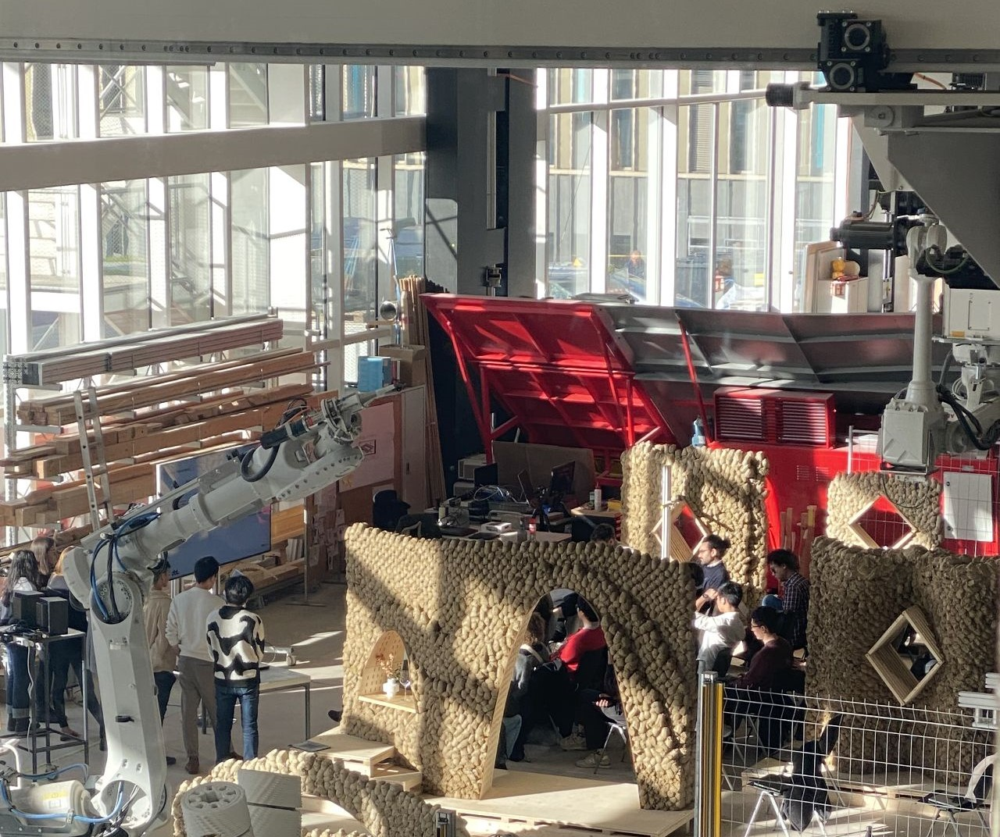

## 03月17日 巴塞尔 Rhino大会
David Rutten，我看到了这位“蒙面网友”的真人。尤其是当他展示关于GH2的内容的时候
关于pannel的提升已经让我们对dark data有更直白的了解，类似于指针的数据显示思路是对.net使用的完美体现；同时，对于显示语法的提升也是很让人眼前一亮的概念。
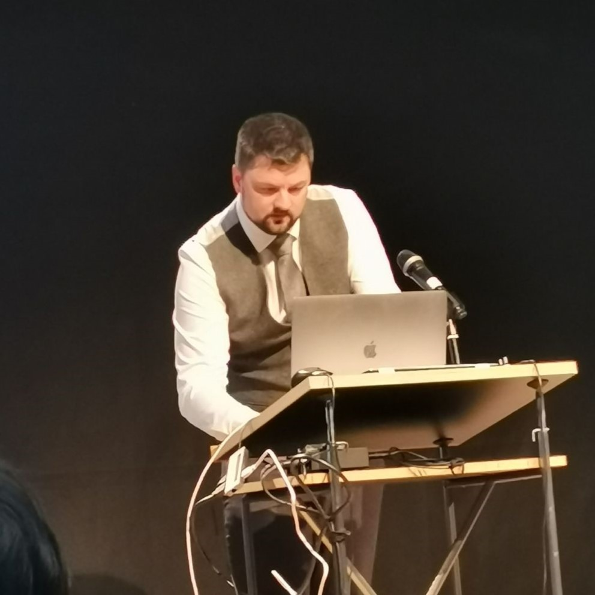

## 04月06日 RSL参观
RSL机器狗的智能程度超出我的想象，全程我都感觉很震惊，知道原来把算法变成现实的人才是最厉害的人。
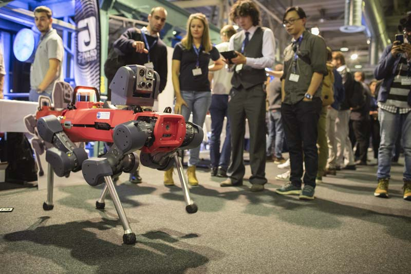

## 04月08日 斯图加特 90瑞罚款的金钱哲学
由于用7点到期的车票上了7点05到站的火车，荣幸地在6点55分被一位古董瑞士检票员罚款。

## 04月09日 斯图加特 奔驰博物馆
环形螺旋的流线仿佛汽车赛道；从顶到底的方向有效防止人流堵塞；时间顺序的展厅体现汽车历史和人类历史的完美融合。更令人震惊的是其中海量的汽车模型，所有人都能从某些熟悉的古董中追忆到曾经的记忆。同时我又纳闷他们是如何被运上展厅的。
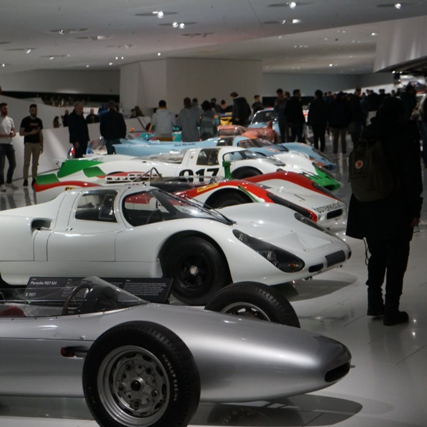

## 05月07日 BRG SLOA Running
有水有厕有医疗站，有补给点有湿海绵，工作人员在收包裹，滑翔飞机在天上看局势。很多跑者明显是专业派，很有质量的跑步体验。
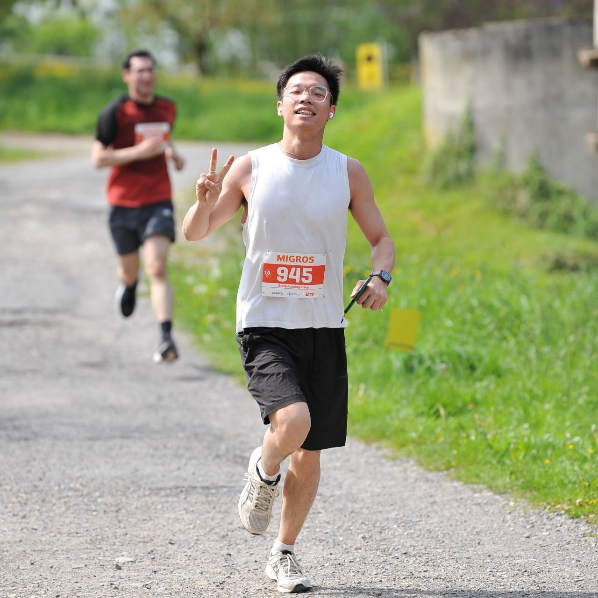

## 05月16日  NCCR annual review day
产业、学习、研究；建筑，结构，建造。每4年折合人民币将近1亿元的研究资金，成就这一系列不可思议的研究。
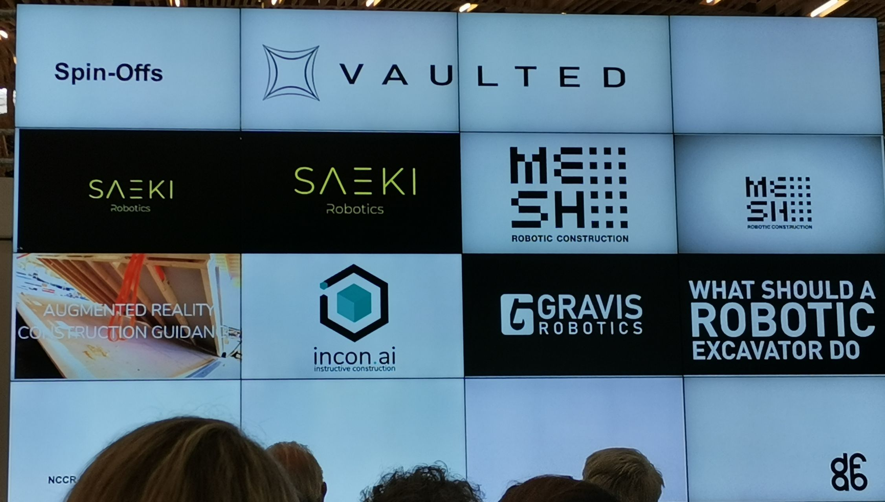

## 06月12日 T2 Final
第二个T2的效果和感受是这个项目的末名，心累不支中也感觉心里圆满。

## 06月14日 T3 kick off
在两个T3提案中反复衡量，最终向同伴Car和导师Kunal握手，开启一段奇妙T3旅程。

## 06月20日 和Prof Block会面
经过一段比较顺利的自我营销，Block接受我加入BRG，并和我讨论了很多可能性。

## 06月24日 小猫湖BBQ
迎接对象小陈来瑞士的第一个活动是和同学BBQ，所有人都很开心沉醉。
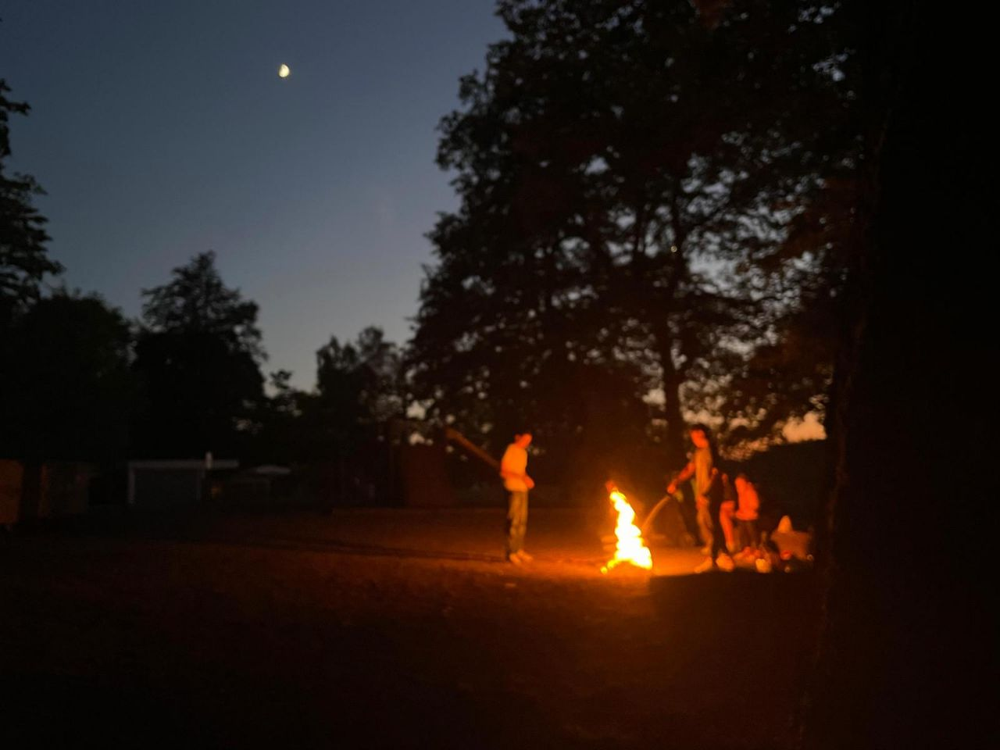

## 06月25日 巴塞尔
法国侧的瑞士更加活力和年轻。

## 06月26日 罗马
斗兽场比例和规模令人震撼，五层楼高的建筑由大理石堆砌而成，占地很大。想象在古代只凭人力完成这样的建筑是相当困难的，修建历时很多年才成为世界七大奇迹之一，令人惊叹。

## 06月27日 梵蒂冈
米格朗奇罗《创世纪》系列、《雅典学院》和《最后的审判》系列……在梵蒂冈博物馆的参观过程中看到的不仅仅是看到名画本身，更是看到名画以及其一系列的背景故事。以及名画背后的其他名画，它们在某种历史的节点中相互连接、掺杂、影响，使名画成为名画，使系列成为系列。高浓度的艺术成分令我们甚至达到某一种词汇匮乏和审美疲劳——他们太美，所有的美放在一起，所有的精彩放在一起，让他们不再那么出类拔萃。但是实际上每一个点，都是这个世界上最灿烂的文化曙光。大教堂中也有万神殿一样的圆顶。这个圆顶的光线射到画上，射到墙壁上，射到雕像上，使得墙上的天使都熠熠生辉，从天上降临。
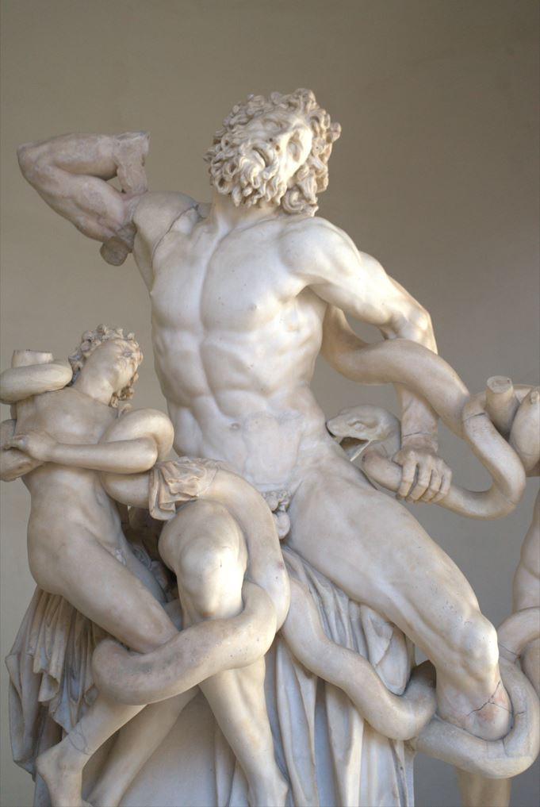

## 06月28日-30日 佛罗伦萨
小巧、精致的艺术城市。牛排、日落、生命、音乐……
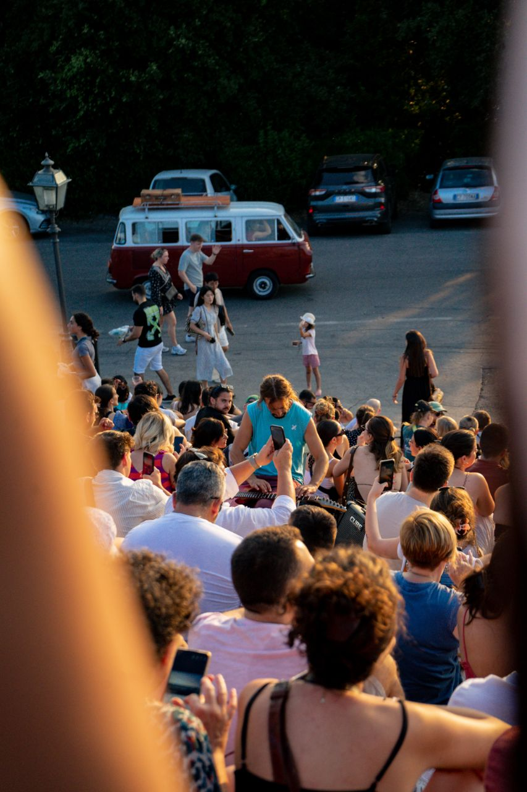

## 07月01日 米兰
一路上不错的“头等舱”待遇、清澈的湖水、高耸的山坡和绚丽的云层……

## 07月05日 苏黎世美术馆
莫奈的朦胧、梵高的虚幻和毕加索的抽象艺术……
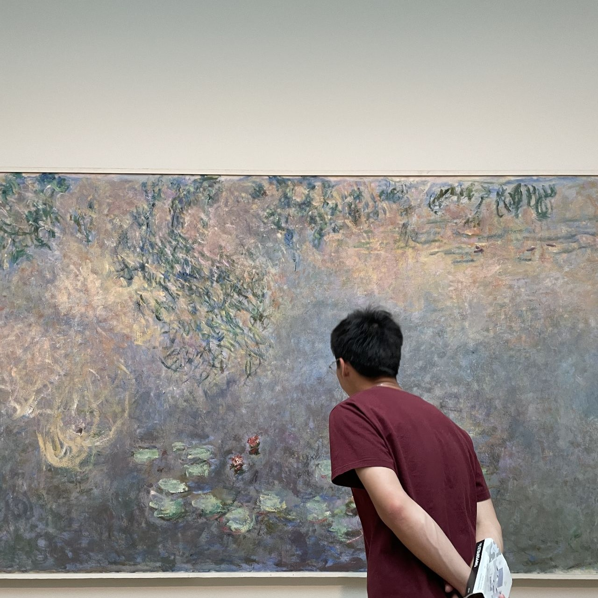

## 07月07日 Zurich Festival
60万瑞士法郎的烟花和浏阳烟花有得一比，无人机的狮子形象很有特色。
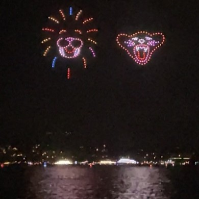

## 07月08日  苏黎世-莱茵瀑布-玫瑰小镇-苏黎世
我们看到有人在另一艘船上向我们招手；还有人在岸边的浅滩上嬉戏；还有苏黎士湖边各种古老和现代的湖景房屋；以及蓝天白云，令人欣喜。我们坐的也是一艘非常古老的蒸汽动力船，从船的中间可以看到巨大的动力系统和旋转式螺旋桨。
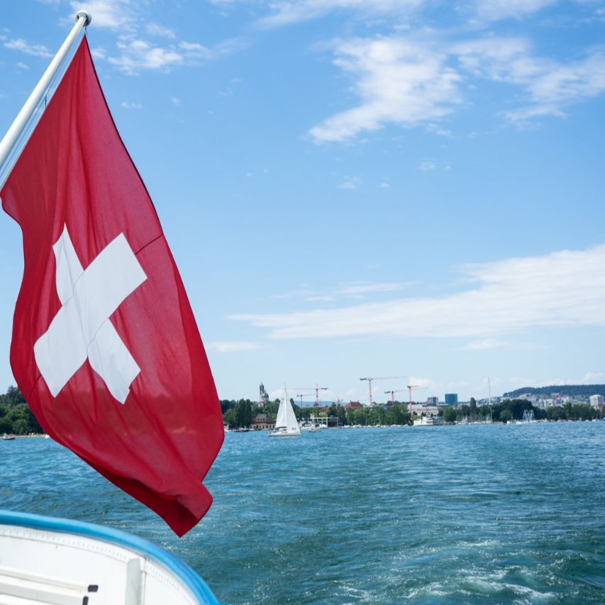

## 08月01日  瑞士国庆
第二次在Carl家聚会吃袋鼠，仅仅偶尔的烟火声十分符合瑞士这个国家的国庆气质。

## 08月24日 晴转小雨 ITA Summer Party
Fabio, Matthias, Benjamin和Philip都有来。虽然他们大多数都是来闲聊几句便离开，但Philip是实打实的一直跳舞到最后，BRG的人也成了此次party的蹦迪主力军。看到平常老实认真的同事在party上如此放得开，实属有趣和罕见。

## 09月02日 RFL工作到凌晨3点
为了T3，努力工作到深夜。期间Carl聊起了他曾经在澳大利亚消防队的经历
二十岁的他在沙漠中负重徒步6小时救人；空降被海啸袭击的小镇，和被飓风插入建筑的飞机合照；一队人保护好几个巨型燃料罐，绕其一圈对外灭火，几百升水只是瞬间喷射。听到这些我心中敬佩的同时，感叹他活下来的幸运。
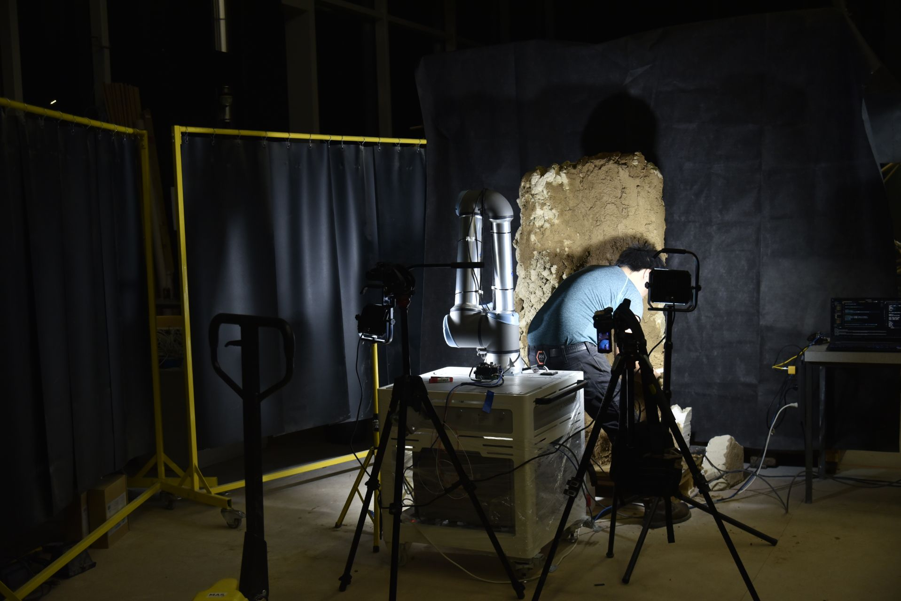

## 09月04日 MenziMuck加汽油
作为我见过的最复杂的挖掘机机器人，Menzi的设计的确非常巧妙。

## 09月11日 T3 Final Fab
为 T3最后冲刺，最后我和Carl已经累到在外面马路旁的地上躺着，看着零星几颗星星和橙黄的路灯，我们交谈起来。内容既有对问题的解决策略，又有T3和研究的深刻思考。最终我们决定一口气把这个墙体完成。

## 09月12日 6km in 29min
新的跑步记录。

## 09月15日 MAS最后一个工作日
Carl说周一的plastering test是他这辈子迄今为止最累的一天，尽管他之前经历过穿越过沙漠等事，但不知为何那次最累。我听到很惊讶，但也不难找到答案
除了将近20小时的超负荷体力工作，我们的精神还处在高度紧张的状态下，并且持续保持思考、试图解决问题，生理和心理的双重过载，这不累才怪呢。
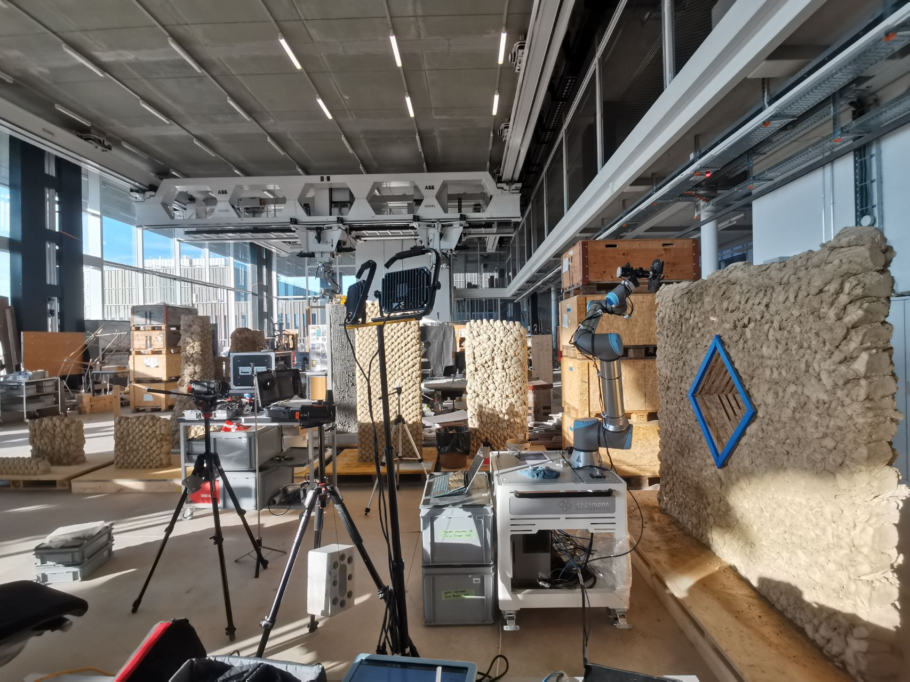

## 09月18日  MAS Final Presentation
一场准备充分的演讲。提问环节，发言者都是超出客气程度的恭喜与赞叹，两位guest则是表情惊讶，所问的问题不仅不刁钻，而且大多数都在我们的意料之中。提问环节更像是给我们机会透露更多细节、进一步展示炫耀的环节。下台之后，所有的听众再次为我们鼓掌、所有的朋友均在给我们拍照、亲近的同学们更是送来温暖的拥抱。我和Carl再次击拳，终于完成了这趟艰难而又有意义的旅程。
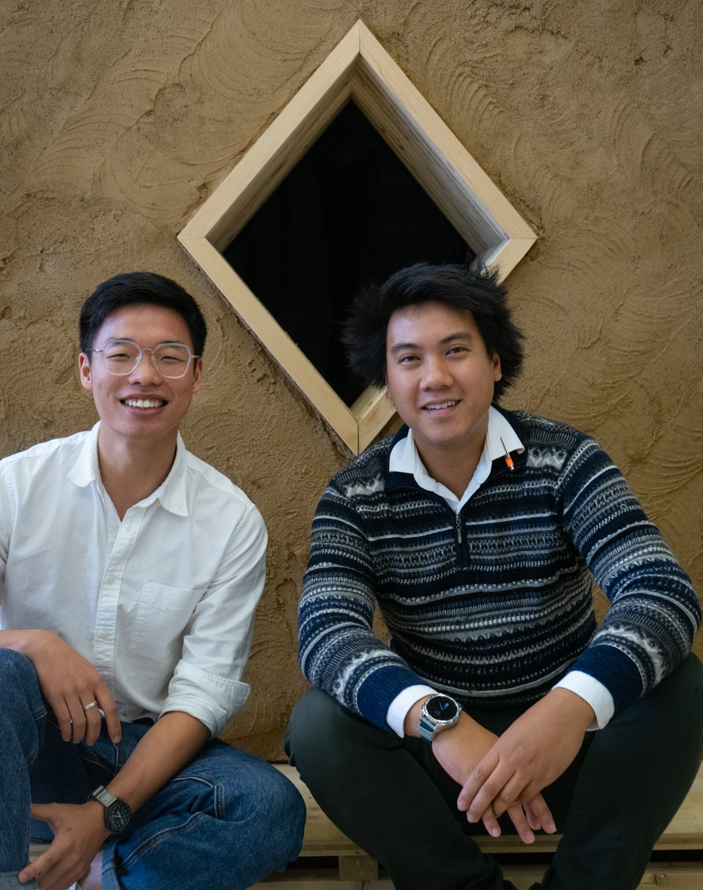

## 09月28日 Hiking
美丽的Caumasee。我本来准备一鼓作气下去游泳，无奈水实在是刺骨的冷，只好和Su一起在附近涉水走走。大家玩得都很开心
游到中岛、跳水、打水漂、玩充气船，不亦乐乎。最后的聚会里，Lihin说了几句动人的话。他是第一个在MAS结束后离开的同学，之后大家也将陆续毕业离开，很感恩这一年的相遇。
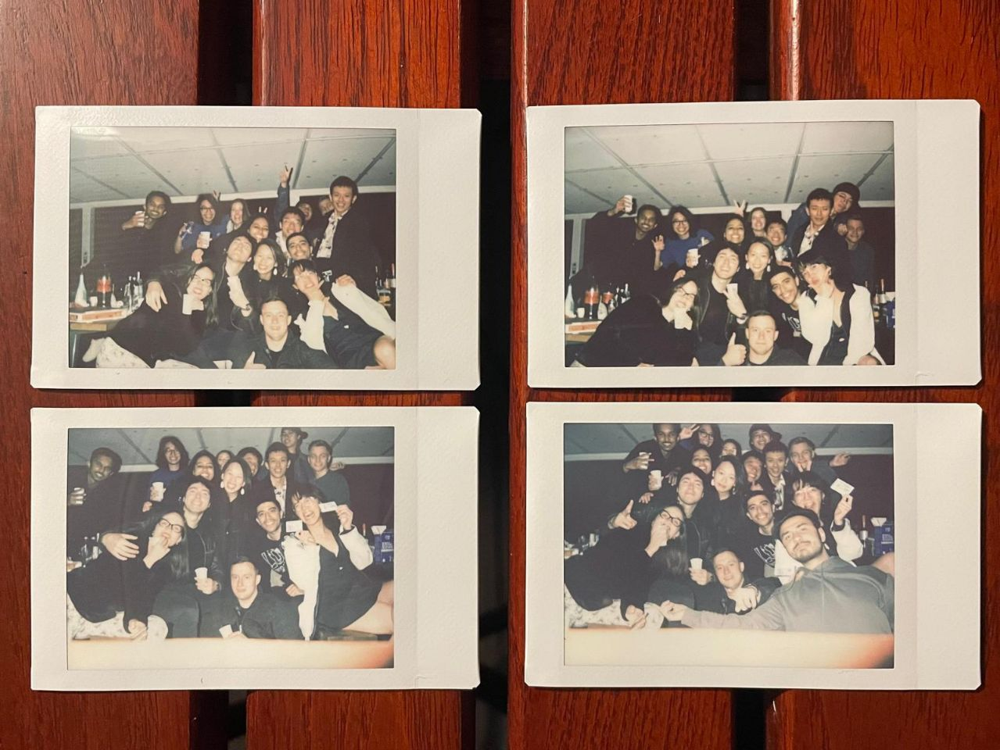

## 09月29日 T2 exhibition
Exhibition作为项目的最终收尾。
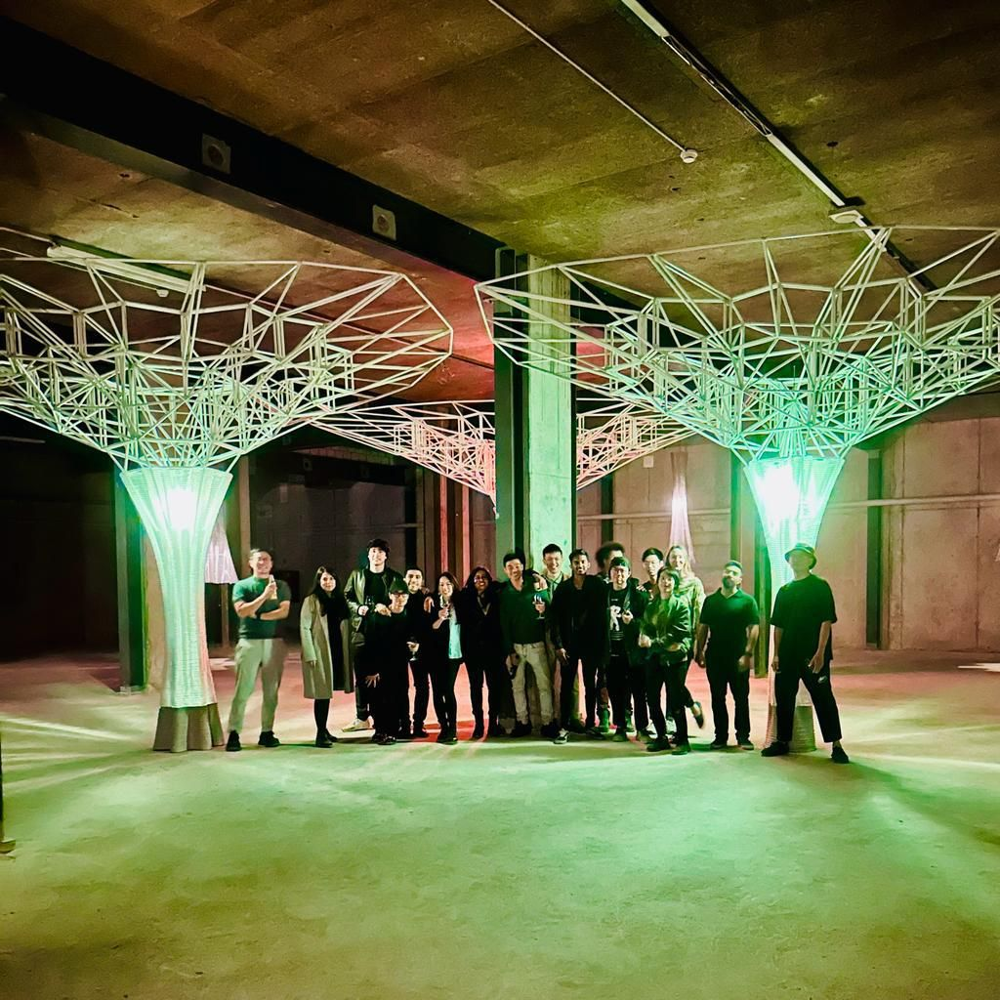

## 10月02日 BRG工作第一天
正式开始接手compas_view2开发。
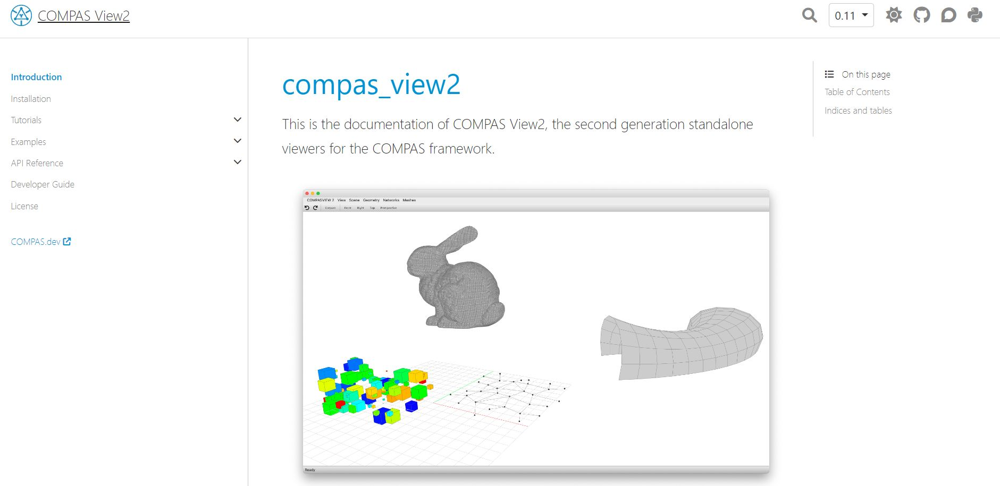

## 10月07日 伯尔尼
在地理形态上，苏黎世更像是中国的上海，而伯尔尼则像是中国的成都——依山傍水，靠山而居。穿过广场一座建筑的拱廊就能远眺广阔的山景。如果说远处的山景如同油画，则近处的拱廊如同画框——名画并不一定配好框，平凡才能衬托震撼。
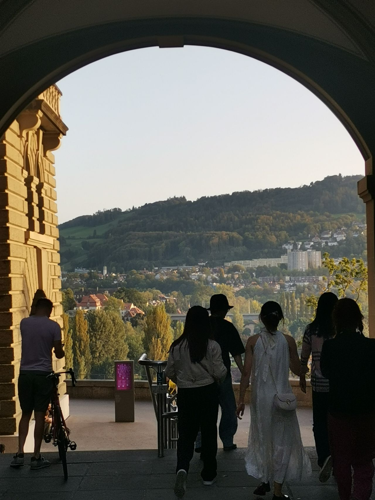

## 10月12日 收到移民局驱逐信
拿到diploma和收到驱逐信恰巧是同一天，驱逐申诉的截至恰巧是我看到信的前一天。但在时间控制上，移民局向来“严于律人，宽以待己”，最后成功解决问题。

## 10月16日 见到王澍
OP1一如既往的有人开会，只是第一排最远端角落的一位老人看上去似曾相识——我一眼便认出了这是普奖大师王澍。茶歇阶段我当即上去跟他打招呼了起来，有了一场令我十分深刻的谈话。
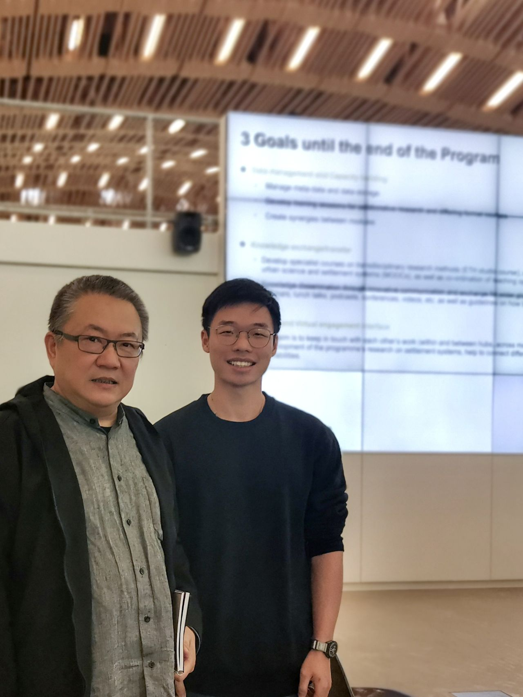

## 10月22日 瑞士大选
没什么波澜，大家也不怎么在意，投票的瑞士人还不够总人口三分之一，这个国家的确是不怎么参与政治了。

## 11月03日  Swiss Robotics Day
很高兴有机会在Swiss Robotics Day上展示我们的作品。
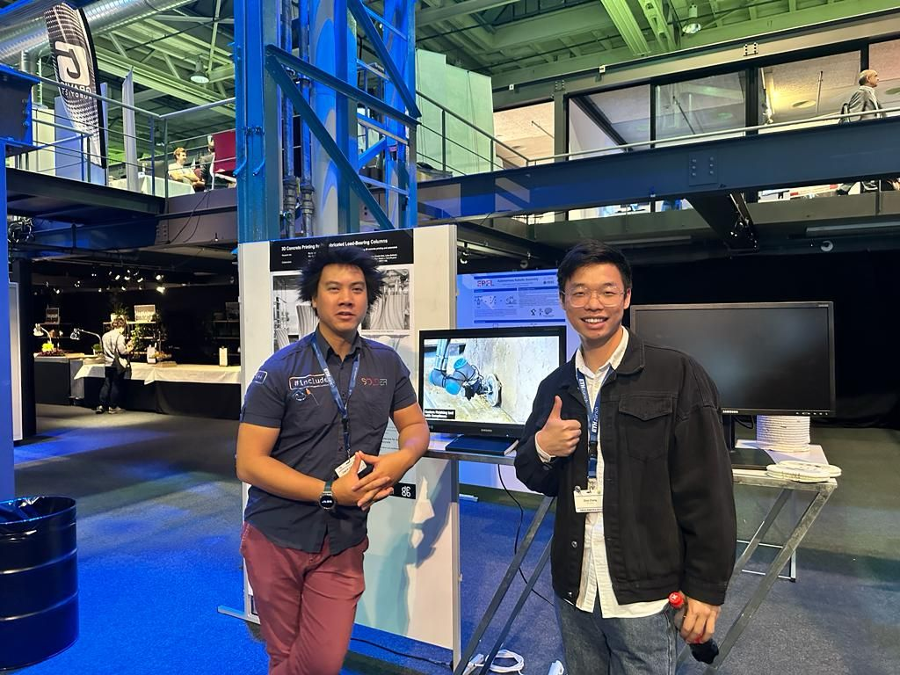

## 11月06日  Gravis第一天
第一天就学到了一些工程学的冷知识，比如，由于CAT挖掘机的发动机和燃油等重物都在尾部，为了防止重心不稳和倾覆，满斗工作通常只能在挖掘机转盘为0或180°时进行，而不是90°。但非满斗工作则可以让转盘转90°，方便挖掘机一边前进一边侧面挖掘。
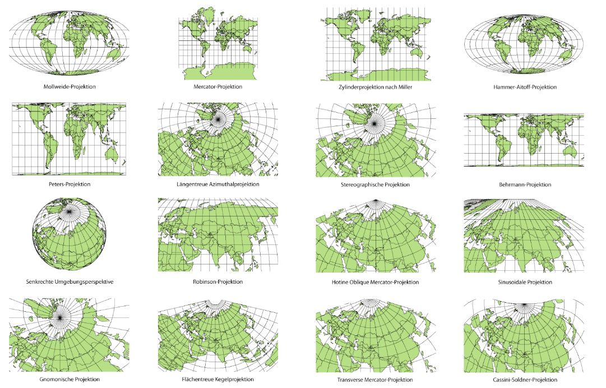

## 11月12日  初雪
初雪。
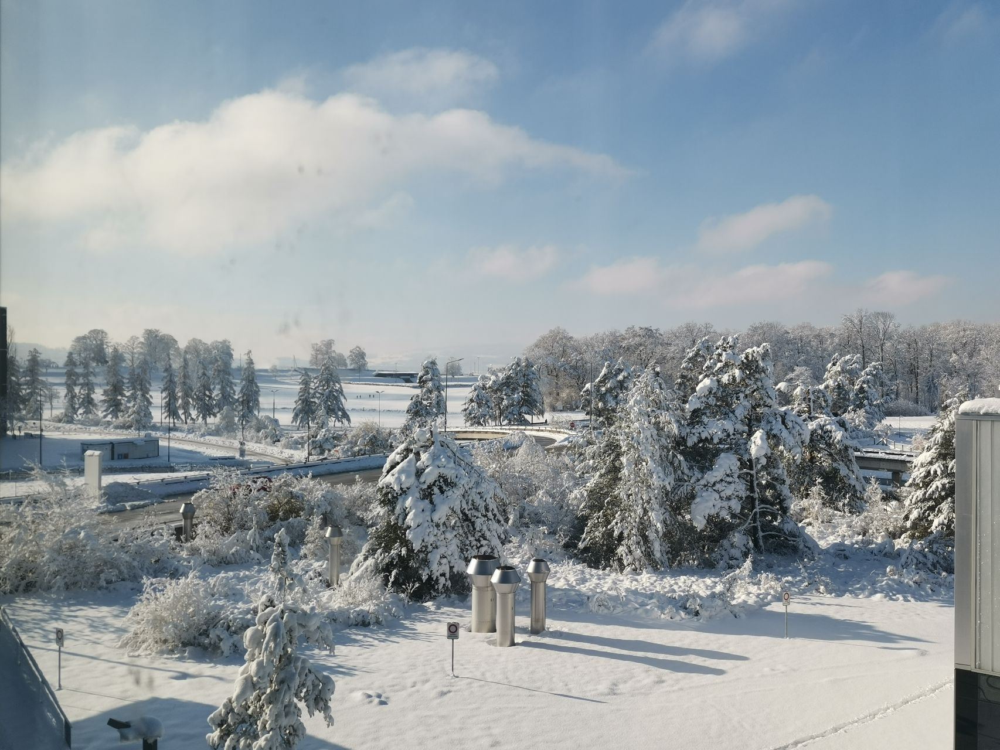

## 11月23日 感恩节
下午知道老板Ryan的文章发到了Science Robotics，我倍感惊讶。共同作者中还有Lauren的名字。我发消息祝贺了他们两位——发《科学》的子刊的确太厉害了。
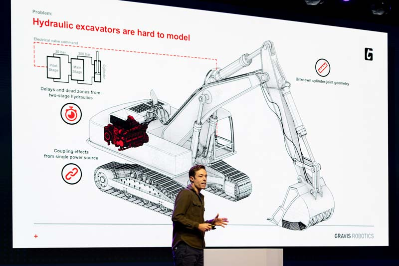

## 12月07日  NCCR Christmas Party
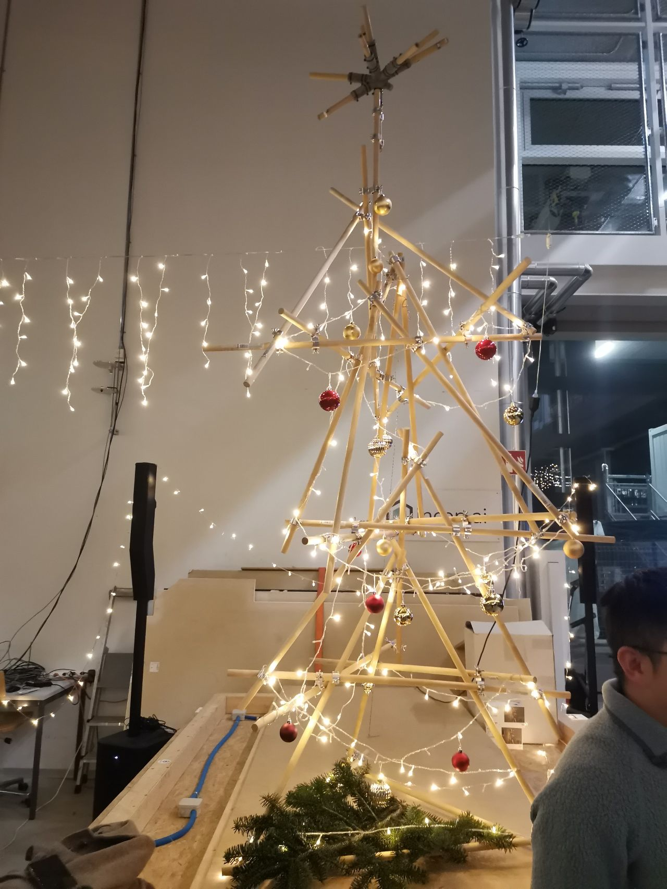

## 12月10日 BRG Christmas Party
礼物交换环节拿到了许多奇妙的东西。

## 12月13日  Gravis Christmas Event

## 12月25日 圣诞节
沉迷写代码。

## 12月29日 2023最后健身
练腿后上跑步机，成绩不错的跑完6km。
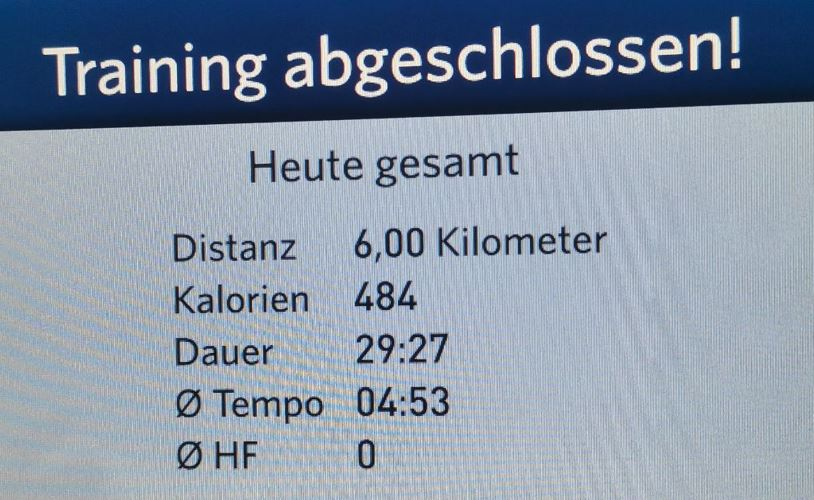
